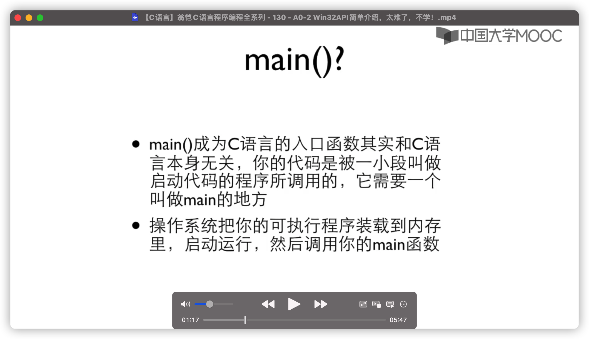

# 13.2.2 移位运算


- 所有按位的运算都默认是int


- 原来：1000;

移1位之后：1100

- 左移不管符号类型（unsigned,signed)


 

# 13.2.3 位运算例子

```c
//输出一个数的二进制
int number;
scanf("%d",&number);
unsigned mask = 1u<<31;//u：这是一个unsigned的数，变成1000（31个0）
for (; mask ; mask >>=1){//一个个(>=)去右边的0，加左边的0，01000……，直到最后只有0000……为止
  printf("%d",number & mask ? 1:0);
}//一位一位把它复刻下来，每个循环值搞移位即mask(1)所对应num的位数
printf("\n");

```

# 13.2.4 位段

# 14.1.1 可变数组

- 一旦有了数组，在运行过程期间无法改变它的大小
- 如何实现一个可以自动变大小的数组

- 封装：给一个函数，把内部的细节都保护起来，不知道里面怎么做的

- 如果不确定优先级，用括号就行

```c
//在定义结构的arry.h文件里面
#ifndef _ARRAY_H_
#define _ARRAY_H_
typedef struct{
  int *array;//定义int的指针，当做数组用
  int size;
}Array;
//如果有结构要传到函数里面去，用指针传递（成本小）
//不 要定义指针类型（使用容易误会，而且无法把结构真正放在函数里面）
Array array_create(int init_size);
void array_free(Array *a);
int array_size(const Array *a);
int *array_at(Array *a,int index);
void array_inflate(Array *a,int more_size);
#endif
```

```c
//在array.c文件中
#include "array.h"
#include <stdio.h>
#include <stdlib.h>

const int BLOCK_SIZE=20;

Array array_create(int init_size)
{
  Array a;
  a.size=init_size;
  a.array=(int*)malloc(sizeof(int)*a.size);
  return a;
}

void array_free(Array *a)
{
  free(a->array);
  a->array=NULL;//在C语言中，可以说NULL就是0，两者是**完全等价**的。只不过NULL用在指针和对象，0多用于数值。
  a->size=0;//保险起见再都搞成0
}

int array_size(const Array *a)
{
  return a->size;
}

int *array_at(Array *a,int index)
{//定位
  if(index>=a->size){
    array_inflate(a,(index/BLOCK_SIZE+1)*BLOCK_SIZE-a->size);
  }//找到要加block的底线在哪里(index/BLOCK_SIZE+1)*BLOCK_SIZE，在size之后加block（算出增加量）
return &(a->array[index]);//返回的是一个指针,不确定优先级加括号
}//可以自动增长下标，扩展空间，要访问的即使不存在也造出来空间（0）

void array_inflate(Array *a,int more_size)//长大
{
  int *p=(int*)malloc(sizeof((int)(a->size+more_size)));//搞了一个新指针
  int i;
  for (i=0;i<a->size;i++){
    p[i]=a->array[i];//把array一个个复制到p里面
  }
  free(a->array);//清空array
  a->array=p;//两个指针可以之间赋值
  a->size+=more_size;//复制剩余的就是0了（多出来的空间）
}

int main()
{
  Array a=array_create(100);
  printf("%d\n",array_size(&a));
  *array_at(&a,0a)=10;//array [0]=10;
  printf("%d\n",*array_at(&a,0));//指针，指针，所指的数
  
  int number=0;
  int cnt = 0;
  while(number!=-1){
    scanf("%d",&number);
    *array_at(&a,cnt++)=number;
  }
  array_free(&a);//释放结构里的int *arry
  return 0;
}
```

# 14.2.2 链表

- 链表linked-list ：一个指针指向a（节点），a以及后面的节点都是由数据和指针组成（除了最后一个节点），a里面的指针部分指向b，b里面的指针部分指向c ……，最后一个没有指针

```c
//在node.h文件里
#ifndef _NODE_H_
#define _NODE_H_
typedef struct _node{
  int value;
  struct _node *next;//一个指针指向下一个这种类型的结构变量
}Node;
#endif
```

```c
//在.c文件里
#include "node.h"
#include <stdio.h>
#include <stdlib.h>

typedef struct _list{
  Node * head;
} List;

void add(List *list, int number);
void print(List *pList);

  int main()
{
  List list;
  int number;
  list .head= NULL;//Node *head=NULL 给链表一个头，所有的链表都是空的
  do{
    scanf("%d",&number);
  if (number !=-1){//读number 直到-1
    add(&list,number);//给list取地址，让另外一个指针指向list（plist）
  }
  }while(number !=-1);
    
    print(&list);
  //该输入的都输完了，打印这个链表
   
    //让用户输入一个数字，在链表里面找到那个数字，如果数字存在的话就把它删除
  scanf("%d",&number);
    Node *p;
    int isFound=0;
    for(p=list.head; p; p=p->next){
      if(p->value==number){
        printf("找到了\n");
        isFound =1;
        break;
      }
    }
    if(!isFound){//!isFound=1，isFound=0
      printf("没找到\n");
    }
    Node *q;//定义一个在P之前的指针
    for(q=NULL,p=list.head;
        p;//保证之后的p->是安全的，p不是NULL。但是此时无法保证q->是安全的
        q=p,p=p->next){
      if(p->value==number){
        if( q ){//q=!NULL
          q ->next = p -> next;
        }else{
          list.head=p->next;//输入的就是第一个结点的value，让p成为第一个结点，在把它删掉
        }
        free(p);//把p所指找到数的结点删了
        break;
      }
    }
    /*
    判断边界：指针在->的左边的时刻，指针不能是NULL
    为了确保 指针->安全 ，需要将指针=NULL和!=NULL的情况都讨论
    */
    
    //删除整个链表
    for(p=head; p; p=q;){//函数1里面有变量1，函数1里面有函数2，3，变量1在函数2，3都使用，变量1在函数2使用完了之后 再在函数3里使用前会清零。
      q=p->next;
      free(p);//即使free p，p这个变量还可以继续使用（释放了p的上一个地址），之后p指向另一个地址
    }
    return 0;
  }


void add(List* pList,int number)//plist是List的指针
{
//add to link-list 
    Node *p=(Node*)malloc(sizeof(Node));
    p->value=number;
    p->next =NULL;
    //find the last
    Node *last=pList->head;  
  //Node *last= head（head是指针）
  //last是一个指针。pList->head, (*pList).head, list里的head指针
    if(last){//last!=NULL(整体）。添加第二个结点：last指向此时的head，也就是第一个结点。第一个结点有number，所以不全是NULL，进入if语句
//last指向第一个结构（head)，进入if语句
      while(last->next){//last所指head(第一个写入的结点）的next指针是NULL，不进入while语句
//第一个结点有了next指针，进入while循环
 //第二个结点是null，跳出while循环
        last=last->next;//把last指向第二个结点，第二个结点是：p2，null
      }
      //attach
      last->next=p;//last所指head(第一个写入的结点），让第一个结点的next的地址是新加入第二个结点的地址
      //让 last所指第二个结点的next 的地址是新加入第三个结点的地址
    }else{
      pList->head = p;//last指向head，添加了第一个结点
    }
}

void print(List *pList){//pList是一个指针，指向类型List
   Node *p;//新的p
    for(p=pList->head; p; p=p->next){
      //p=pList->head，p=(*pList).head
      printf("%d\t",p->value);
    }
    printf("\n");
    /*for循环：
    “表达式1”仅在第一次循环时执行，以后都不会再执行，可以认为这是一个初始化语句。
    第一个表达式：初始条件:输入的链表有结点，两个Node的指针赋值
    第二个表达式：循环条件：p!=0,这个结点存在
    第三个表达式：循环一轮结束进入下一轮要做的事，再和循环条件比较，若成立才正式进入下一轮：
    p=p->next，p这个指针等于p所指下一个指针的地址，p指向下一个结点
    */
}
```


- 传入一个指向指针的指针，可以在函数内部对指针的值进行修改

- **p表示p也表示地址，简单的说，这个地址对应的存储单元存储的数也是一个地址，而不是数值，而这个被存储的地址对应的存储单元存储的数据才是真正的相应类型的数值!

  例如： 

  ```c
  int i=10; //定义了一个整型变量 
  
  int *p=&i; //定义了一个指针指向这个变量 
  
  int **p1=&p; //定义了一个二级指针指向p指针 
  
  //那么取出10的值方式为： 
  
  printf(“i=%d\n”,*p); //反过来指回一次就行
  
  printf(“i=%d\n”,**p1);//反过来指回两次
  ```

  - 添加list可以以后更加灵活更改

- 


# ACLLib


ACLLIB基于Windows API（应用程序编程接口）



启动运行的第一条指令是编译器给的启动代码的程序，它会寻找并执行main函数

对于Windows32API，启动函数是WinMain(){}


- 写程序


win32API很不友好


