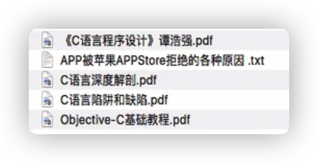
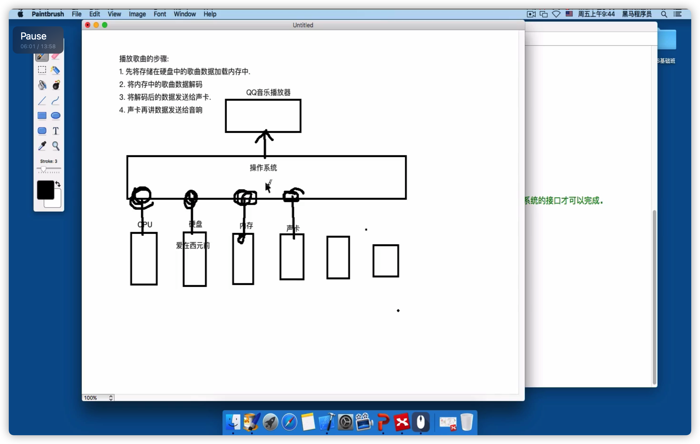
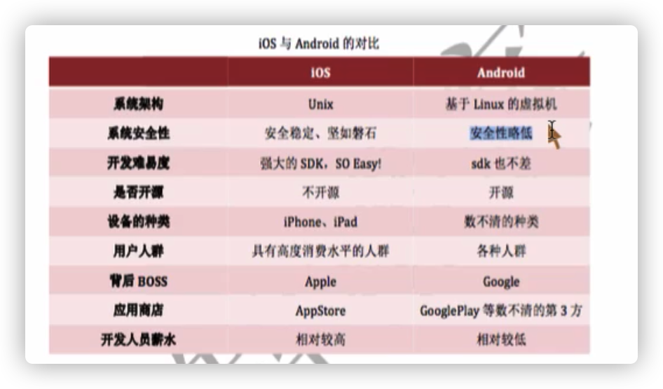

https://www.bilibili.com/video/BV1GJ411T7Fz

看关键词回忆

《乔布斯传》

（基本不会看，先搁在这里）

# 操作系统

- 内存是计算机的工作场所；硬盘用来存放暂时不用的信息。

集成电路是主板的一部分。

- 计算机运行需要硬件（CPU，内存，硬盘……），软件（操作系统是底层软件）

操作系统管理协调硬件设备工作

- 计算机只能懂二进制语言

- 操作系统把对硬件的操作，封装成接口SDK（比如鼠标点一下，调用接口，就向硬件发送二进制指令）

不同的操作系统提供的接口不一样，所以下载软件要看操作系统下载

跨平台：翻译器，根据操作系统的不同打破 看操作系统下载

- 应用软件（的一个按钮之类）运行在操作系统之上，是操作体统的上层抽象（封装操作体统的接口）

应用开发，按照顺序调用操作系统的接口

- 操作系统的分类（按照设备）

PC（个人电脑）：Windows（微软），macOS ,Linux

服务器上的操作系统（也是电脑，比PC更强大）：windows sever,linux(大部分）)

移动设备上：安装（谷歌），iOS，Windows

# 移动开发

- 软件开发分类（按照开发平台）

桌面开发：运行在桌面上，窗体软件

Web开发：网页开发

移动开发：运行在移动设备上

- iOS开发只能用Xcode，只能在OS 上面开发

发布App Store，一年99美金（发布证书），还有抽成

# 苹果设备发展史

- iPhone1（2007），没有键盘

iPhone2（2008），3G

iPhone4（2010），视网膜屏幕retina，一个点两个像素（跨时代），摄像头（跨时代产品）

iPhone5S（2013），指纹识别，土豪金

iPhone5C（2013），廉价版，彩色

iPhone6（2014），变大，Apple Pay, nfc近场通信（Near Field Communication，简称*NFC*），在彼此靠近的情况下进行数据交换

- MBA: Mac Book Air

MBP:pro

# Mac使用

- 最上面的条条：任务栏里面有 菜单栏（左边），当前选中软件的菜单栏固定在任务栏

- 一般在下面的，有很多软件图标的一行：dock栏
- 彻底退出程序：Command + Q: 退出应用 或者 dock里面quit

强制退出，左上角苹果 或 Command + Option + Esc: 强制退出应用

- finder（我的电脑）：工具栏，边栏（左边），内容显示区

- command键（花键）

- 安装包格式：.dmg(虚拟磁盘，拖拽）； .pkg

不让安装，在系统安全与隐私，通用，允许从以下位置下载

- u盘等等打开需要退出再拔出

移动硬盘不支持OS，需要加插件

# C语言简介

- 机器语言，二进制

汇编语言，直接操作硬件（变硬件就不行）

高级语言，与人的思维像（编译器转换成机器语言）

- 1972贝尔实验室设计C语言，用C重写了Unix操作系统（加强可移植性），公开核心和编译器（大家随便可以改）。所以制定了标准，1978K&R标准，C89,C99，2011C11

OC是C的儿子

# 终端

- 终端是OS操作系统（基于unix）自带的程序（Windows命令提示符）

所有功能都可以通过终端完成，有些只能用终端

- 计算机名字

～：家目录

 

drwx文件夹

-rw-r--r--@:文件

touch：在当前工作路径下创建1个空文件

touch 文件名称.文件格式

cc:出现clang: **error:** no input files ，就装了c语言编译器

rm 文件名（可以多个）：删除

# 编译注意

- 后缀名.c的文件是C程序的源文件

- 除了引号内的，其他都用英文输入法

- 总是切换到对象文件/文件夹所属的文件夹路径里

写文件名的时候带上扩展名

- .c：源文件

.o:目标文件(如果符合C规范才会形成.o)

.out:可执行文件

命名----写.c源文件----编译（执行.c文件的预处理代码----检查语法---编译成.o目标文件）---链接--执行

- 直接：

cc .c文件：就是cc -c和cc .out的合成版本,只生成.out文件 

# 系统偏好设置（控制面板）

- 活动监视器：可以看看程序运行的状况，也可以强制退出

#  IDE集成开发环境Xcode

- 搭建一个环境-->装一个软件
- IDE intergrated development environment，一键编译，链接，执行

  

Xcode：OS，IOS系统，c,c++,objective-c,swift

- 如果点不开可能启动界面

没有钩上，可以在左上角window启动

- 新建：OS----- command line tool（命令行）

命名那里，organization identifier：一般倒着写写公司网站域名

保存地址那里，下面的 别 勾

生成的可执行文件在源代码导航区的products

想在Xcode打开一个project：（finder）

project下面的文件夹是target，一个程序

添加target，上图

切换：编译执行哪个- target

# 函数示范

- CPU只会执行main函数的代码

一个程序只能有一个main函数（程序的入口：开始执行；程序的出口：main里面语句执行结束之后自动结束）

只有在上一句执行成功才会执行下一句

- 运行右边方形图标：在程序运行的时候强行结束

# 程序运行模式

- 计算机三大件：CPU，内存，硬盘

硬盘程序，放到内存（内存读取程序效率高），CPU再读指令

内存越大，能够同时运行的程序越多

