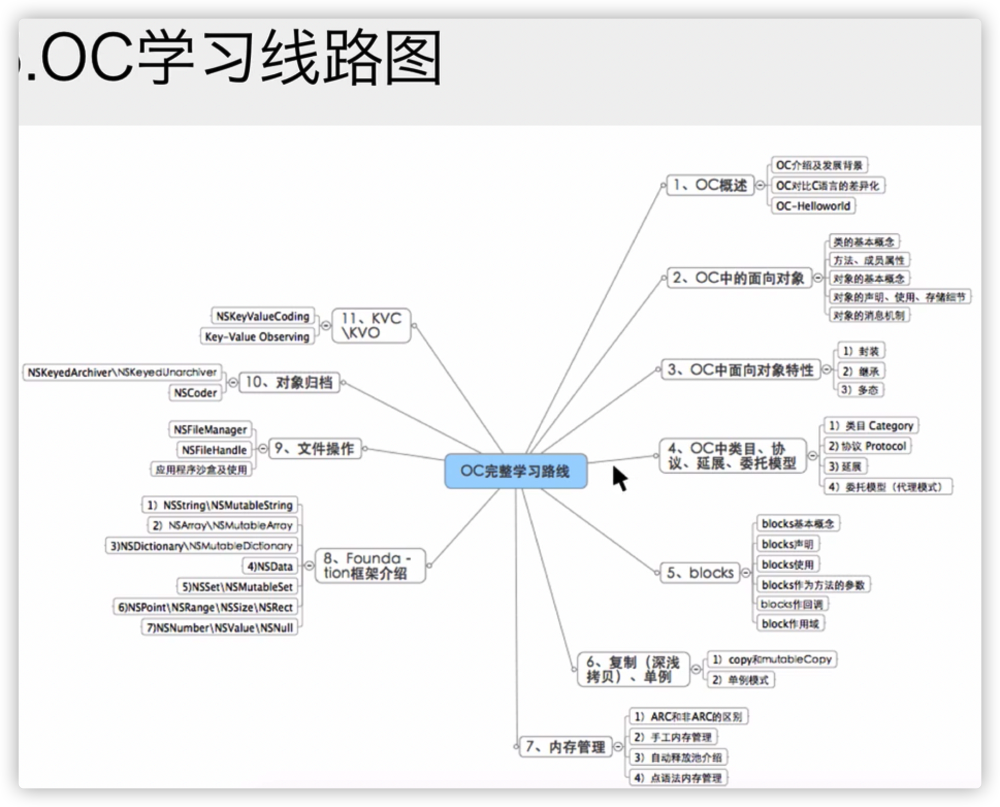
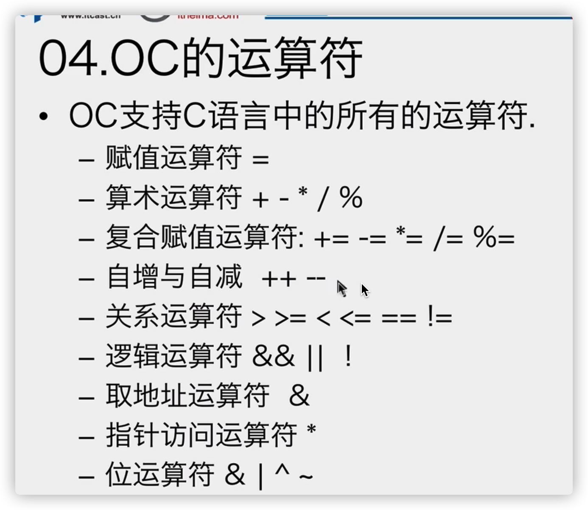
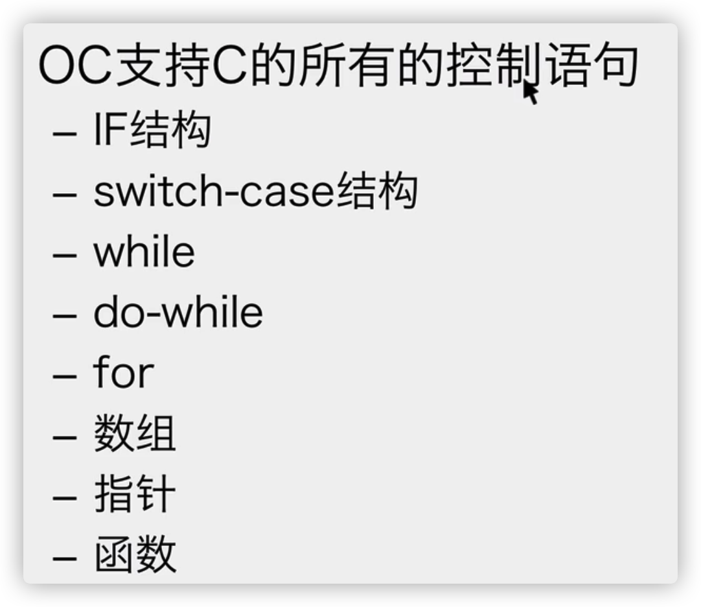
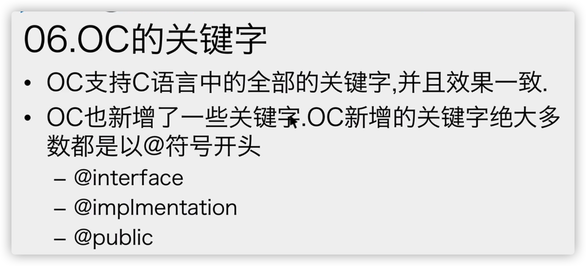
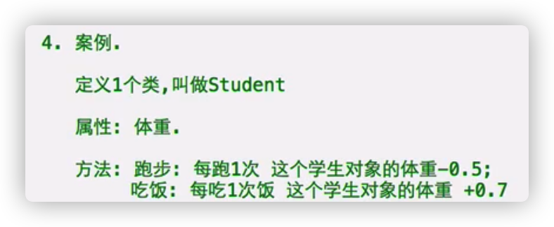

# OC概述

- 简称Obj-C或OC

    C:C语言

    objective对象

    OC是面向对象的C语言，在C语言的基础上增加了面向对象的语法，把语言的语法封装得更简单

    （感觉会更简单）

    OC完全兼容C语言，可以在OC语言中写C语言

  

- Brand Cox：80年代，结合C语言和Smalltalk

    C语言优势：高级语言，可移植（可以在不同CUP运行）

    Smalltalk：面向对象语言 

- NeXT（乔布斯创建的公司）设计NextStep：使用OC编写的一套界面工具包

    之后，苹果公司收购NeXT，NextStep更名Cocoa，OC成为Mac平台主力语言，之后成为IOS平台的主力

    2014WWDC推出swift，全面优于OC，会取代OC

  

- OC源文件的后缀名.m message是OC一个重要机制，消息机制




# 基础语法

- main函数仍然是程序的入口和出口

    有int类型返回值，代表程序的结束状态

    main函数的参数：接收运行程序的时候传递给程序的数据，同C，参数也可以不用

- \#import指令：

    1）以#开头，是预处理指令

    2）作用：就是#include指令的增强版，将文件内容在预编译的时候拷贝到写指令的地方

    3）增强：同一个文件无论#import多少次实际上只会#import一次

- 框架

    1）是一个功能集，有人把一些功能写好，封装在函数和类中，这些类和函数的集合是框架

    2）Foundation框架：提供基础功能，数据类型，输入输出……

    \#import <Foundation/Foundation.h>引用Foundation框架里面Foundation.h文件

    Foundation.h里面有 所有 Foundation框架里的头文件

- 、@autoreleasepool{ }自动释放池

    删除也没关系（目前来说）

- NSLog(@"Hello, World!");

    NSLog是函数

    1）作用：printf增强版，向控制台输出信息

    2）语法：

    NSLog(@"格式控制符串"，变量表）;

    NSLog(@"要输出的信息");

    3）增强：

    a.输出调试相关信息

     2021-08-01 20:09:12.999100+0800 day1[87809:7548622] Hello, World!

     执行代码时间（时间之差看代码性能）

     target名称

     【进程编号：线程编号】

     输出信息

    b.自动换行,如果自己 在最后 加了\n，函数的自动换行功能就会失效，\n生效

    c.可以输出OC新增的数据类型

- 字符串

    1）NSString类型的指针变量，专门存储OC字符串的地址

    2）OC字符串常量：

  ​    @"jack"

  ​    NSString* str = @"jack";

    3）NSLog函数的第一个参数是1个OC字符串，所以NSLog函数的第一个实参以@开头

    4）使用占位符%@

```objective-c
int main() {
    NSString* str = @"jack";
    NSLog(@"%@",str);
    NSLog(@"我叫%@",str);
    return 0;
}
```

- NS前缀：区分创建者

- @符号

    1、将C字符串转换成OC字符串

    2、OC绝大部分关键字以@开头

- 注释：正常

- 函数的定义和调用：正常

```objective-c
void test(void);

int main(){
    test();
    return 0;
}

void test(){
    NSLog(@"感觉有的推翻了，有的还一样");
}
```

# OC与C对比

- 1、数据类型

    1）OC支持C语言所有数据类型：

  ​    a.基本数据类型：int float char double

  ​    b.构造类型：数组，结构体

  ​    c.指针类型：int* p;

  ​    d.空类型: void

  ​    e.typedef自定义类型

    2）BOOL类型

  ​    a.可以存储YES或NO

  ​    b.BOOL变量来储存条件表达式的结果

  ​    c.BOOL本质：char,0,1

  ```objective-c
  int main(int argc, const char * argv[]) {
      int num1 = 10;
      int num2 = 20;
      BOOL a = num1 > num2;
      return 0;
  }
  ```

  3)Boolean类型，[ˈbuːliən]

  ​    a.Boolean类型存储true或flase

  ​    b.Boolean变量来储存条件表达式的结果

  ​    c.Boolean本质:char,0,1

    **一般用BOOL**

    4）class 类型，类

    5）id类型，万能指针

    6）nil，与NULL类似

    7）SEL，方法选择器

    8）block，代码段

- 2、运算符：正常

   3、控制语句：正常

   4、关键字：正常，额外加了一些以@开头的关键字

   5、函数的定义和调用一样

- 综上：OC语言完全兼容C语言








# 面向过程与面向对象

- 买电脑：

   自己买：自己是主角，是执行者，面向过程的解决思路

   找高手，自己带钱：高手是执行者，自己是指挥者，面向对象的解决思路

   （明显面向对象更爽）

   

- 代码世界的面向过程与面向对象

    1）面向过程：

   遇到需求的时候，每一个步骤都用自己写的代码一步步实现

    2）面向对象：

   遇到需求，找一个高手搞定

- 优缺点：

   C语言，面向过程语言（有功能的概念，没有人的概念）

   OC语言，面向对象的语言，有人

    1）面向过程：

  ​    缺点：后期的维护和修改不方便

    2）面向对象

  ​    优点：后期的维护和修改方便

- 如何使用面向对象来设计程序：

   遇到需求的时候，不 要亲自实现

   先看看有没有现成的人做这件事情，框架

   如果没有，自己造一个人，之后可以反复使用

# 类与对象

- 对象

    是现实生活中的一个具体存在，可以看得见摸得着（买电脑的高手），可以拿过来直接用

    唯一性（我的第一台Mac电脑）

- 类

    是对一群具有相同特征或行为事物的统称（抽象），不能直接使用

    如果要使用类的话，只能找到这一类事物中的一个具体存在，使用那一个具体存在

    不唯一性（Mac电脑）

- 类与对象的关系

    类是模版，类的对象根据这个模版被创建出来

    类模版里有什么，对象中就有什么，不多不少

    

    类是制造月饼（对象）的模子，不能吃（使用）；

    月饼（对象）从模子堆出来，一摸一样，可以吃（使用）

- 如何设计一个类

    类的作用：用来描述一群具有相同特征和行为的事物

   

    类的三要素：

  ​    1）类的名字

  ​    2）这类事物具有的相同 **特征**：都有什么

  ​    3）这类事物具有的共同 **行为**：能做什么

- 如何找到类

    名词提提炼法：分析整个业务流程，分析出现哪些名词，名词就是类

   

    3辆坦克发射6枚炮弹打中了3架飞机。
    
    坦克类，炮弹类，飞机类

- 先有对象还是先有类？

    现实角度：现有对象再有类

    从代码角度：现有类再有对象

- 如何定义类

    1）类的三要素

    2）语法

  ​    a.声明和实现都 在函数外面

  ​    b.

  ​    ->类的声明：

  ```objective-c
  @interface 类名 ： NSObject
  {
  这类事物具有的共同特征。将其定义为变量。
  这些东东叫：属性/成员变量/实例变量/字段
   }
  功能是一个方法，把方法的声明写在这里。
  @end
  ```

  ​    ->类的实现:

   ```objective-c
   @implementation 类名
    将方法实现写在这里
    @end
   ```

    3）为类定义属性的时候，类名首字母大写，属性的名字必须以_开头

  ​    属性在对象中以变量方式存在

- 如何创建一个类的对象：

  ```objective-c
  类名 *对象名 = 【类名 new】；
  Person *p1 = [Person new];
  ```

   根据Person这个类的模版，创建了一个对象的名字叫p1

- 如何使用对象

    如何访问对象的属性：

    1）默认，对象的属性无法从外部访问；

  ​    如果允许对象的属性可以被外界访问，需要在声明属性的时候加 @public

```objective-c
@interface Person : NSObject
 {
     @public
     NSString* _name;
     int _age;
     float _height;
 }
 @end
```

2）访问对象的属性方式：

  对象名->属性名 = 值；

  对象名->属性名；

  (平时用箭头）

   也可以：

  （*对象名).属性名;

```objective-c
//案例见Xcode
@interface Person : NSObject
main
```

# 方法的声明实现调用

- 行为

    行为就是1个功能，C语言用函数表示一个功能

    OC类具有的行为，使用方法表示

   

    方法函数都表示1个功能

- 方法的位置

     @interface 类名 : NSObject

     {

  ​    属性，表示类的特征

     }

     方法的声明，方法表示类的功能

     @end

     

     @implementation 类名

     方法的实现;

     @end

- 无参数的方法

例子:

```objective-c
@interface Person : NSObject
  main
```

1）声明

​    a.位置：在@interface大括弧的下面

​    b.语法：

```objective-c
- （返回值类型）方法名称；
- (void) run;
```

​    声明一个无返回值，无参数的方法，方法名是run

  2）实现

​    a.位置：在@implementation中，去掉分号，追加大括弧，将方法实现的代码写在大括弧中

  3）调用

a.方法无法直接使用，因为类无法直接使用，必须创建对象，调用对象的方法

b.调用对象的方法

```objective-c
【对象名 方法名】；
```

- 带一个参数的方法

例子

```objective-c
@interface Person : NSObject
  main】
```

Eat

1）声明(函数头)

a.位置：在@interface大括弧的下面

b.语法

```objective-c
- (返回值类型)方法名称:(参数类型）形参名称；
```

方法头中的数据类型都要用小括弧括起来

**一个类可以有多个方法**

```objective-c
- (void)eatWith: (NSString*)foodName;
```

定义了一个没有返回值的方法，方法叫**eatWith:**

方法有一个参数，类型是NSString* 

参数的名字是foodName

2)  实现

a.位置：在@implementation中，去掉分号，追加大括弧，将方法实现的代码写在大括弧中

3) 调用

a.方法无法直接使用，因为类无法直接使用，必须创建对象，调用对象的方法

b. 调用语法

```objective-c
[对象名 方法名：实参]；
```

- 带多个参数的方法

例子

```objective-c
@interface Person : NSObject
  main】
```

Sum

1）声明

a.位置：在@interface大括弧的下面

b.语法：

```objective-c
- （返回值类型）方法名称：（参数类型）形参名称1 :(参数类型）参数名称2 :(参数类型）参数名称3；
```

```objective-c
- (int)sumWith:(int)num1 and:(int)num2;
```

 声明一个方法，返回值是int类型 

方法的名称是 sumWith: and:

有两个参数，参数名是num1 num2

2）实现：

a.位置：在@implementation中，去掉分号，追加大括弧，将方法实现的代码写在大括弧中

3) 调用

a.方法无法直接使用，因为类无法直接使用，必须创建对象，调用对象的方法

b. 调用语法

```objective-c
[对象名 方法名:参1 :实参2 :实参3]；
```

- 带参数的方法声明规范

1） 如果方法有一个参数，命名xxxWith:  或  xxxWithXxx

2）如果方法有多个参数，命名

方法名With:(参数类型)参数名称 and:(参数类型)参数名称 and:(参数类型)参数名称；

```objective-c
- (int)sumWith:(int)num1 and:(int)num2;
```

名字成为sumWith: and:

更加详细的是:

方法名With参数1:(参数类型)参数名称 and参数2:(参数类型)参数名称 and参数3:(参数类型)参数名称；

**一切的目的都是增加可读性，看起来像一句话**

```objective-c
- (int)sumWithNum1:(int)num1 andNum2:(int)num2;
```

# 使用注意

- 一个类可以创建无数个对象

同一个类的多个对象之间毫无关系，虽然拥有相同的属性和方法，属性的值 不会 互相影响的

- 在方法的实现中 可以 之间访问属性 

该方法是通过哪一个对象来调用的，方法中直接访问的属性就是哪一个对象的

以上例子

```objective-c
@interface Person : NSObject
```



- 成员：凡事定义在类中的都是成员
