# 案例

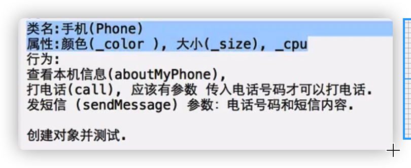   

  ```objective-c
  @interface Phone : NSObject
  ```

# 类加载

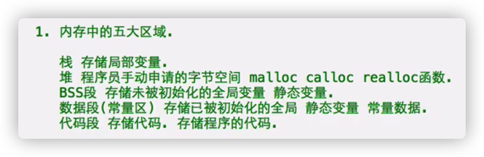

- 类加载：

1、声明一个类的指针变量也会访问类

2、类加载：在程序运行时，当类被第一次访问到时，会将这个类存储到内存中的代码段区域，这个过程是类加载

一旦被加载到代码段，直到程序结束的时候，才会被释放

- 对象在内存中究竟如何存储：

```objective-c
Person* p1 = [Person new];
```

1）Person* p1; 在栈内存中申请一块空间，声明一个Person*类型的指针变量

2）[Person new] 

a.在堆内存中申请一块合适大小的空间

b.在空间中，根据类的模版创建对象

（类模版中定义了什么属性，就依次把属性声明在对象里面）

对象中还有1个属性  isa，一个指针（指向该对象所属的类 的地址）

要把三块内存连在一起

c.初始化对象的属性

如果属性的类型是基本数据类型，赋值0

是C指针，NULL

是OC指针，nil

d.返回对象地址

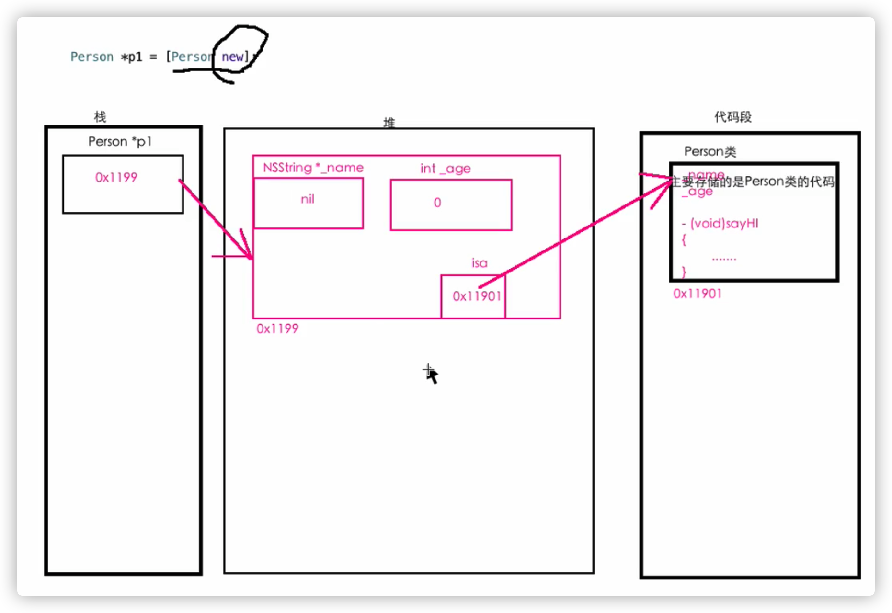

- 对象中只有属性，没有方法

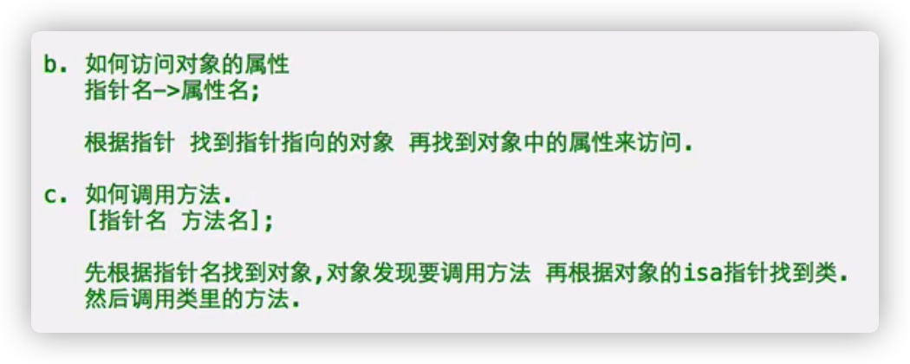

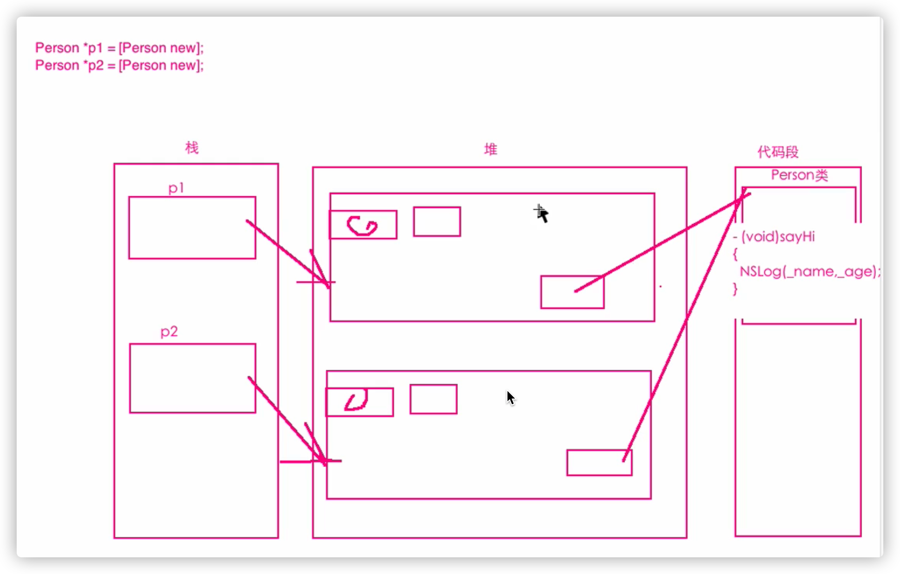

多个相同类的对象，共享一个方法（内存） 

这些对象的isa值是一样的（指向方法的地址是一样的）

节约空间

# nil和NULL

- NULL

只能给指针赋值，代表指针不指向任何一块空间

NULL是一个宏，0（地址的0，不是地址的0）

- nil

只能给指针赋值，代表指针不指向任何一块空间

NULL是一个宏，0（地址的0，不是地址的0）

- NULL和nil一样的

 验证见

```objective-c
main
```

- 使用

1、两者可以混用，但不建议

2、**C指针用NULL，OC指针用nil**(OC类指针)

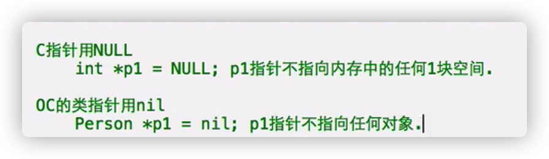

- 如果一个类指针的值是nil，这个指针不指向任何的对象

通过这个指针访问对象的属性会报错；调用对象的方法不会报错，不会执行

# 多个指针指向同一个对象

- 同类型的指针可以相互赋值

```objective-c
Person* p1 = [Person new];
Person* p2 = p1;
```

无论用p1还是p2，都可以修改用一个对象

# 分组导航标记

**在导航栏**

- ```objective-c
  #pragma mark 标签名
  ```

  在声明或者实现的前面

- ```objective-c
  #pragma mark -
  ```

在实现的后面，会产生分割线

- ```objective-c
  #pragma mark - 标签名
  ```

在实现的后面，产生分割线和下一个标签名

# 方法与函数

- 函数，C中：

```c
void test(){
}
```

OC类中，方法:

```objective-c
- （void）sayHi;
```

- 相同：

都是用来封装一段代码

- 不同

1、语法不同

2、定义的位置不同：

函数的声明：出来@interface和函数内部，其他都可以

就算把函数写在类中，类与函数也是不想干的（劝你别干）

方法的声明和实现位置固定

3、调用方式

函数，直接调用

方法需要通过对象调用

4、独立性

方法属于类

函数是独立的

# 注意

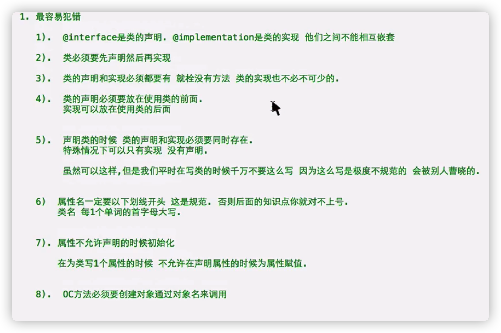

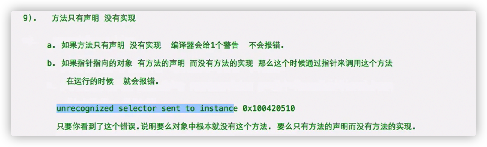

# 多文件开发

- 把1个类写在一个模块中，1个模块至少包含2个文件：

.h文件：类的声明

.m文件：类的实现

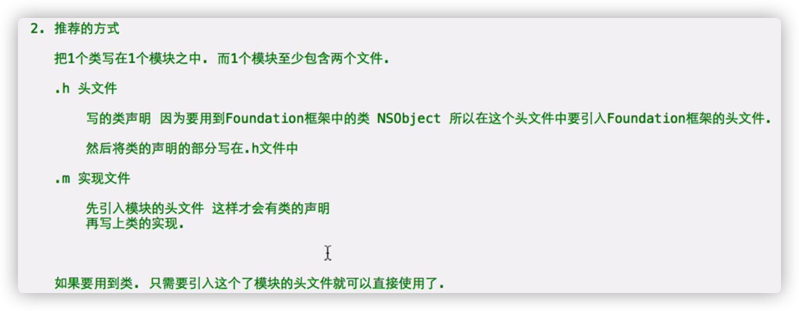

- 更爽的方式

新建文件 Cocoa Class

自动生成.h .m两个文件

文件名一致，即类名

使用类时，将该类的头文件引进来

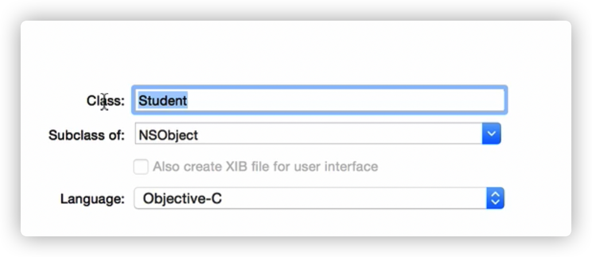

# 对象与方法

- **对象作为方法的参数，对象作为方法的返回值**

- 类的本质是自定义的一个数据类型

数据类型：在内存中开辟空间的模版

- 类是数据类型，就可以作为方法的参数

```objective-c
- (void)test:(Dog*)dog;
```

- 注意

1、对象作为方法的参数，参数类型是类指针

2、是地址传递，在方法内部通过形参修改形参指向的对象，会影响实参变量指向对象的值

# 上帝和人的故事

# 对象作为方法的返回值

- 使用情况：

方法执行完毕后，有一个对象，方法不知道该拿它怎么办，调用者也需要出来的对象，此时将对象返回

- 案例见 对象与方法 

```objective-c
- (Dog*) test1;

- (Person*)makePerson;(上帝与人）
makePersonWithNaame
```

- 返回值类型：类指针 

# 对象作为类的属性

- 一个target中的类无法直接在另外一个target里面访问

如果想要这么做的话，在finder里面把想要的文件拖到源代码导航区

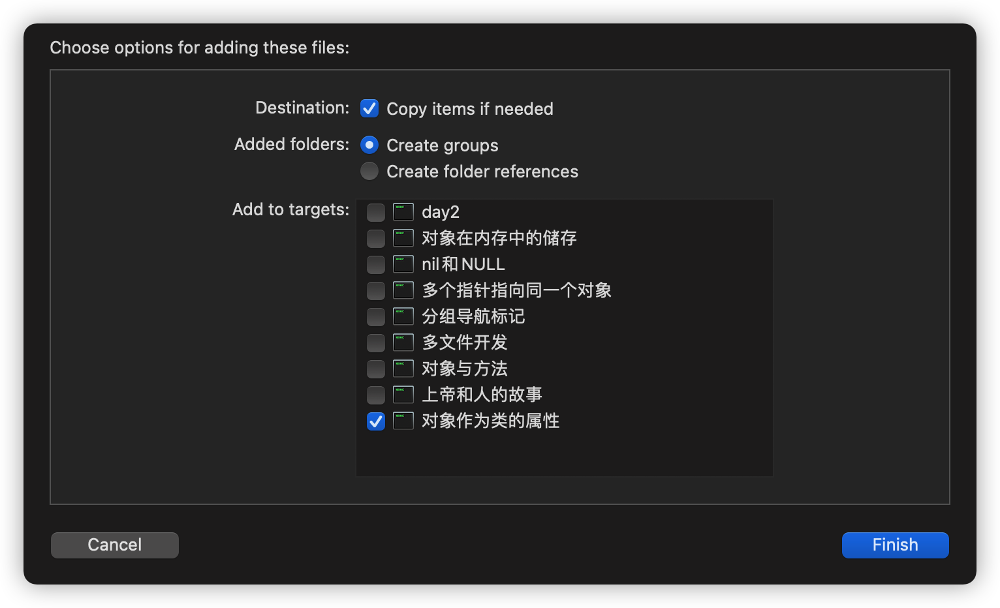

- 类的属性：代表这个类所拥有的东西

属性的本质是变量

如果对象的属性是另一个类的对象，这个属性就是一个指针变量，没有对象的产生

**需要给属性赋值一个对象的地址**

- A类作为B类的属性，属性默认nil，要给B对象的A属性赋值才可以使用

```objective-c
    QuanQuan* _qq = [QuanQuan new];
    p1->_dog->_qq = _qq;
    这两句可以缩为一句
    p1->_dog->_qq = [QuanQuan new];
    _qq是指针
```

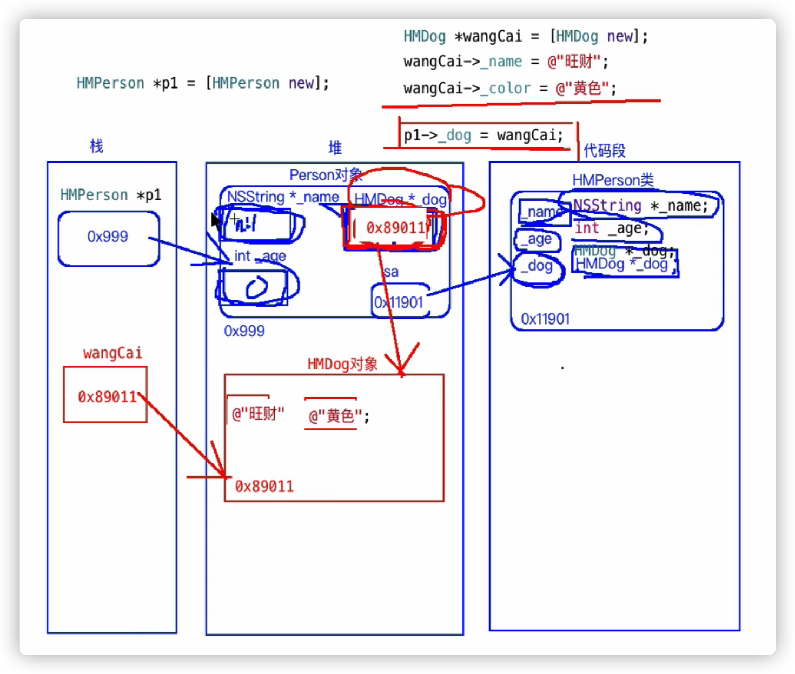

# 猜拳游戏

- 枚举，结构体放在头文件里

- 如果要在方法中调用当前对象的另外一个方法

[self 方法名];

self代表当前对象

