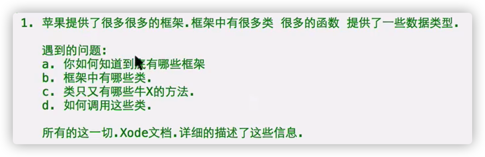
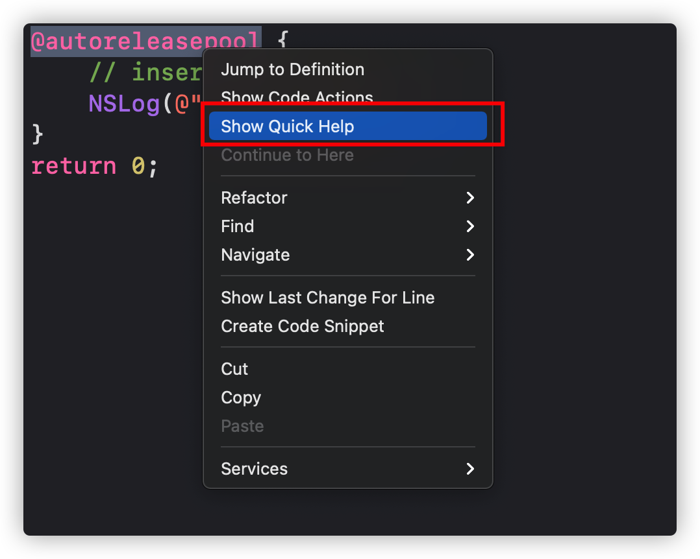
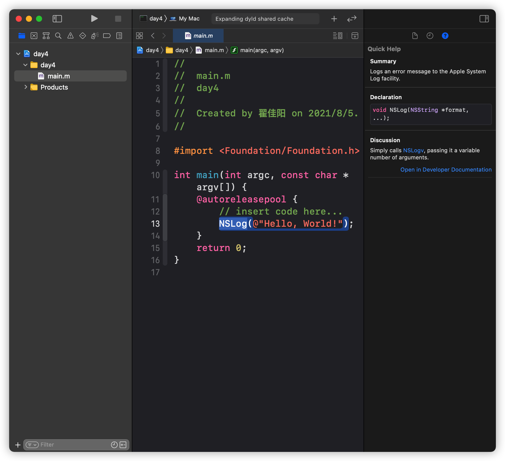
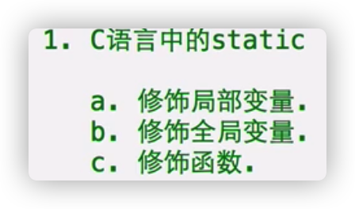
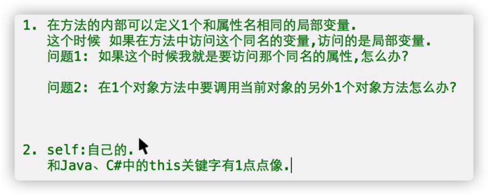
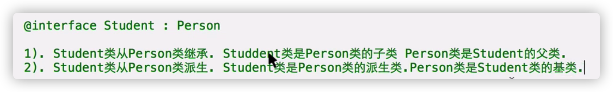
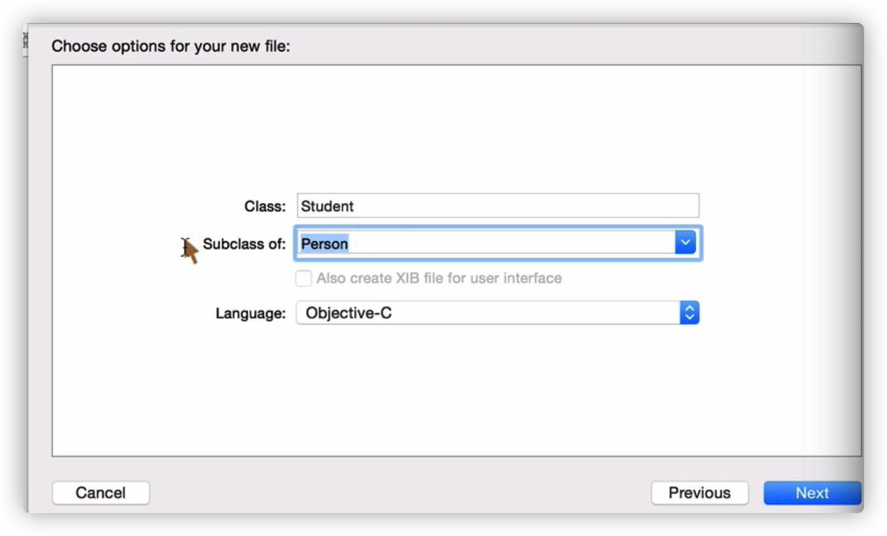
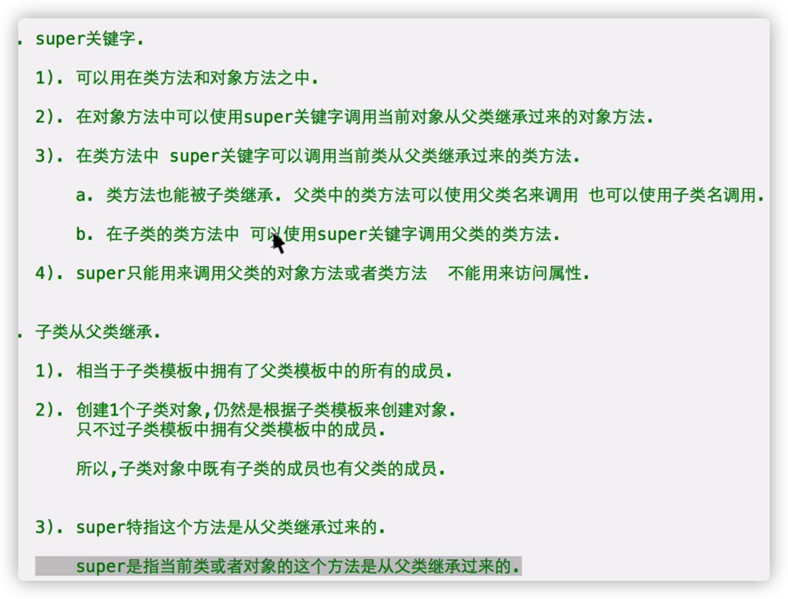
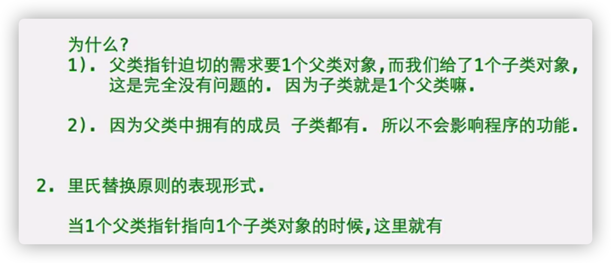
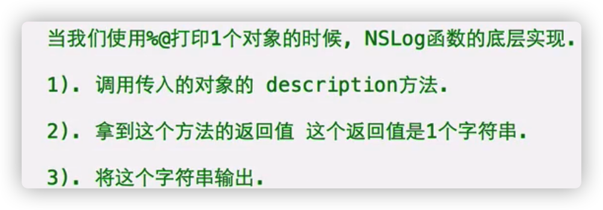

# Xcode文档的安装



# 找Xcode文档

选中关键词



或者



选中关键词，在属性检察区问号里面找，可以open in developer documentaion

或者

option点关键字

# static

- 
- OC中static不能修饰属性，方法

可以修饰方法中的局部变量，变成静态变量，存储在常量区，该方法执行完毕不会回收，再次执行时不需要声明，直接用就行

- 如果方法返回值是当前类的对象：
- 返回值类型就是(instancetype)

```objective-c
+ (instancetype)student;
```

- static实现学生编号的递增，且无法从外界改变

\+ (instancetype)studentWithName:(NSString*)name 

# self

- 在方法的内部可以定义一个和属性名相同的局部变量

访问这个同名的变量，访问的是**局部变量**

\- (void)sayHi;



- 可以在对象方法和类方法吃中使用

self是一个指针，在对象方法中指向当前对象，在类方法中指向当前类

当前对象：调用该方法的对象


- 作用：1.通过self访问当前对象的属性，当前对象的方法

```objective-c
NSLog(@"我是%@，今年%d岁",_name,_age);
    //等价
NSLog(@"我是%@，今年%d岁",self->_name,self->_age);
```

Self -> 属性，访问当前对象的属性

2、可以用self来调用当前对象的其他对象方法

[ self 对象方法名 ]

- 必须使用self的情况

1、如果方法中存在和属性同名的局部变量：

如果想要访问同名的局部变量，直接写就可以

如果想访问属性，就要用self

2、**在对象方法中，如果想要调用当前对象的其他对象方法，必须用self**

- 选用self

在方法中不存在和属性同名的局部变量，如果要访问当前对象的属性，用不用self都可以

- self在类方法中

指向当前类在代码段里的地址（同isa)，指向当前这个类

**可以在类方法中使用self来显示调用本类的其他类方法，虽然可以使用类名，建议还是使用self**

+(void)dsd;

- 取到类在代码段中地址

1、调试查看isa

2、在类方法中查看self的值

3、调用对象的对象方法class。[对象名 class]  返回这个对象所属类在代码段里的地址：

4、调用类的类方法class，返回这个类在代码段里的地址

- 对象方法之间不能重名

类方法之间不能重名

对象方法和类方法之间可以重名

- 注意：

1、在对象方法中，self代表当前对象，可以访问当前对象的成员

不能用self调用该类的类方法：类方法只能用类名来调用

2、在类方法中，self代表当前类，可以通过self访问该类的其他类方法

不能使用self访问对象的成员（它就是一个类，不是对象）

# 继承

- 类似财产继承

- 继承的目的：儿子类想要拥有父亲类中的**所有成员**（方法，属性），但是不想自己定义，而是想凭空拥有
- 语法：

```objective-c
@interface 类名 ： 父亲类的名字
  
@end 
```

- 派生类，基类





在创建的时候指定父类

# 继承注意

- 子类如果有想添加的内容，正常格式再添加就行

继承是类继承，不是对象继承，子类对象的内容与父类对象的内容没有关系

- 使用继承情况：如果发现另外一个类的所有成员（属性和方法），我也想要

满足继承的关系的类再继承 A is a  B

当A类属于B类时，A类可以从B类继承

# 继承的特点

- 单根性：

一个子类只能继承一个父类

- 传递性

A类从B类继承，B类从C类继承，A类就有B、C类的成员

 [t1 sayHiPerson];

 [t1 sayHiStudent];

- 子类中无法存在和父类同名的属性和方法

# NSObject类

- NSObject类：是OC类的祖宗类

是Foundation框架中的类，该类有类方法new

用来创建对象，返回值是创建对象的指针

- 所有的类默认从NSObject类继承

如果我们想要让我们的类具备创建对象的能力，必须直接或间接从NSObject类中继承

- Isa 

是NSObject中的属性

# super关键字

- 可以用在类方法和对象方法中

1、在对象方法中使用super关键字调用当前对象从父类继承过来的**对象方法**

```objective-c
[self sayHi];
    //等价于
[super sayHi];
```

2、在类方法中，super关键字可以调用当前类从父类继承过来的**类方法**

a.父类中的类方法可以用父类名调用，也可以用子类名调用

[Person hehe];

[Student hehe];

b.也可以用super关键字调用父类的类方法

```objective-c
//以下四个语句都等价
    [Person hehe];
    [Student hehe];
    [self hehe];
    [super hehe];//一般写这个，可读性更改
```

3、**super只能调用父类的对象方法和类方法，不能访问父类属性**



# 访问修饰符

- 来修饰**属性（不能用来修饰方法）**：限定对象的属性在哪一段范围中访问

@private：私有：只能在本类的方法实现中访问

（默认）@protected：受保护:只能在本类和本类的子类方法实现中访问

@package:可以在当前框架中使用

@public:可以在任意地方访问，可以在外面通过->访问

- **子类仍然可以继承父类的私有属性@private，但是无法直接访问 从父类继承过来 的私有属性**

如果父类中有方法来给属性赋值或取值，子类可以调用该方法，来访问从父类继承过来的私有属性

- 作用域：

从写访问修饰符的地方开始往下，直到遇到另外一个访问修饰符或结束大括弧为止，中间所有属性都应用这个访问修饰符 

- **使用建议：1、不用@public(属性不要暴露给外界）**

2、@private 如果属性只想在本类中使用，不给子类使用

3、@protected 希望属性在本类和子类都可以使用

**推荐使用默认的@protected**

# 私有属性和私有方法

- @Private私有属性，只能在该类中访问，但是Xcode还会提示（但是不能用），为了让外界不知道有私有属性

```objective-c
@implementation Person
{
    NSString* _name;
    int _age;
}
@end
```

把想要真私有的属性放在实现的大括号里，不需要加访问修饰符

加了修饰符也没有用

- 私有方法

如果一个方法只写实现，不写声明，该方法只能在**本类其他方法**中调用

\- (void)sayHi

-(void)hehe

# 里氏替换原则LSP

**Person* p2 = [Student new];**

- 里氏替换原则:子类可以替换父类的位置，并且程序的功能不受影响 



作用：

1、一个指针中不仅可以存储本类对象的地址，还可以存储子类对象的地址

2、如果一个指针的类型是NSObject指针类，这个指针就可以存储任意的OC对象的地址

```objective-c
NSObject* obj = [Student new];
---------------------------------
NSObject* obj = @"jack";
NSString也是类，@"jack"是NSString类的对象
```

3、如果一个数组元素的类型是一个OC指针类型，这个数组既可以指向本类对象，还可以指向子类对象

```objective-c
Person* ps[2];
    ps[0] = [Person new];
    ps[1] = [Student new];
```

4、如果一个数组的类型是NSObject指针类型，任意的OC对象都可以存储在这个数组中

```objective-c
NSObject* objs[2];
    objs[0] = [Person new];
    objs[1] = [Student new];
```

5、如果一个方法的参数是一个对象，我们在为这个参数传值的时候，可以传递一个本类对象，可以传递一个子类对象，

 [p2 setName:@"jack"];

6.**当父类指针指向一个子类对象时，只能通过该父类指针调用子类对象中的父类成员**

子类独有的成员无法访问

# 方法重写

- 子类虽然也拥有父类的一个行为，但是具体实现和父类不一样

此时就直接在子类方法的实现里面重写就行

方法名没有变

- 当一个父类指针指向子类对象时，如果调用的方法在子类中重写了，调用的就是子类重写的方法

# 多态

使用方法重写来实现

- 同一个行为，对于不同的事物具有完全不同的表达形式

同一个行为，具备多种形态

（cut指令下 理发师，演员，医生）

例子见杀人游戏

- 后期维护方便

# discription

- %p打印指针变量的值

%@打印指针指向的变量：

输出：<对象所属的类名 : 对象的地址>

- 原理
- 

Description 方法定义在NSObject类中

- 什么时候需要重写description方法？

希望使用%@打印一个对象，打印的内容是我们自定义的