# 继承的本质

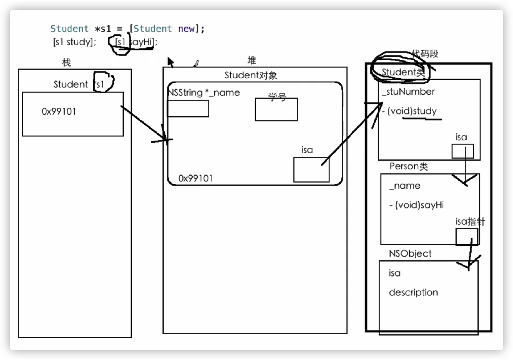

- 代码段的每一个类都有一个叫isa的指针，指向它的父类，一直指到NSObject

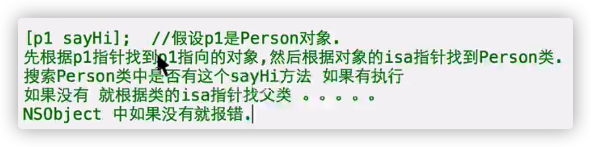

# 结构体与类

- 相同：都可以将多个数据封装成一个整体

```objective-c
struct Date{
  int year;
  int month;
  int day;
};
--------------------------
  @interface Date : NSObject
  {
  int year;
  int month;
  int day;
  }
@end
```

- 不同点

1、结构体只能封装数据，类还可以封装行为

2、结构体（局部变量）在栈，对象在堆空间

3、赋值方式不同

结构体之间的赋值：值的赋值

类与类的赋值：地址的赋值

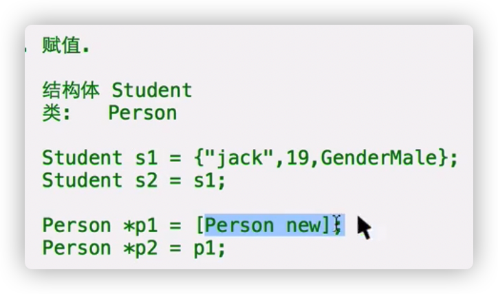

- 栈空间相对小，访问效率高

堆，空间相对大，访问效率较低

- 使用情况：

1、有方法，用类

2、属性较少，定义结构体；属性较多，定义类

# 类的本质

- 类什么时候加载到代码段：类加载，类第一次被访问

- 类加载到代码段，在程序结束之后才会被回收

- 类是以什么形式存储在代码段里的？

1、任何存储在内存中的数据都有一个数据类型

任何在内存中申请的空间都有自己的类型

2、在代码段存储类的空间是什么类型：

在代码段中存储类的步骤：

Class对象,类对象

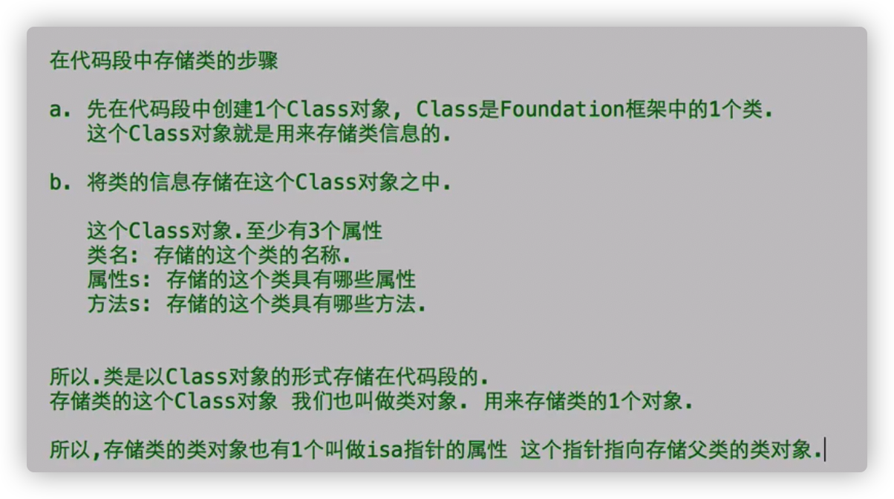

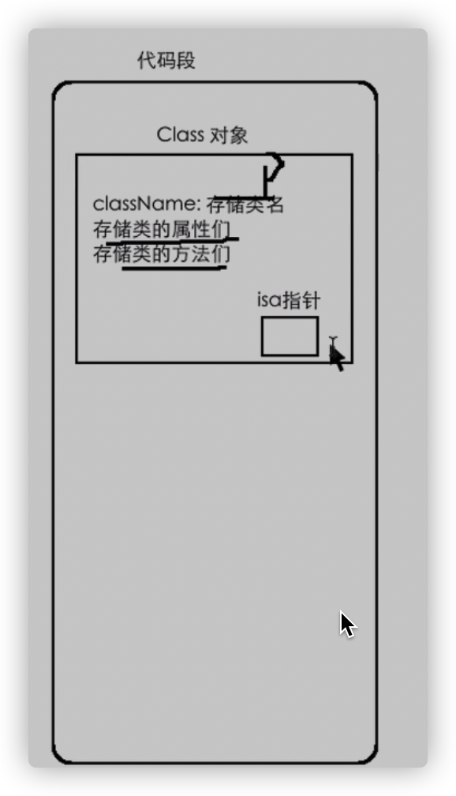

# 类对象的使用

- 拿到代码段中的类对象：

1、调用类的类方法class，得到存储类的类对象的指针

```objective-c
Class c1 = [Person class];
    //typedef struct objc_class *Class;
    //定义typedef的时候加*，声明类对象指针就不加*
```

2、调用对象的对象方法class，得到该对象 所属类的 存储该类的类对象的指针

```objective-c
Person* p1 = [Person new];
Class c2 = [p1 class];
```

3、对象里面isa的值就是该类对象的地址

- 如何使用类对象

 1)**c1对象 就等于 Person类**

 2）使用类对象来调用类的类方法

 [c1 sayHi];

 3)使用类对象调用new方法，创建存储在类对象中 类的对象

Person* p0 = [c1 new];

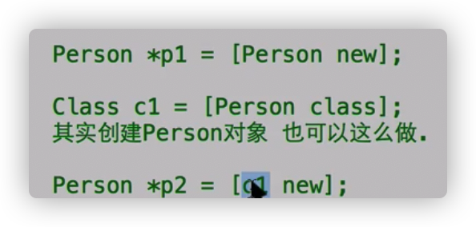

# SEL

- selector选择器：数据类型

SEL是一个类，SEL对象用来存储1个方法

class对象里面存储类的方法们，类的方法们在class对象里就是一个属性，属性的类型是SEL

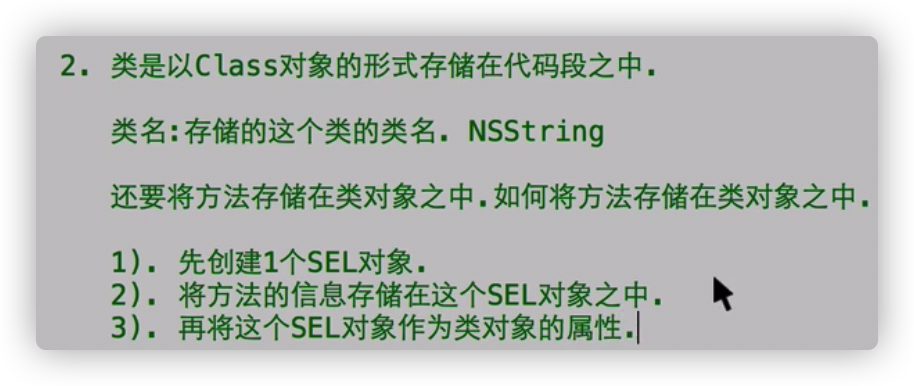

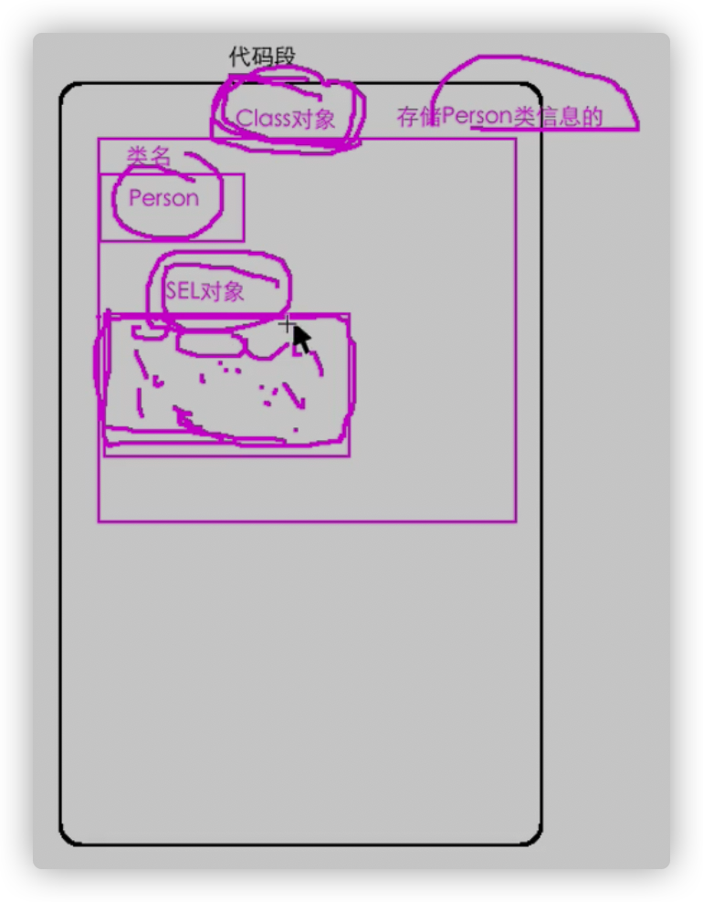

- 拿到存储方法的SEL对象

```objective-c
SEL SEL指针名称 = @selector(方法名);
-------------------------------------
SEL s1 = @selector(sayHi);
```

- 调用方法的本质

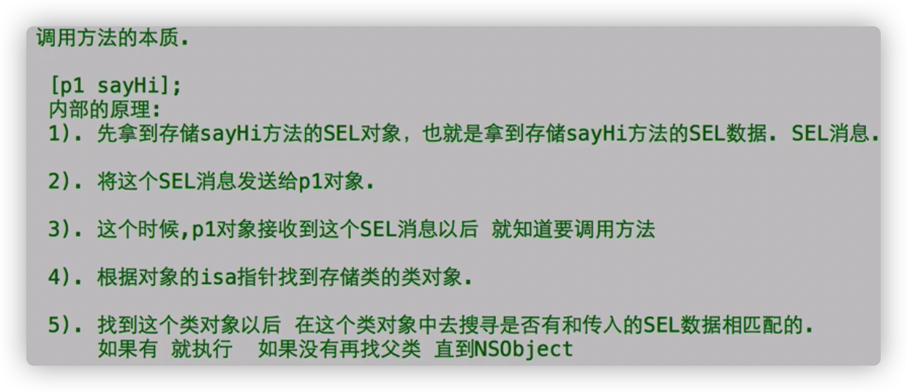


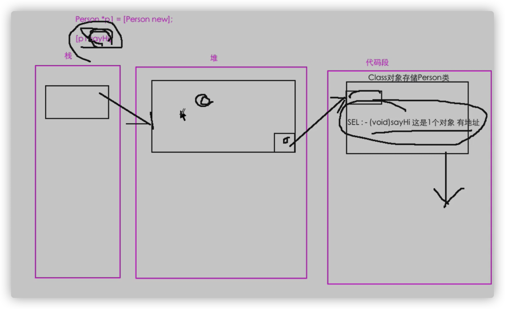

**OC最重要的一个机制：消息机制**

向p1对象（堆）发送一条sayHi消息

# 手动向对象发送SEL消息

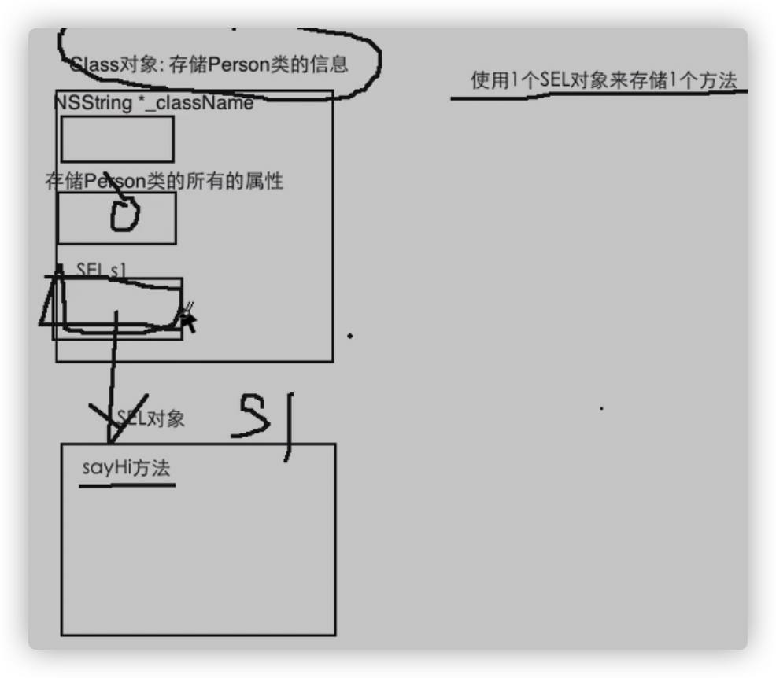

1、得到方法的SEL数据

```objective-c
SEL s1 = @selector(sayHi);
```

2、将SEL消息发送给p1对象

```objective-c
[p1 performSelector:s1];
```

- 调用对象的方法：

1、自动调用【对象名 方法名】

2、手动向对象发送SEL消息

- 注意：

如果方法有参数：

1、方法名带冒号

```objective-c
SEL s2 = @selector(eatfood:);
```

2、传参

一个参数：

```objective-c
[p1 performSelector:s2 withObject:@"牛蛙"];
```

2个参数

[performSelector: SEL指针 withObject:  参数1   withObject:  参数2  ];

多个参数：可以传参一个对象，把多个参数封装到对象里去

```objective-c
-(void)drinkWithWine:(NSString*)hongJiu:(NSString*)Weishiji:(NSString*)LongSheLan:(NSString*)WeiShiJi;
```

# 点语法

点语法在编译时会自动转换成getter,setter(**使用前提：属性封装getter，setter**)

**在有setter和getter方法的对象里**

- 点语法访问对象的属性

**对象名.去掉下划线的属性**

- 取出属性：同理

- 本质：

将点语法转化成：
【对象名 set去掉下划线的属性名：数据】

```objective-c
p1.age = 10;
等价于
[p1 setAge:10];
```

- 注意：

1、在getter和setter中慎用点语法，可能会造成无限递归（死循环）

2、使用点语法要求getter和setter的命名符合规范

3、使用点语法必须封装，getter，setter

----------

# @property

- 自动生成，getter，setter方法的**声明**

```objective-c
@property 数据类型 名称不加下划线
```

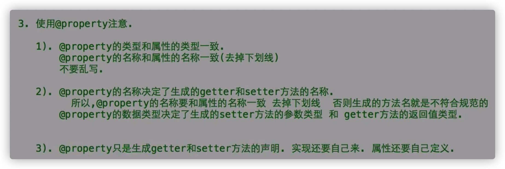

# @synthesize

- 英文：合成

- 自动生成setter，getter方法的**实现**，应该写在类的实现里面

```objective-c
@synthesize @property声明过的名称;
------------------------------
  @interface Person : NSObject
  {
    int _age;
  }//可以不声明属性了
@property int age;
@end
  ---------------------
  @implementation Person
  @synthesize age;
  @end
```

- 内部原理：

1、生成一个真私有属性，属性类型，名字和对应@property一致

```objective-c
@implementation Person
{
  int age;
}
```

2、生成setter方法的实现：将参数直接赋值给自动生成的私有属性

没有逻辑验证

```objective-c
- (void)setAge:(int)age{
  self->age = age;
}
```

3、生成getter方法的实现

```objective-c
- (int)age
{
  return age;
}
@end
```

- 如果希望@synthesize不自动生成私有属性，希望getter,setter实现自己声明的属性

```objective-c
@synthesize @property名称 = 已经存在的属性名；
  -------------------------
  @synthesize age = _age;
```

还是需要正常的@property

1、生成setter：把参数的值赋给指定的属性

2、生成getter：返回指定属性的值

- 如果想要setter，getter进行逻辑验证，就需要按照老方法自己写

- 批量声明：**类型一致情况下**

```objective-c
@property float height,weight;
```

批量实现：**类型可以不一致**

```objective-c
@synthesize name,age,weight;
@synthesize name = _name,age = _age,weight = _weight;
```

# @property增强

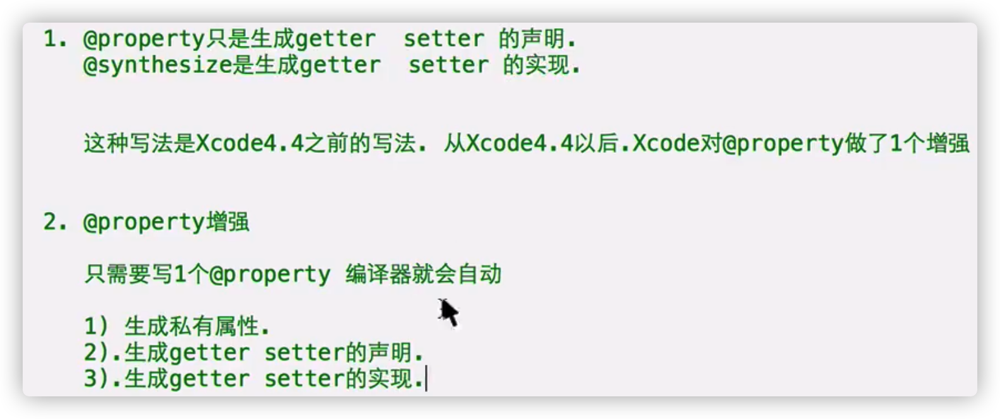

自动生成属性getter，setter的**声明和实现**

不需要别的了

属性的名字会加下划线 

- 批量声明 **相同类型**

```objective-c
@property float height, weight;
```

- 注意：

可以自己写getter，setter任何一个的逻辑验证，会自动生成另一个

如果setter和getter同时重写，@property就不会自动生成属性

- @property可以被继承：但是是私有属性，无法直接访问，想要在子类访问，必须通过**setter，getter**

# 静态类型和动态类型

- OC是一门弱语言：编译的时候，检查不是很严格（编译可以，运行报错）

优点：灵活

缺点：太灵活

强语言：编译就会报错  

- 静态类型：一个指针指向的对象是本类对象

```objective-c
Animal *a1 = [Animal new];
```

动态类型：一个指针指向的对象不是本类对象

```objective-c
Animal *a1 = [Pig new];
```

- 编译检查：

编译器在编译的时候，判断能否通过一个指针来调用指针指向对象的方法：
指针所属类是否有这个方法，有可以，没有报错

**编译时，能否调用方法看指针的类型**

```objective-c
Animal* a1 = [Pig new];
    [(Pig*)a1 eat];//强制类型转换，骗过编译器
```

- 运行检查：

有的语句可以骗过编译器，但是运行就报错

运行时，会调用对应对象类的方法

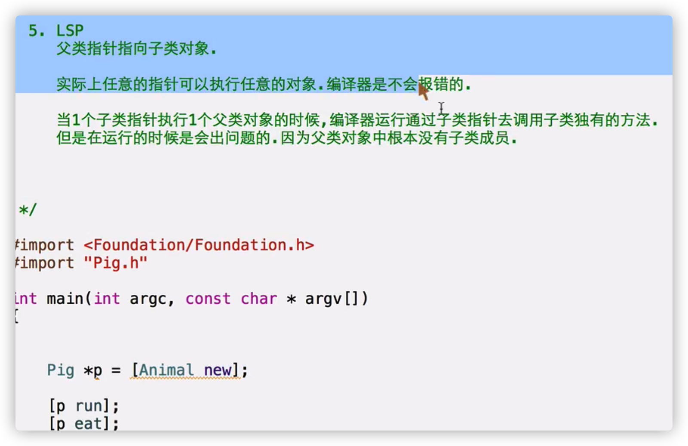

# id指针

- NSObject是所有类的**基类**

 根据LSP，NSObject可以指向任何OC对象，NSObject是**万能指针**

- 缺点：调用指向子类对象的独有方法，必须强制类型转换

- id指针：万能指针，可以指向任意的OC对象

**声明id指针不需要加*** 

```objective-c
 id id1 = [Person new];
```

- Id 与 NSObject指针的区别

```objective-c
NSObject *obj = [Person new];
[obj sayHi];
//NSObject里面没有sayHi方法，编译时就会报错
id id1 = [Person new];
[id1 sayHi];
//看到id，直接编译通过
```

- **用id指针类型，不用NSObject指针类型**
- **id类型指针不能使用点语法,也不能使用->**,如果想访问属性用setter,getter

**id只能调用方法**

```objective-c
id id1 = [Person new];
[id1 setName:@"jack"];
```


# instancetype

- 创建对象类方法(父类子类通用)

```objective-c
+(id)person 
{
    return [self new];
}
```

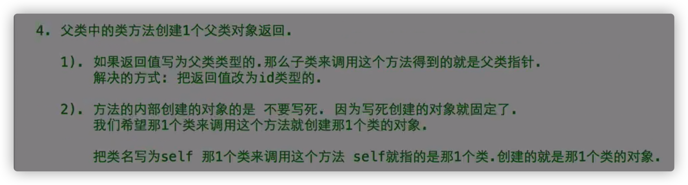

但是方法的返回值id类型，无法指定接收的变量是指定对象的指针

- Instancetype:**有类型，返回值是当前类的对象**

```objective-c
+(instancetype)person 
{
    return [self new];
}
```

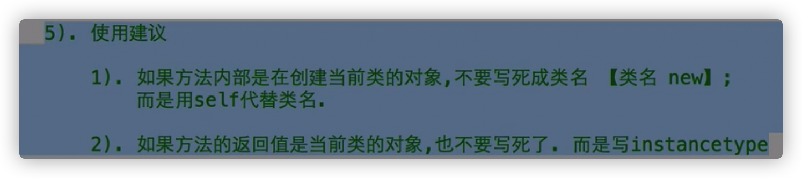

- instancetype**只能作为方法的返回值**

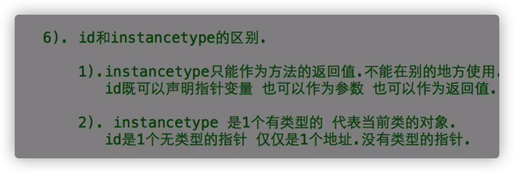

# 动态类型检测

- 苹果编译器：LLVM

程序就算编译通过，也不意味会完美执行

- **respondsToSelector:@selector（方法名）**避免编译检查遇到不存在的方法，直到运行的时候才会报错

**是对象方法**

\- (BOOL)respondsToSelector:(SEL)aSelector;

```objective-c
 BOOL b1 = [p1 respondsToSelector:@selector(sayHi)];
    if(b1 == YES){
        [p1 sayHi];
    }
//判断p1对象能否响应sayHi方法
```

判断**对象**是否有这个**对象方法**(包括自己的对象方法和继承过来对象的方法)

```objective-c
BOOL b1 = [Student respondsToSelector:@selector(person)];
    NSLog(@"b1 = %d",b1);
```

判断**类**是否有这个**类方法**(包括自己的类方法和继承过来的类方法)

- **isKindOfClass:**

\- (BOOL)isKindOfClass:(Class)aClass;

```objective-c
BOOL b2 = [p1 isKindOfClass:[Person class]];
    NSLog(@"b2 = %d",b2);
    //判断p1对象是不是Person或Person子类对象
```

- **isMemberOfClass:**

\- (BOOL)isMemberOfClass:(Class)aClass;

```objective-c
BOOL b3 = [s1 isMemberOfClass:[Person class]];
    NSLog(@"b3 = %d",b3);
    //判断s1对象是不是Person类的对象，不包括其子类对象
```

- **Student isSubclassOfClass:**

\+ (BOOL)isSubclassOfClass:(Class)aClass;

```objective-c
BOOL b4 = [Student isSubclassOfClass:[Person class]];
    NSLog(@"b4 = %d",b4);
    //判断Student是否是Person的子类
```

# 构造方法init

- new实际上是一个类方法，在【】里面写

作用：创建对象，初始化对象，返回对象地址

\+ (instancetype)new OBJC_SWIFT_UNAVAILABLE("use object initializers instead");

|                                                              |
| ------------------------------------------------------------ |
| This method is a combination of [alloc](doc://com.apple.documentation/documentation/objectivec/nsobject/1571958-alloc?language=swift) and [init](doc://com.apple.documentation/documentation/objectivec/nsobject/1418641-init?language=swift). Like [alloc](doc://com.apple.documentation/documentation/objectivec/nsobject/1571958-alloc?language=swift), it initializes the `isa` instance variable of the new object so it points to the class data structure. It then invokes the [init](doc://com.apple.documentation/documentation/objectivec/nsobject/1418641-init?language=swift)method to complete the initialization process. |
|                                                              |

alloc+init

- alloc

+(instancetype)alloc;

类方法，哪一个类调用这个方法，就创建哪一个类的对象， 并返回地址

- **构造方法init**

\- (instancetype)init

对象方法，初始化对象,为对象的属性赋默认值

基本数据，0

C指针，NULL

OC指针，nil

- 自己规定初始化的值，重写init方法

规范：

1、必须先调用父类init方法，把返回值给self

2、使用init初始化对象可能会失败，初始化失败就是nil

3、判断父类是否初始化成功，判断self值是否是nil,不是nil即初始化成功

调用父类的init方法会初始化父类的属性，要保证当前对象中父类的属性也被初始化

4、最后返回self值

```objective-c
- (instancetype)init{
  self = [super init];
  //调用父类的init方法，返回初始化成功的对象
  if(self != nil){
        self.name = @"jack";
    }
    return self;
}
-------------不同的写法------------------
 
  - (instancetype)init{
  //调用父类的init方法，返回初始化成功的对象
  if(self = [super init]){
        self.name = @"jack";
    }
    return self;
}
```

```objective-c
真正使用的 
  - (instancetype) init
{
  if(self = [super init]){
    //初始化当前类属性的代码;
  }
  return self;
}
```

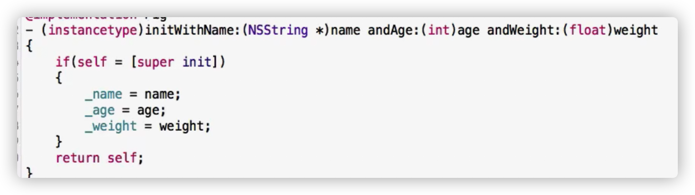

# 自定义构造方法

- 调用者可以指定需要初始化的变量的数据

- 规范

1、返回值：instancetype

2、名称initWith开头

3、方法的实现和init一样

```objective-c
Dog* d1 = [[Dog alloc]initWithName:@"大狗" andAge:132];
    return 0;
```

- self只有在构造方法中赋值，构造方法以initWith开头

