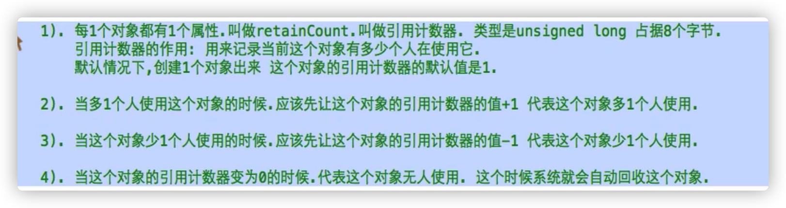
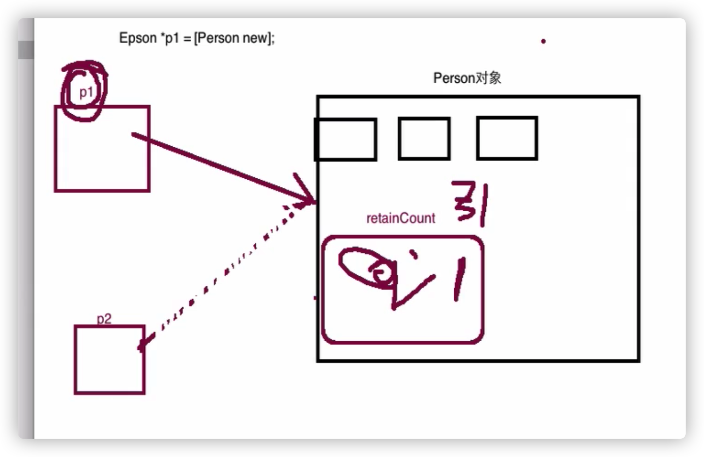
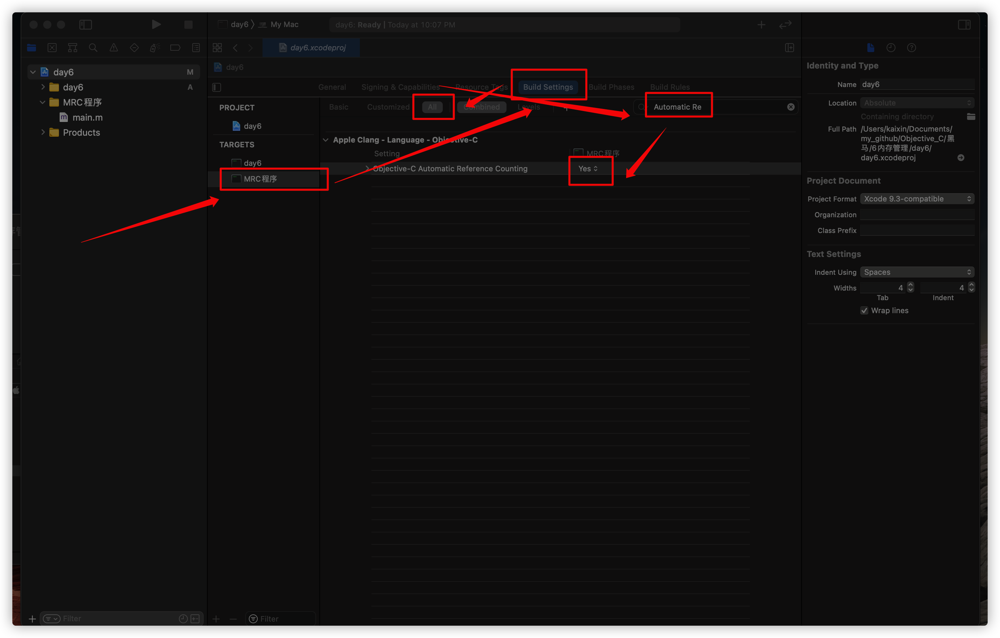
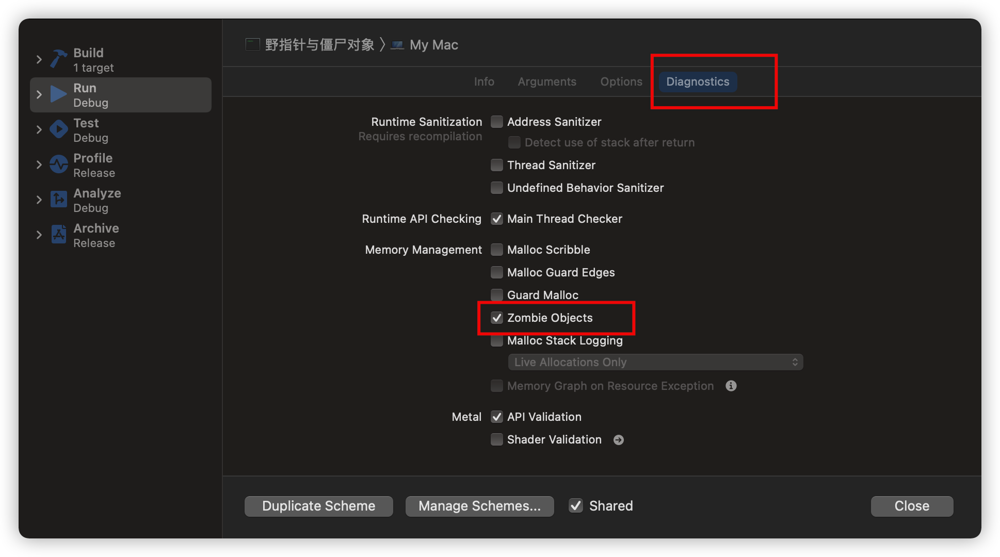
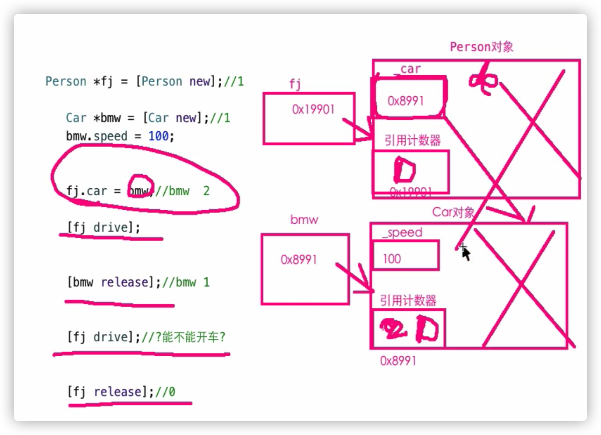
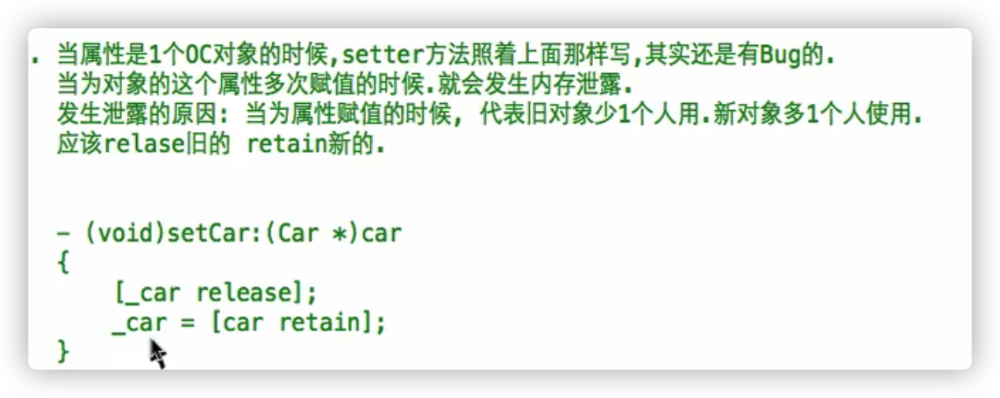
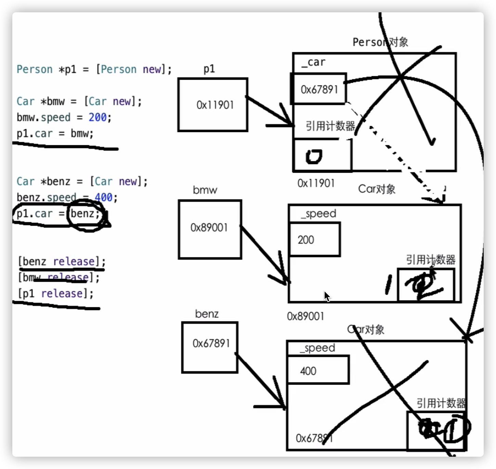
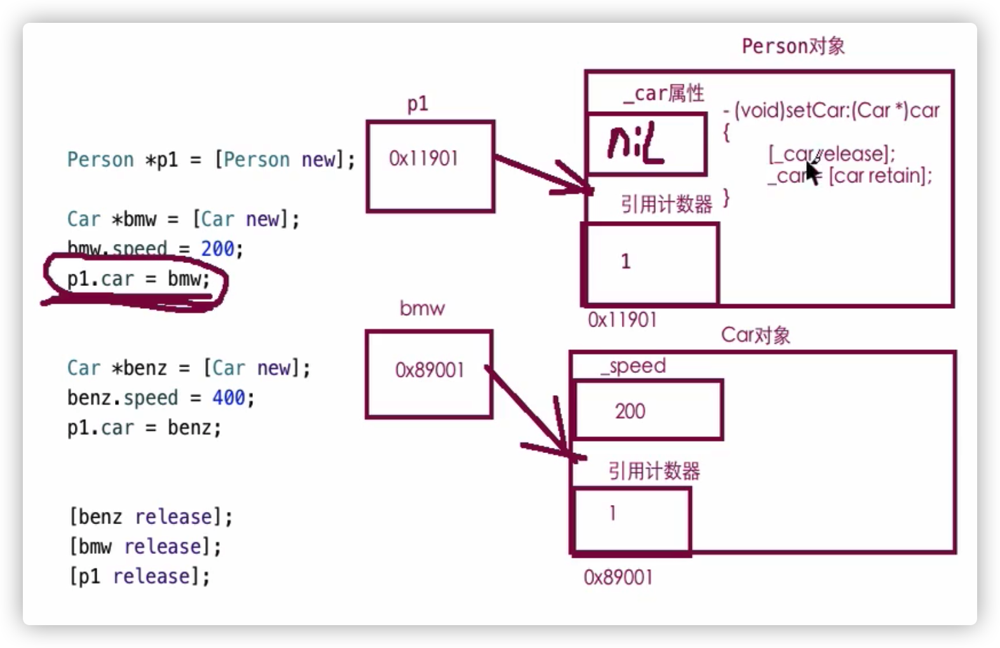
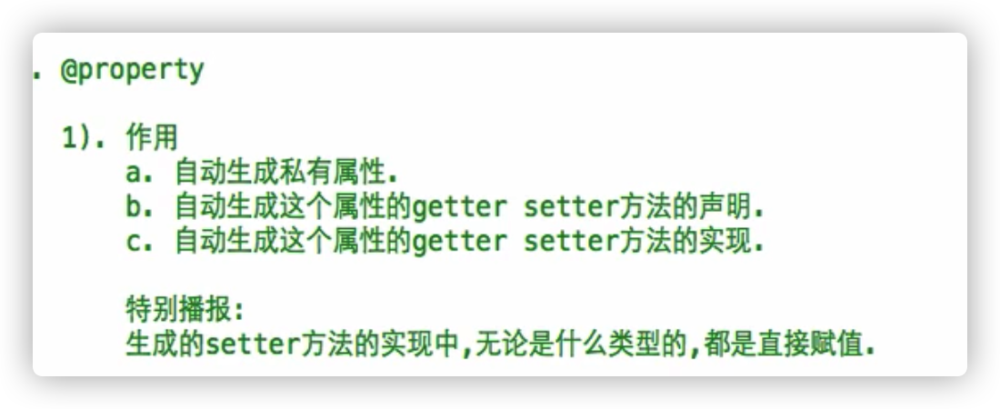
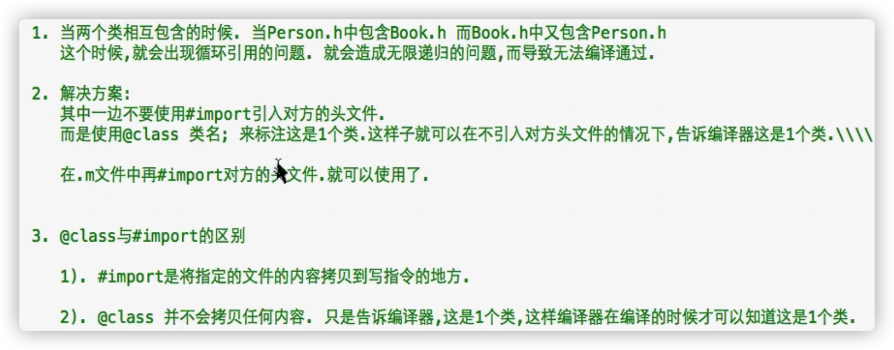

#  内存管理

- 内存：存储数据

1、如何将数据存储在内存中：变量

2、数据不再会被使用时，占用的内存空间如何被释放

内存中5大区域：

栈：局部变量，局部变量的作用域执行完毕后，局部变量就会被系统回收（那一对大括弧）

堆：OC对象，malloc等等

BSS段：未初始化堆全局变量，静态变量（一旦初始化就回收，转存在数据段里）

数据段：初始化了的全局变量，静态变量，程序结束自动回收

代码段：代码，程序结束自动回收

- iPhone内存机制，40M发警告，120M闪退

- 内存管理的范围：管理堆的数据

- 回收存储在堆里的OC对象：以后不会使用该对象的时候

- 引用计数器**retainCount**：每一个对象都有的属性，记录**当前**该对象有多少人（指针等等）在使用

**默认值1**

类型是unsigned long 8个字节





- 如何操作引用计数器

多一个人使用该对象时，向对象发送**retain**消息，对象的引用计数器+1

少一个人使用该对象时，向对象发送**release**消息，对象的引用计数器-1

查看现在引用计数器的值，向对象发送retainCount消息

当对象被回收时，会自动调用对象的**dealloc**方法

# 内存管理的分类

- **MRC：Manual Reference Counting 手动引用计数，手动内存管理，管理的只有OC对象**

手动发送retain,release消息

- **ARC:Automatic Reference Counting 自动计数，自动内存管理**

系统自动发送retain,release消息

- MRC

IOS 5,Xcode4.2开始支持ARC 

Xcode 7 默认ARC

想要用MRC需要关闭ARC



- 重写dealloc方法的规范：

必须调用父类的dealloc方法，并将其放在最后一句


```objective-c
- (void)dealloc{
    NSLog(@"%@挂了",_name);
    [super dealloc];
}
```


**ARC机制下，retain,release,dealloc无法使用**

- 内存管理的原则

1、对象的创建，匹配一个release

2、retain次数和release次数匹配（除了1、之外）

3、谁用谁retain，谁不用谁release

# 野指针与僵尸对象

- C语言 野指针：定义一个指针变量，没有初始化，垃圾值，指向随机空间 

OC语言 僵尸对象：指针指向的对象已经被回收

```objective-c
Person* p1 = [Person new];
    [p1 release];
    //对象已经被回收，p1现在是野指针
```

- 对象回收的本质：

垃圾值：变量回收，可以使用该空间，但是原来变量的值没有变

僵尸对象：一个已经释放的对象，该对象所占的空间还没有分配给别人

通过野指针访问僵尸对象时，有可能没有问题，有可能有问题

没问题：僵尸对象占用的空间没有分配给别人使用

- **只要对象成为了僵尸对象，你就别访问**

- 让访问僵尸对象时报错：

Xcode机制：僵尸对象实时检查机制




默认不打开，可以省性能

- 如何避免僵尸对象错误：

**将野指针的值设为nil,通过该指针来调用对象方法(包括点语法）时，不会报错，没有反应。如果直接访问属性（->）的话，直接报错**

**不要轻易给一个指针赋值nil，除非是野指针**

- 无法复活一个僵尸对象

# 单个对象的内存管理

- 内存泄露：一个对象没有及时回收，一直滞留在内存中，直到程序结束

- 单个对象的内存泄露情况：

1、有对象的创建，没有对应的release

2、release和retain次数不匹配

3、在不适当的时候（回收对象之前），将指针赋值nil

让指针指向空地址，但是对象还在，之后的retain,release就不能通过该指针调用




- 当属性是一个OC对象时

  setter方法：

执行该方法可能之前已经被使用了，_car属性原本指向的对象少一个人使用，需要release旧的，传入的对象多一个人使用多了一个人使用，需要retain新的

当新旧对象是同一个对象时，就不需要再用setter方法（改进）



```objective-c
- (void)setCar:(Car*)car
{
  if(_car != car){//说明新旧对象不是同一个对象
    [_car release];//release旧的
  _car = [car retain];//retain新的
  }
}//retain返回当前对象
```

当前对象回收时，属性指向的对象少一个人使用，在dealloc中release

```objective-c
- (void)dealloc
{
  [_car release];
  [super dealloc];
}
```





**NSString也是OC对象**

```objective-c
- (void)setName:(NSString*)name
{
  if(_name != name){
    [_name release];
    _name = [name retain];
  }
}
```

# @property参数



- @property（参数1，参数2，，，）数据类型 名称；

- 四组参数

1、与多线程相关的两个参数：

Atomic

nonatomic

2、与setter方法的实现相关的参数

assign

Retain

3、与生成只读、读写相关的参数

readonly

readwrite

4、与生成getter,setter方法名字相关的参数

getter

Setter

# 与多线程相关的参数

- atomic 默认值:生成setter方法的代码会加上一把线程安全锁

特点：安全，效率低。一个一个访问，排排队

- Nonatomic：生成setter方法的代码**不**会加上一把线程安全锁

特点：不安全，效率高

**建议nonatomic**

# 与生成的setter方法的实现相关的参数

- Assign **默认值**：生成setter方法的实现是直接赋值,不会增减引用计数器

- Retain ：生成的setter方法的实现是标准**MRC**内存管理代码(就是之前笔记上的）)

判断新旧对象是否是同一个对象，不是release旧的，retain新的

- 使用：

**属性的类型是OC对象，使用retain**

- 注意：

**用了retain参数，还要手动在dealloc中release**

# 与生成只读与读写的参数

- readwrite 默认值 ：同时生成setter，getter 

- readonly ：只会生成getter

无法 p1.car = [Car new];

# 生成getter,setter方法名称相关的参数

- 默认情况下@property生成的getter，setter方法的名字都是最标准的名字

```objective-c
- (void)steAge;
- (int)age; 
```

- get:指定@property生成getter的名字

```objective-c
@property(nonatomic,assign,getter=xxx)int age;
生成：
- (void)setAge:(int)age;
- (int)xxx;
```

- Setter:指定@property生成setter的名字

Setter方法带参数，需要加：

```objective-c
@property(nonatomic,assign,getter=xxx,setter=xyz:)int age;
```

如果使用点语法，编译器会调用修改后名字的代码（本质上都是getter，setter）

**别setter改方法名**

用getter改方法名为了可读性：

**当属性的类型是BOOL类型时，修改getter名字以is开头**

# @class

- 两个类（的属性）互相包含的时候：头文件相互引用，会出现循环引用问题，会无限递归，报错

- 解决：将其中一个头文件（A）引用的#import关键字改为**@class关键字 类名；**

同时，在之前的类（A）的.m文件中，@import “头文件”

在不引入头文件的情况下，告诉编译器这是一个类

- #import与@class

1、#import将指定的文件内容拷贝到指定地方

2、@class不拷贝，告诉编译器这是一个类



# 循环retain

- 当两个对象相互引用的时候

A的属性是B对象，B的属性是A对象

如果两边都用retain参数会内存泄露

- 解决方案：

一端使用retain，另一端使用assign

使用assign那端在dealloc里面就不需要release

只要一边dealloc就会顺带把另外一边dealloc

