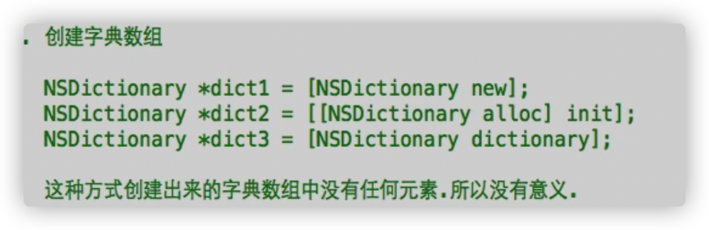
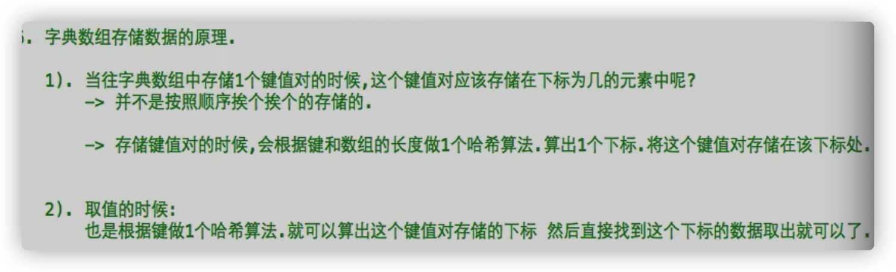
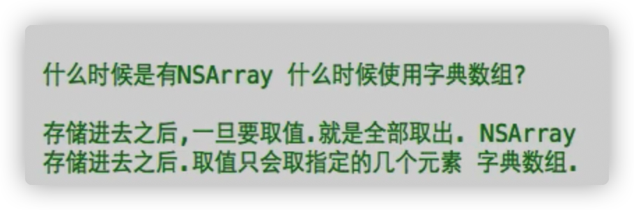
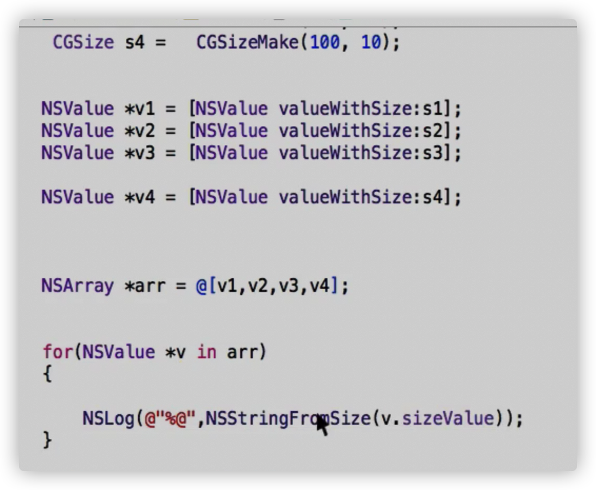
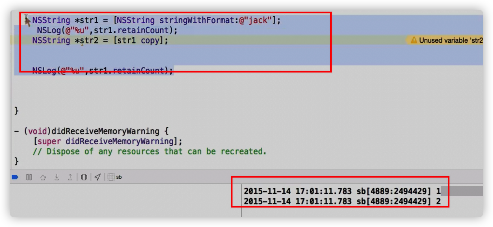
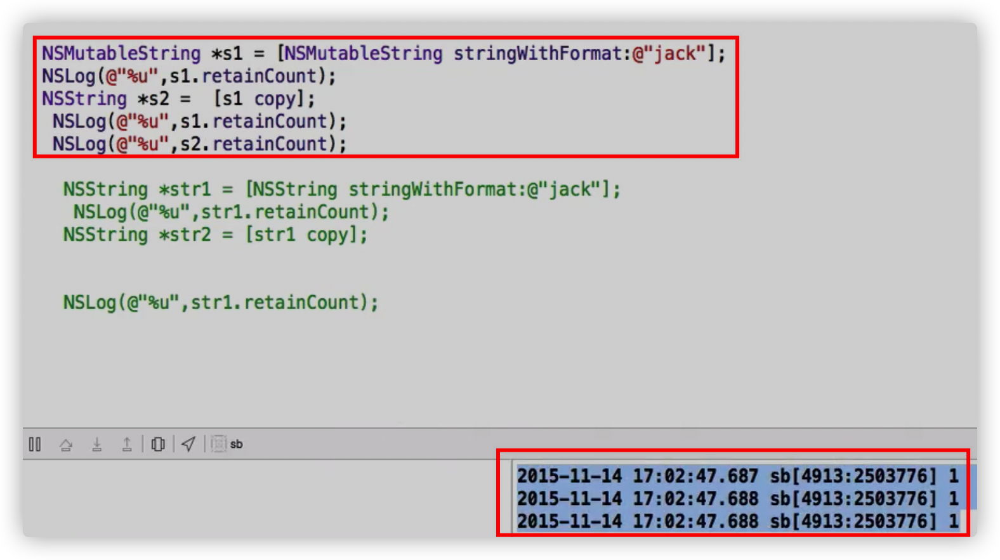
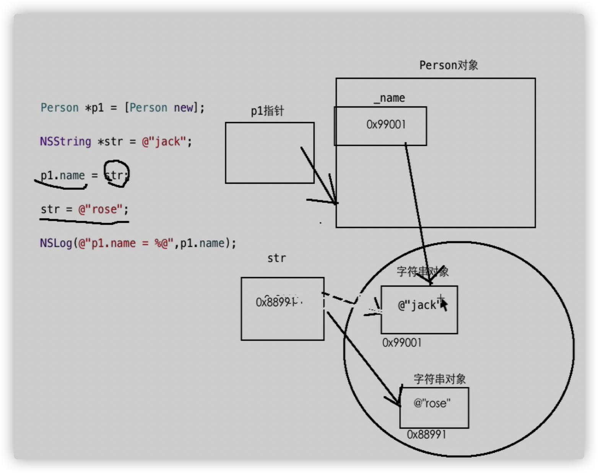
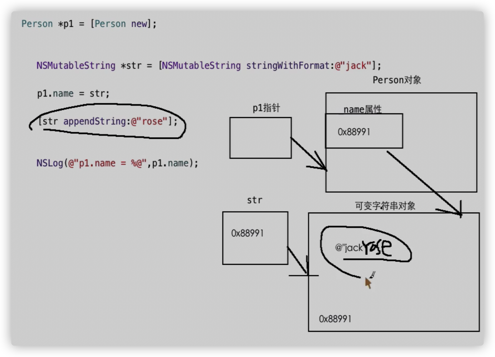
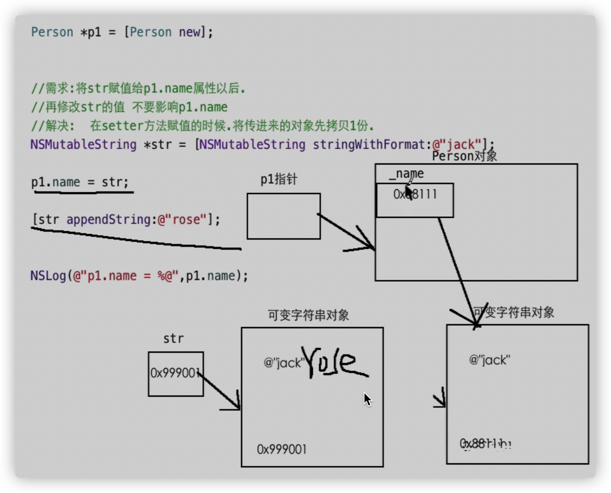
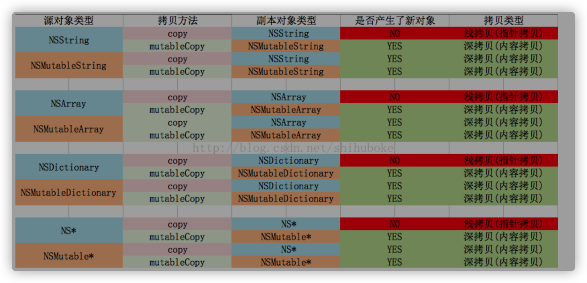

# 补充

- 将数组元素的值保存在磁盘上

数据的持久化

plist文件，属性列表文件：可以将数组中的元素保存在这个文件中

\- (BOOL)writeToFile:(NSString *)path atomically:(BOOL)useAuxiliaryFile API_DEPRECATED_WITH_REPLACEMENT("writeToURL:error:", macos(10.0, API_TO_BE_DEPRECATED), ios(2.0, API_TO_BE_DEPRECATED), watchos(2.0, API_TO_BE_DEPRECATED), tvos(9.0, API_TO_BE_DEPRECATED));

```objective-c
NSArray * arr = @[@"jack",@"rose",@"helen"];
    [arr writeToFile:@"/Users/kaixin/Documents/pl.plist" atomically:NO];
//创建一个文件，文件自己命名，格式是plist
```

- 保存磁盘上 数组元素的值 到Xcode

\+ (nullable NSArray<ObjectType> *)arrayWithContentsOfFile:(NSString *)path API_DEPRECATED_WITH_REPLACEMENT("arrayWithContentsOfURL:error:", macos(10.0, API_TO_BE_DEPRECATED), ios(2.0, API_TO_BE_DEPRECATED), watchos(2.0, API_TO_BE_DEPRECATED), tvos(9.0, API_TO_BE_DEPRECATED));

```objective-c
 NSArray * arr = [NSArray arrayWithContentsOfFile:@"/Users/kaixin/Documents/pl.plist"];
    if(arr != nil)
    {
        for(NSString * str in arr)
        {
            NSLog(@"%@",str);
        }
    }//如果文件不存在arr的值就是nil
```

- 也可以直接在plist文件中修改元素

# NSDictionary字典数组

- NSArray与NSMutableArray

每一个元素紧密相连，每一个元素直接存储数据

缺点：元素下标不固定（无法通过下标确定指定元素）

- Kay-value 键值对

存储数据，给每一个数据一个别名，通过别名（key）找数据（value）

而不是通过下标找，下标可能发生变化

- NSDictionary是数组，以键值对的形式存储数据

特点：

1、数组一旦创建就不能增减元素

2、键：遵守了NSCoping协议的对象，**比如NSString**

值：**只能OC对象**

- 语法



\+ (instancetype)dictionaryWithObjectsAndKeys:(id)firstObject, ... NS_REQUIRES_NIL_TERMINATION NS_SWIFT_UNAVAILABLE("Use dictionary literals instead");

```objective-c
//值先键后
    NSDictionary *dict = [NSDictionary dictionaryWithObjectsAndKeys:@"jack",@"name",@"OC",@"lan" ,nil];
```

- 简要创建方式

```objective-c
NSDictionary * dict = @{键1:值1，键2:值2，键3：值3};
NSDictionary * dict = @{@"name":@"rose",@"lan":@"OC"};

```

# NSDictionary使用

- 打印%@

- 取值：使用别名取

1、中括弧

```objective-c
字典数组名[键]；
    NSLog(@"%@",dict[@"name"]);
```

2、对象方法

\- (nullable ObjectType)objectForKey:(KeyType)aKey;

```objective-c
    NSLog(@"%@",[dict objectForKey:@"name"]);
```

如果没有这个键，就是nil，不报错

- 字典数组的键值对的个数

@property (readonly)NSUInteger count;

```objective-c
    NSLog(@"%lu",dict.count);
//dict这个字典数组里面有多少个元素
```

- 注意：

键名**不能重复**

- 遍历：

for不能用：NSDictionary不能使用下标

1、单独使用使用for in循环遍历出来的是所有的键

```objective-c
 NSDictionary * dict = @{@"name":@"rose",@"l语言":@"OC"};

    for(id item in dict)
    {
        NSLog(@"%@ = %@",item,dict[item]);
    }
```

2、使用block

```objective-c
 NSDictionary * dict = @{@"name":@"rose",@"l语言":@"OC"};
    [dict enumerateKeysAndObjectsUsingBlock:^(id  _Nonnull key, id  _Nonnull obj, BOOL * _Nonnull stop) {
        NSLog(@"%@ %@",key,obj);
    }];
```

# NSDictionary内存

以哈希算法算出的下标来存取，并不是按照顺序存储



- NSDictionary NSArray

存的时候：NSArray效率高

取的时候：全部取出NSArray效率高；取出指定元素NSDictionary效率高



# NSMutableDictionary

- 是NSDictionary的子类，以键值对形式存储数组

存储在其中的元素可以动态增减

```objective-c
 NSMutableDictionary * dict1 = [NSMutableDictionary new];
    NSMutableDictionary * dict2 = [[NSMutableDictionary alloc] init];
    NSMutableDictionary * dict3 = [NSMutableDictionary dictionary];
//都可以创建
```

```objective-c
NSMutableDictionary * dict1 = @{
  @"name":@"jack",
  @"age":@"10"
};
//不可以。子类指针指向父类对象
```

- 新增键值对：

\- (void)setObject:(ObjectType)anObject forKey:(KeyType <NSCopying>)aKey;

```objective-c
NSMutableDictionary * dict1 = [NSMutableDictionary new];
    [dict1 setObject:@"火星" forKey:@"xingqiu"];
```

**如果键名重复，就会用新加的那个**

- 删除元素

1、删除所有键值对

\- (void)removeAllObjects;

```objective-c
 [dict1 removeAllObjects];
```

2、删除指定的键值对（根据键）

\- (void)removeObjectForKey:(KeyType)aKey;

```objective-c
    [dict1 removeObjectForKey:@"xingqiu"];
```

# 字典数组的持久化

持久化，永远保存下来

plist文件

- 存

\- (BOOL)writeToFile:(NSString *)path atomically:(BOOL)useAuxiliaryFile API_DEPRECATED_WITH_REPLACEMENT("writeToURL:error:", macos(10.0, API_TO_BE_DEPRECATED), ios(2.0, API_TO_BE_DEPRECATED), watchos(2.0, API_TO_BE_DEPRECATED), tvos(9.0, API_TO_BE_DEPRECATED));

```objective-c
    [dict1 writeToFile:@"/Users/kaixin/Documents/pl.plist" atomically:NO];
```

- 取

\+ (nullable NSDictionary<KeyType, ObjectType> *)dictionaryWithContentsOfFile:(NSString *)path API_DEPRECATED_WITH_REPLACEMENT("dictionaryWithContentsOfURL:error:", macos(10.0, API_TO_BE_DEPRECATED), ios(2.0, API_TO_BE_DEPRECATED), watchos(2.0, API_TO_BE_DEPRECATED), tvos(9.0, API_TO_BE_DEPRECATED));

```objective-c
NSDictionary * dict1 = [NSDictionary dictionaryWithContentsOfFile:@"/Users/kaixin/Documents/pl.plist"];
    NSLog(@"%@",dict1);
```

# 集合的内存管理

- 集合：NSArray集合 ,NSDictionary字典集合

- 将对象存储在集合中，该对象的引用计数器+1

当集合销毁的时候，会向存储在集合中的所有对象发送release消息

- 使用 @[ ]  @{ } 或调用和类同名的类方法，创建集合，放在autoreleasepool里面就已经autorelease过了 

```objective-c
NSArray * arr1 = [NSArray arrayWithObjects:@"jack",@"helen", nil];
    NSArray * arr2 = @[@"jack",@"helen"];
//上面的方法创建集合放在autoreleasepool里面就被autorelease过了
```

- 在ARC模式下，集合的元素是强类型的指针

```objective-c
Person * p1 = [Person new];
NSArray * arr = @[p1];
```

# NSFileManager

- 是Foundation框架中提供的一个类：操作（复制，删除等等）磁盘上的文件，文件夹

- NSFileManager这个类的对象是以单例模式创建的

```objective-c
NSFileManager * fileManager = [NSFileManager defaultManager];
//得到单例对象
```

# 常用方法：判断

1、判断指定的文件/文件夹在磁盘上是否真实存在

\- (BOOL)fileExistsAtPath:(NSString *)path;

```objective-c
NSFileManager * fileManager = [NSFileManager defaultManager];
    NSString * path = @"/Users/kaixin/Documents/pl.plist";
    BOOL res = [fileManager fileExistsAtPath:path];
```

2、判断指定的路径是否是文件/文件夹，并判断是文件路径还是文件夹路径

\- (BOOL)fileExistsAtPath:(NSString *)path isDirectory:(nullable BOOL *)isDirectory;

Directory dəˈrektəri  (计算机文件或程序的)目录;

```objective-c
NSFileManager * fileManager = [NSFileManager defaultManager];
    BOOL flag = NO;
    BOOL res = [fileManager fileExistsAtPath:@"/Users/kaixin/Documents/pl.plist" isDirectory:&flag];
    if(res == YES)
    {
        NSLog(@"存在路径");
        if(flag == YES)
        {
            NSLog(@"是文件夹");
        }
        else{
            NSLog(@"是文件");
        }
    }else
    {
        NSLog(@"给定的路径不存在");
    }
```

3、判断指定文件/文件夹 是否可以**读取**

\- (BOOL)isReadableFileAtPath:(NSString *)path;

```objective-c
NSFileManager * fileManager = [NSFileManager defaultManager];
    BOOL res = [fileManager isReadableFileAtPath:@"/Users/kaixin/Documents/p.plist"];
```

4、判断指定文件/文件夹 是否可以**写入**

\- (BOOL)isWritableFileAtPath:(NSString *)path;

```objective-c
 NSFileManager * fileManager = [NSFileManager defaultManager];
    BOOL res = [fileManager isWritableFileAtPath:@"/Users/kaixin/Documents/pl.plist"];
```

5、判断指定文件/文件夹 是否可以**删除**

\- (BOOL)isDeletableFileAtPath:(NSString *)path;

```objective-c
NSFileManager * fileManager = [NSFileManager defaultManager];
    BOOL res = [fileManager isDeletableFileAtPath:@"/Users/kaixin/Documents/pl.plist"];
```

# 常用方法：获取信息

1、拿到文件/文件夹的相关所有信息

\- (nullable NSDictionary<NSFileAttributeKey, id> *)attributesOfItemAtPath:(NSString *)path error:(NSError **)error API_AVAILABLE(macos(10.5), ios(2.0), watchos(2.0), tvos(9.0));

```objective-c
 NSFileManager * fileManager = [NSFileManager defaultManager];
    NSDictionary * dict = [fileManager attributesOfItemAtPath:@"/Users/kaixin/Documents/pl.plist" error:nil];
    NSLog(@"%@",dict);
NSLog(@"%@",dict[NSFileSize]);
//只打印文件大小
//返回值是字典数组，如果想要拿到特定的信息，通过key就行
```

2、获取指定文件夹下所有文件和文件夹 以及文件夹里面的所有东西（就着一个文件夹挖到底）（多辈）

\- (nullable NSArray<NSString *> *)subpathsAtPath:(NSString *)path;

```objective-c
 NSFileManager * fileManager = [NSFileManager defaultManager];
    NSArray * arr = [fileManager subpathsAtPath:@"/Users/kaixin/Documents/xcode_projs"];
    NSLog(@"%@",arr);
//下面的可以打印中文
    for(NSString * str in arr)
    {
        NSLog(@"%@",str);
    }
```

3、获取指定文件夹下的子目录（一辈）

\- (nullable NSArray<NSString *> *)contentsOfDirectoryAtPath:(NSString *)path error:(NSError **)error API_AVAILABLE(macos(10.5), ios(2.0), watchos(2.0), tvos(9.0));

```objective-c
NSFileManager * fileManager = [NSFileManager defaultManager];
    NSArray * arr = [fileManager contentsOfDirectoryAtPath:@"/Users/kaixin/Documents/xcode_projs" error:nil];
    for(NSString * str in arr)
    {
        NSLog(@"%@",str);
    }//也可以打印出隐藏文件（以.开头）
```

# 常用方法 其他

1、在指定的目录创建文件

\- (BOOL)createFileAtPath:(NSString *)path contents:(nullable NSData *)data attributes:(nullable NSDictionary<NSFileAttributeKey, id> *)attr;

attribute [əˈtrɪbjuːt , ˈætrɪbjuːt] 属性

```objective-c
NSFileManager * fileManager = [NSFileManager defaultManager];
    NSString * str = @"我爱赚钱";
    NSData * data = [str dataUsingEncoding:NSUTF8StringEncoding];
//将字符串转换成二进制
    BOOL  res = [fileManager createFileAtPath:@"/Users/kaixin/Documents/my_github/Objective_C/黑马/haha.tex" contents:data attributes:nil];
    if(res == YES)
    {
        NSLog(@"成功");
    }
    else
    {
        NSLog(@"失败");
    }
```

第二个参数：文件的内容，二进制（存储在磁盘上的任何文件都是以二进制的形式存储的）

NSData对象专门来保存二进制数据

第三个参数：文件属性

2、在指定的目录创建文件夹

\- (BOOL)createDirectoryAtPath:(NSString *)path withIntermediateDirectories:(BOOL)createIntermediates attributes:(nullable NSDictionary<NSFileAttributeKey, id> *)attributes error:(NSError **)error API_AVAILABLE(macos(10.5), ios(2.0), watchos(2.0), tvos(9.0));

Directory [dəˈrektəri] 目录

intermediate [ˌɪntəˈmiːdiət] 中间的

```objective-c
 NSFileManager * fileManager = [NSFileManager defaultManager];
    BOOL res = [fileManager createDirectoryAtPath:@"/Users/kaixin/Documents/my_github/Objective_C/黑马/AA/BB/CC" withIntermediateDirectories:YES attributes:nil error:nil];
    if(res == YES)
       {
           NSLog(@"成功");
       }
       else
       {
           NSLog(@"失败");
       }
```

第二个参数：YES一路创建（新建文件夹里新建文件夹等等）；NO不是一路创建

3、拷贝文件

\- (BOOL)copyItemAtPath:(NSString *)srcPath toPath:(NSString *)dstPath error:(NSError **)error API_AVAILABLE(macos(10.5), ios(2.0), watchos(2.0), tvos(9.0));

拷贝到的路径，相当于再创建一个文件（可以重命名）

```objective-c
NSFileManager * fileManager = [NSFileManager defaultManager];
    BOOL res = [fileManager copyItemAtPath:@"/Users/kaixin/Documents/my_github/Objective_C/黑马/10Foundation框架2/10.md" toPath:@"/Users/kaixin/Documents/my_github/Other-notes/10.md" error:nil];
    if(res == YES)
           {
               NSLog(@"成功");
           }
           else
           {
               NSLog(@"失败");
           }
```

4、移动文件（剪贴）

\- (BOOL)moveItemAtPath:(NSString *)srcPath toPath:(NSString *)dstPath error:(NSError **)error API_AVAILABLE(macos(10.5), ios(2.0), watchos(2.0), tvos(9.0));

剪贴到的路径，相当于再创建一个文件（可以重命名）

```objective-c
 NSFileManager * fileManager = [NSFileManager defaultManager];
    BOOL res = [fileManager moveItemAtPath:@"/Users/kaixin/Documents/my_github/Objective_C/黑马/10Foundation框架2/untitled.txt" toPath:@"/Users/kaixin/Documents/my_github/Objective_C/黑马/untitled.txt" error:nil];
    if(res == YES)
               {
                   NSLog(@"成功");
               }
               else
               {
                   NSLog(@"失败");
               }
```

5、删除文件

**不会放在废纸类**

\- (BOOL)removeItemAtPath:(NSString *)path error:(NSError **)error API_AVAILABLE(macos(10.5), ios(2.0), watchos(2.0), tvos(9.0));

```objective-c
NSFileManager * fileManager = [NSFileManager defaultManager];
    BOOL res = [fileManager removeItemAtPath:@"/Users/kaixin/Documents/my_github/Objective_C/黑马/untitled.txt" error:nil];
    if(res == YES)
                   {
                       NSLog(@"成功");
                   }
                   else
                   {
                       NSLog(@"失败");
                   }
```

# 文件终结者

# CGPoint

**下面的使用CG开头的**

**保存控件在iOS界面上的位置（左上坐标）的变量：**

x,y

在Foundation框架中

- ```objective-c
  struct
  CGPoint {
      CGFloat x;
      CGFloat y;
  };
  typedef struct CG_BOXABLE CGPoint CGPoint;
  
  typedef double CGFloat;
  typedef CGPoint NSPoint;
  //CGPoint和NSPoint是一个东西
  ```

- 声明与初始化

```objective-c
 CGPoint p1;
    p1.x = 10;
    p1.y = 20;
    //1
    CGPoint p2 = {10,20};
    //2
    CGPoint p3 = {.x = 10, .y = 20};
    //3
    CGPoint p4 = CGPointMake(10, 20);
    NSLog(@"p.x = %lf, p.y = %lf",p4.x,p4.y);
    //4,推荐
    CGPoint p4 = NSMakePoint(10, 20);
 		//5
```

# CGSize

**一个变量保存控件的大小：宽度，高度**

```objective-c
struct CGSize {
    CGFloat width;
    CGFloat height;
};
typedef struct CG_BOXABLE CGSize CGSize;

typedef double CGFloat;
typedef CGSize NSSize;
//CGSize和NSSize是一个东西
```

- 声明与初始化

```objective-c
CGSize size1;
    size1.width = 10;
    size1.height = 20;
    //1
    CGSize size2 = {10,20};
    //2
    CGSize size3 = {.width = 10, .height = 20};
    //3
    CGSize size4 = CGSizeMake(10, 20);
    //4，推荐
    CGSize size5 = NSMakeSize(10, 20);
		//5
```

# CGRect

- CGRect 和 NSRect

定义在foundation框架中的结构体

**存储控件的位置和大小**

```objective-c
struct CGRect {
    CGPoint origin;
    CGSize size;
};
typedef struct CG_BOXABLE CGRect CGRect;

typedef CGRect NSRect;
```

- 声明和初始化

```objective-c
		CGRect rect;
    rect.origin.x = 10;
    rect.origin.y = 20;
    rect.size.width = 30;
    rect.size.height = 40;
//1
    CGRect rect;
    rect.origin = (CGPoint){10,20};
    rect.size = (CGSize){30,40};
//2
//当结构体作为另外一个结构体/对象的一个属性时，结构体变量名= （结构体类型名称）{,,};
 CGRect rect1 = CGRectMake(10, 20, 30, 40);
//3，推荐
    CGRect rect2 = NSMakeRect(10, 20, 30, 40);
//4
```

# NSValue

类

- NSRange,CGPoint,CGSize,CGRect这些结构体，无法存储在集合中（只限OC对象）

解决：

**将结构体变量存储在OC对象（NSValue)中，把OC对象存储在集合中**

- ```objective-c
   CGPoint p1 = CGPointMake(10, 20);
      CGPoint p2 = CGPointMake(30, 40);
      CGPoint p3 = CGPointMake(50, 60);
  //声明初始化
      NSValue * v1 = [NSValue valueWithPoint:p1];
      NSValue * v2 = [NSValue valueWithPoint:p2];
      NSValue * v3 = [NSValue valueWithPoint:p3];
  //+ (NSValue *)valueWithPoint:(NSPoint)point;
      NSArray * arr = @[v1,v2,v3];
      for(NSValue * v in arr)
      {
          NSLog(@"%@",NSStringFromPoint(v.pointValue));
      }
  //NSString * NSStringFromPoint(NSPoint aPoint);
  //Returns a string representation of a point.
  //将CGPoint转化成NSString
      
  //@property (readonly) NSPoint pointValue;
  //拿到NSValue里面的CGPoint
  ```



# NSDate

类

- 当前时间：当前系统时间

```objective-c
NSDate * date = [NSDate new];
    NSLog(@"%@",date);
```

- 自定义格式

```objective-c
NSDate * date = [NSDate new];
    //1、创建一个日期格式化对象，用该对象来将一个日期输出为指定的格式
    NSDateFormatter * formatter = [NSDateFormatter new];
    //2、指定该 日期格式化对象 转换的格式
    //yyyy 年
    //MM 月
    //dd 天
    //HH 时24
    //hh 时12
    //mm 分钟
    //ss 秒
    formatter.dateFormat = @"yyyy-MM-dd HH:mm:ss";
//    formatter.dateFormat = @"yyyy年MM月dd日 HH时mm分ss秒";

    //@property (null_resettable, copy) NSString *dateFormat;
    NSString * str = [formatter stringFromDate:date];
    //- (NSString *)stringFromDate:(NSDate *)date;
    //Returns a string representation of a specified date that the system formats using the receiver’s current settings.
    NSLog(@"%@",str);
```

- 将NSString转换成NSDate对象

```objective-c
NSString * strDate = @"2021年12月12号 12点12分12秒";
    //1、创建一个日期格式化对象
    NSDateFormatter * formatter = [NSDateFormatter new];
    //2、指定日期字符串格式
    formatter.dateFormat = @"yyyy年MM月dd号 HH点mm分ss秒";
    //3、转换
    NSDate * date = [formatter dateFromString:strDate];
    //- (nullable NSDate *)dateFromString:(NSString *)string;
    NSLog(@"%@",date);
```

# 日期计算

- 在当前时间的基础上，新增指定的时间

```objective-c
NSDate * date = [NSDate dateWithTimeIntervalSinceNow:5000];
    //interval    [ˈɪntəvl]间隔，间隙
    //+ (instancetype)dateWithTimeIntervalSinceNow:(NSTimeInterval)secs;
    //typedef double NSTimeInterval;
    //往后多少秒
    NSLog(@"%@",date);
```

- 在当前时间的基础上，减少指定的时间

```objective-c
 NSDate * date = [NSDate dateWithTimeIntervalSinceNow:-5000];
```

- 两个NSDate对象的差

```objective-c
 double  sj = [endDate timeIntervalSinceDate:startDate];
    //- (NSTimeInterval)timeIntervalSinceDate:(NSDate *)anotherDate;
    //typedef double NSTimeInterval;
```

```objective-c
 　　NSString * str = @"12";
    NSDate * startDate = [NSDate date];
    for(int i = 0; i < 30000; i++)
    {
        str = [NSString stringWithFormat:@"%@%d",str,i];
    }
    NSDate * endDate = [NSDate date];
    double  sj = [endDate timeIntervalSinceDate:startDate];
    //- (NSTimeInterval)timeIntervalSinceDate:(NSDate *)anotherDate;
    //typedef double NSTimeInterval;
```

# NSCalender

- 比如获取年份，其他同理

```objective-c
NSDate * date = [NSDate date];
    //1、创建一个日历对象，可以从日历对象中取得日期的各个部分
    NSCalendar * calender = [NSCalendar currentCalendar];

    //2、让日历对象从日期对象取出各个部分
    NSDateComponents * com = [calender components:NSCalendarUnitYear | NSCalendarUnitDay | NSCalendarUnitHour fromDate:date];
    //- (NSDateComponents *)components:(NSCalendarUnit)unitFlags fromDate:(NSDate *)date;
    //components [kəmˈpəʊnənts] 组成部分
    //单个 ｜ 按位运算或 只要对应的二个二进位有一个为1时，结果位就为1

    NSLog(@"%lu---%lu-----%lu",com.year,com.day,com.hour);
    //@property NSInteger year;
    //typedef long NSInteger;
```

# NSString拷贝

**不论ARC还是MRC模式，如果属性的类型是NSString，@property使用copy参数**

**把传进来的字符串copy一份再赋值**

```objective-c
@property(nonatomic,copy) NSString * name;
```

```objective-c
@property(nonatomic,copy) NSString * name;
//会自动生成下述setter
- (void)setName:(NSString*) name{
    _name = [name copy];
}
```


- copy复制

是一个方法，定义在NSObject类之中，用来拷贝对象

NSString 不可变字符串

**NSString----->copy:没有产生新的对象，将对象的地址返回 浅拷贝**

**NSMutableString----->copy:产生新的对象NSString  深拷贝**

```objective-c
 		NSString * str1 = @"helen";
    NSString * str2 = [str1 copy];
    NSLog(@"%@",str1);
    NSLog(@"%@",str2);
    NSLog(@"%p",str1);
    NSLog(@"%p",str2);
```

```objective-c
NSMutableString * str1 = [NSMutableString stringWithFormat:@"jack"];
    NSMutableString * str2 = [str1 copy];
    
    NSLog(@"%@",str1);
    NSLog(@"%@",str2);
    NSLog(@"%p",str1);
    NSLog(@"%p",str2);
```

- mutableCopy

是一个方法，定义在NSObject类之中，用来拷贝对象

**NSString----->mutableCopy------>可变字符串对象（NSMutableString），深拷贝**

**NSMutableString----->nutableCopy----->可变字符串对象  深拷贝**


- 字符串对象拷贝的引用计数器问题

字符串对象存储在常量区，数据不被回收,字符串对象的引用计数器是一个超大的数

Retain,release无效

```objective-c
		NSString * str1 = @"jeck";
    NSLog(@"%lu",str1.retainCount);
    [str1 retain];
    NSLog(@"%lu",str1.retainCount);
```

若字符串存储在堆区

stringWithFormat:

该字符串对象和普通的对象一样，引用计数器默认1（但是命令行界面固有bug，看我写的就对）

```objective-c
    NSString * str1 = [NSString stringWithFormat:@"helen"];
```

- 字符串对象是浅拷贝会将引用计数器+1



字符串对象是深拷贝，引用计数器不变，因为新创建了对象

- 

- 

```objective-c
 Person * p1 = [Person new];
    NSString * str = @"jack";
    p1.name = str;
    str = @"rose";
    NSLog(@"p1.name = %@",p1.name);
```



```objective-c
		Person * p1 = [Person new];
    NSMutableString * str = [NSMutableString stringWithFormat:@"jack"];
    p1.name = str;
    [str appendString:@"12121"];
    NSLog(@"p1.name = %@",p1.name);
```



- 想要字符串对象作为对象的属性之后，再修改字符串对象不会打扰 其在对象的数据

解决办法：

在setter方法赋值的时候，将传进来的字符串对象事先拷贝1分，使其指向拷贝过来的字符串对象



- 我的小问题

```objective-c
_name = [name copy];
//copy 指针指向对象的方法，对象是NSMutableString的话就是深拷贝
```

**NSMutableString----->copy:产生新的对象NSString  深拷贝**

如果是浅拷贝：

如果更改字符串对象，会自动另外生成一个字符串对象

```objective-c
 		NSString * str1 = @"helen";
    NSString * str2 = [str1 copy];
    str1 = @"12121";
    
    NSLog(@"%@",str1);
    NSLog(@"%@",str2);
//打印
//2021-08-25 18:01:31.129612+0800 copy[55732:4116911] 12121
//2021-08-25 18:01:31.129814+0800 copy[55732:4116911] helen
```



# 自定义类实现对象的拷贝

- copy方法是定义在NSObject类中的方法

copy内部调用了另外一个方法 copyWithZone，该方法定义在NSCoping协议中 

如果自己创造的类不遵守NSCoping协议的话，无法直接使用copy方法

```objective-c
@protocol NSCopying

- (id)copyWithZone:(nullable NSZone *)zone;

@end
```

- 如何让自定义的类具备拷贝方法

让自己创造的类遵守NSCoping协议

- 深拷贝

```objective-c
- (id)copyWithZone:(nullable NSZone *)zone{
    //如果深拷贝：重新创建一个对象，将当前对象属性的值，复制到新对象中，并将新对象返回
    Person * p1 = [Person new];
    p1.name = _name;
    p1.age = _age;
    return  p1;
}

    Person * p1 = [Person new];
    Person<NSCopying> * p2 = [p1 copy];
    NSLog(@"p1 = %p",p1);
    NSLog(@"p2 = %p",p2);
```

- 浅拷贝

```objective-c
- (id)copyWithZone:(nullable NSZone *)zone{
    return  self;
}

	  Person * p1 = [Person new];
    Person<NSCopying> * p2 = [p1 copy];
    NSLog(@"p1 = %p",p1);
    NSLog(@"p2 = %p",p2);
```

# 单例模式

- 一个类的对象无论在何时创建，在什么地方创建，无论创建多少次，创建出来的都是同一个对象
- 无论如何创建对象最终都会调用alloc方法来创建对象（开辟空间）

alloc方法里面只是调用了allocWithZone方法

- 如何实现单例模式

重写 

+(instancetype)allocWithZone:(struct _NSZone *)zone OBJC_SWIFT_UNAVAILABLE("use object initializers instead");

```objective-c
+(instancetype)allocWithZone:(struct _NSZone *)zone
{
    static id instance = nil;
    //static修饰的局部变量：生存期为整个源程序，只能在定义该变量的函数内使用。退出该函数后， 尽管该变量还继续存在，
    //但不能使用它
    if(instance == nil)
    {
        instance = [super allocWithZone:zone];
    }
    return  instance;
}
```

- 单模式的规范

如果类是单例模式，要求为类提供一个类方法，来返回这个单例对象

类方法的名称：shared类名 或者 defult类名

shared  [ʃeəd]  共有; 合用

defult  [dɪˈfɔːlt]  默认 

```objective-c
+(instancetype)sharedPerson
{
    return [self new];
}
+(instancetype)defaultPerson
{
    return [self new];
}


--------------------------
Person * p1 = [Person sharedPerson];
//或者
Person * p1 = [Person defaultPerson];

```

- 使用情况

单例特点：where,when,how many创建对象，得到的都是同一个对象

存储在单例对象的数据可以共享

无论在哪里创建单例对象，访问的都是同一个对象

**如果数据需要被整个程序共享，将数据以属性的方式存储在单例对象之中**


