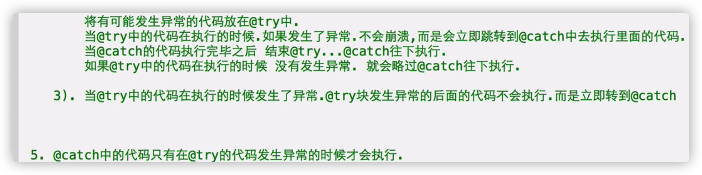
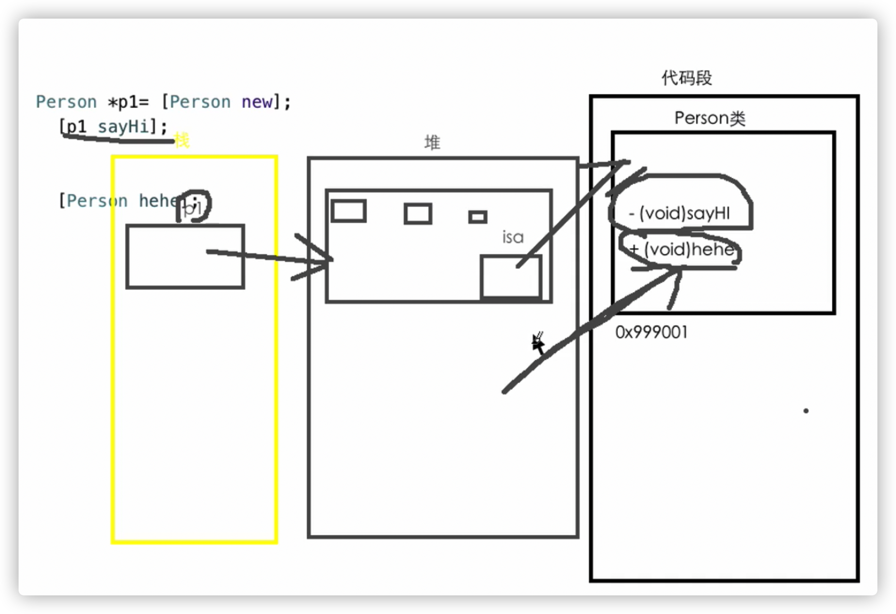
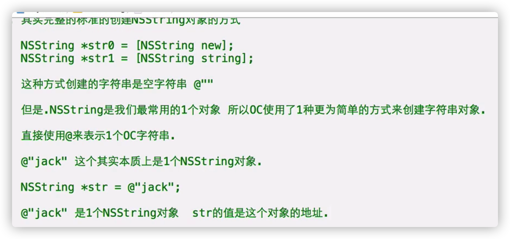
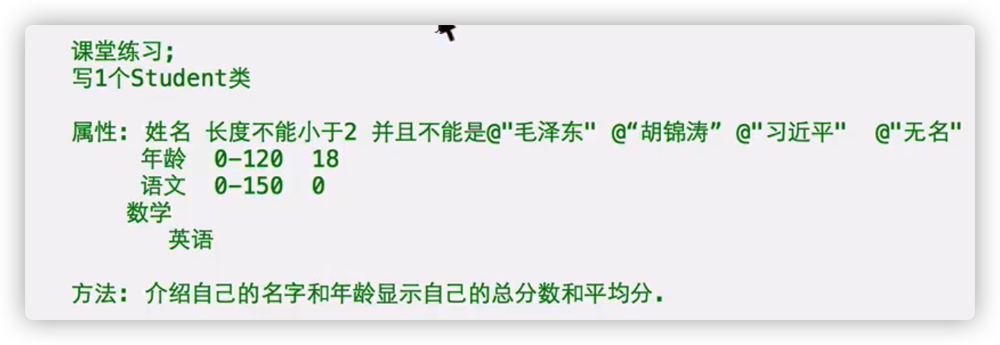
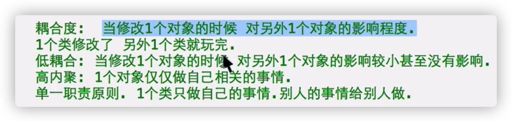
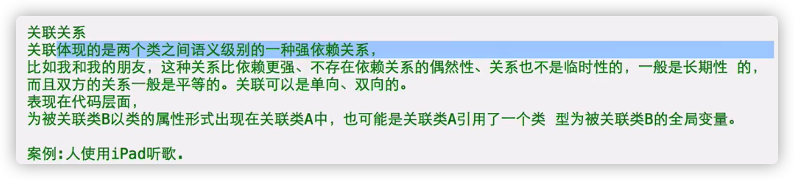

# 本类对象作为本类方法的函数

- 例子

Dog Person

Point 

- 表示平面上的一点：X Y 坐标

- 类的名字不能重复（为了避免重复，命名时可以加前缀）

- 开平方：

```objective-c
#import <math.h>
sqrt(变量名);
```

# 异常的基本使用

- BUG：程序可以正常运行，但是结果不是我们想要的

解决：通过调试解决

- 异常：可以正常运行，在某种特定情况下，就立即终止运行（崩溃），后面的代码不会实现

出现异常就会闪退

- 处理异常：

为了让程序在执行的时候发生异常不会崩溃，继续往下执行

```objective-c
@try{
  有可能发生异常的代码
}
@catch(NSException *ex){
  如果try里的代码发生异常，会继续往下执行（catch及其之后的代码)
  如果try里面的代码正常，会跳过catch，继续往下执行
}
```




Catch 里面的代码，发生异常之后干什么

记录异常（时间，原因），存储在数据库里

- %@打印指针所指的对象

使用%@就可以拿到发生异常的原因

```objective-c
@try{
  有可能发生异常的代码
}
@catch(NSException *ex){
  如果try里的代码发生异常，会继续往下执行（catch及其之后的代码)
  如果try里面的代码正常，会跳过catch，继续往下执行
    
    NSLog(@"%@",ex);//可以拿到发生异常的原因
}
```

- finally：不论try里面是否发生异常，都会执行

```objective-c
@try{
  有可能发生异常的代码
}
@catch(NSException *ex){
  如果try里的代码发生异常，会继续往下执行（catch及其之后的代码)
  如果try里面的代码正常，会跳过catch，继续往下执行
    
    NSLog(@"%@",ex);//可以拿到发生异常的原因
}
@finally{
  //不论try里面是否发生异常，都会执行
}
```

- Try catch 不是万能的，比如，C语言的异常无法处理。所以不太用

# 类方法

- 例子 \+ (void)hehe;

- 对象方法/实例方法：想要调用对象方法必须创建对象，通过对象来调用

类方法：不依赖于对象，想用就用，不需要创建对象

- 类方法的声明实现

**只是- 变成+，其他都是一样（包括声明实现）**

```objective-c
+ (返回值类型）方法值；
```

- 类方法的调用

直接用类名

```objective-c
[类名 类方法名];
-----------------
[Person hehe];
```



- 类方法在内存：

直接在代码段里面找

优点：节约空间，效率快

缺点：**在类方法中，无法直接访问属性（包括self也不行)**

原因：属性在创建对象的时候创建，类方法没有通过对象实现

如果在类方法的实现中创建一个对象，访问该对象的属性可以

- 在对象方法中可以直接调用类方法

- 使用情况：一个方法不需要直接访问属性，不需要直接调用其他对象的方法

- 规范：

1）如果我们写一个类，要求这个类提供一个**和类名同名的类方法（小写）**，这个方法创建一个最纯洁（返回值都是默认值）的对象返回

+（Person*)person;

```objective-c
+(Person*)person{
    Person* p1 = [Person new];
    return p1;
}
//也可以是---------------------
+ (instancetype)student{
    return [Student new];
}
```

纯洁对象的使用

```objective-c
Person* p1 = [Person new];
    //等价于
Person* p2 = [Person person];
//也可以是---------------------
Student* s1 = [Student student];
```

如果想返回一个不那么纯洁的对象


**命名：类名WithXxxx**

例子

```objective-c
+(Person*)personWithName:(NSString*)name andAge:(int)age;
```

# NSString

- NSString是一个数据类型，来保存OC字符串

是Foundation框架中的一个类

OC字符串的本质是用NSString对象存储的



- %p，打印指针的值（地址）

%@，打印指针指向的对象

```objective-c
NSString* str = @"jack";
NSLog(@"str = %p",str);
NSLog(@"str = %@",str);
```

- NSString的类方法

1) + (nullable instancetype)stringWithUTF8String:(const char *)nullTerminatedCString;

将C语言的字符串转化为OC字符串对象

例子：stringWithUTF8String:

2)**+ (instancetype)stringWithFormat:(NSString *)format, ... NS_FORMAT_FUNCTION(1,2); **

拼接一个字符串对象。使用变量或其他数据拼接成OC字符串

stringWithFormat:

- 常用对象方法

1）length方法：返回值为 NSUInteger 本质是unsigned long

得到字符串字符的个数，可以处理中文

2）得到字符串中指定下标的字符

\- (unichar)characterAtIndex:(NSUInteger)index;

返回值是 unichar,本质上是unsigned short，占据2个字节

3）判断两个字符串的内容是否相同

判断两个字符串用== 不靠谱

\- (BOOL)isEqualToString:(NSString *)aString;

4)比较字符串的大小

先比较双方第一个字符ASKII码的大小，如果不一样就比完了，如果一样再比较双方第二个字符的ASKII码

\- (NSComparisonResult)compare:(NSString *)string;

可以用int接收，返回值是枚举

返回值 -1，小于

​            0，等于

​            1，大于

# 匿名对象

- 1)之前学的创建对象:

```objective-c
Person* p1 = [Person new];
```

一个指针指向一个对象， 这个对象的名字就是这个指针

p1所指的对象就叫做p1

2)  匿名对象：

没有名字的对象，没有任何指针指向这个对象

```objective-c
[Person new]；
  //new其实是一个类方法，创建一个对象，返回创建对象的地址（指针）
```

- 使用匿名对象

```objective-c
 [Person new]->_name = @"jack";
    //访问匿名对象的属性
    [[Person new] sayHi];
    //调用匿名对象的方法
```

把[类名 new]直接当做对象名使用

**每次使用[类名 new]都是创建一个新的对象，匿名对象只能使用一次，**

**每次使用匿名对象就是创建一个新的匿名对象**

- 关于返回值：可以直接使用，不用变量接收

```objective-c
test()
```

同理：

有名字的对象，有指针变量来接收返回的地址

没有名字的对象，没有指针来接收返回值的地址，但是也可以直接用

- 使用情况

1）某个对象的成员（属性）只会使用一次

2)方法的参数是一个对象，该对象就是为了这个方法传递的，之后对象也不会使用，就可以给方法传递一个匿名对象

[ys killWithPerson:[Person new]];

Person就是为了被神杀的

# 属性的封装

- 面向对象的三大特征：

1）封装：

函数，类（更高级别的封装，将数据和行为封装成一个整体）就是一个封装的体现

好处：

a.屏蔽内部的实现，外界只直到怎么用

b.操作方便

c.后期维护便利

2）继承

3）多态

- 想要限制年龄，给属性赋值做一个逻辑验证（判断是不是在逻辑值之内）

  判断年龄是不是在0-200之间，否则就以默认值处理

方法：

例子 \- (void)setAge:(int)age;

1）将属性里面的@public去掉，不让外界直接访问属性，无法赋值

2）为类提供一个方法（setter)，专门给属性赋值

a.setter是一个对象方法，给属性赋值

b.没有返回值，只是给属性赋值

c.命名：set开头，去掉下划线首字母大写的属性名

d.有参数,参数的类型和属性的类型一致，参数的名称和属性的名称一致（去下划线）

e.实现：判断传入的数据是否符合逻辑，如果符合就赋值，否则做默认处理

f.外界想要给对象的属性赋值，调用setter方法

- 为姓名属性赋值的时候，要求姓名的长度不小于2，否则赋值@"无名"

\- (void)setName:(NSString*)name;

- 专门的方法（getter）来返回经过setter属性的值

例子

\- (int)age;

\- (NSString*)name;

a.这个方法是一个对象方法，拿到属性的值，返回

b.有返回值，返回值的类型和属性类型一致

c.方法名称就是属性名称，去掉下划线（小写）

d.该方法没有参数

e.方法的实现，直接将属性的值返回

- 

- OC标准：

**只要属性需要被外界访问，就为该属性封装setter，getter。哪怕赋值取值没有逻辑验证。**

# 只读封装，只写封装

- 只读封装：为属性封装时，只提供getter，不提供setter

只写封装：为属性封装时，只提供setter,不提供getter

# 对象之间的关系

- 组合关系，依赖关系，关联关系，继承关系
- 组合关系:

一个类由其他几个类联合起来组合而成

计算机：显卡，声卡，CPU，内存，网卡……

- 依赖关系

一个对象的方法参数是另外一个对象

b类是a类方法的参数，a类依赖于b类

- 耦合度，低耦合；高内聚，单一指责原则



设计程序，尽量往低耦合靠近

- 关联关系



一个类作为另外一个类的属性，他们不是组合关系，而是属于，拥有的关系

# 士兵突击

