# 自动释放池

- 自动释放池原理：

用来存储OC对象

存入到自动释放池中的对象，在自动释放池被销毁的时候，会自动调用存储在**当前**自动释放池中所有对象的**release**方法（调用一次）

好处：把创建的对象放在自动释放池里，不需要再写（匹配创建对象的）release

```objective-c
@autoreleasepool
{
  //该自动释放池的范围 
  Person* p1 = [[Person new] autorelease];
  //将p1对象存储在当前的自动释放池
  同理
  Person* p1 = [[[Person alloc] init] autorelease];
}
```

在自动释放池中储存对象：

在自动释放池中调用对象的autorelease方法(返回值是当前对象)

- 使用注意

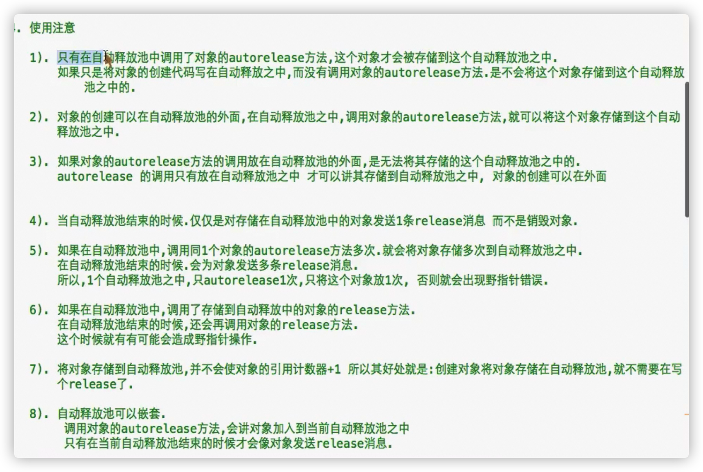

2、对象的创建不重要，只要对象在自动释放池里面使用autorelease方法就可以

```objective-c
Person* p1 = [Perosn new];
@autoreleasepool
{
  [p1 autorelease];
}
```

5、在自动释放池调用同一个对象的autorelease多少次，就会将这个对象存储到自动释放池多少次

**无论如何 只将同一个对象在自动释放池中release一次**

否则会出现僵尸对象问题：release到底之后就不知道会release什么重要的数据了

```objective-c
@autoreleasepool
{
  Person* p1 = [[Person new]autorelease];
  [p1 autorelease];
  [p1 autorelease];
}//会将同一个对象释放三次
```

6、同5理：

release与autorelease的区别：

autorelease在自动释放池被销毁之后自动发送release消息

8、自动释放池的嵌套

**当前**自动释放池结束发送release消息

```objective-c
int main(int argc,const char * argv[])
{
    @autoreleasepool
    {
        Person * p1 = [[[Person alloc ] init ] autorelease ];
        
        @autoreleasepool{
            Person * p2 = [[[Person alloc ] init ] autorelease ];
            
            @autoreleasepool{
                Person * p3 = [[[Person alloc ] init ] autorelease ];
            }
        }
    }
}
```

- 自动释放池唯一的作用**省略创建对象匹配的release**
- **只要MRC模式才使用自动释放池**

# 类方法的两点规范

- 定义对象同名类方法（创建对象），里面顺便把对象自定义初始化

```objective-c
- (instancetype)initWithName:(NSString*)name andAge:(int)age andWeight:(float)weight
{
  if(self = [super init])
  {
    _name = name;
    _age = age;
    _weight = weight;
  }
  return self;
}


+ (instancetype)pig
{
  return [[self alloc] init];
}
//二合一项目
+ (instancetype)pigWithName:(NSString*)name andAge:(int)age andWeight:(float)weight
{
  return[[[self alloc]intWithName: name andAge: age andWeight:weight] autorelease];
}
```

- 使用**对象方法不需要**使用autorelease

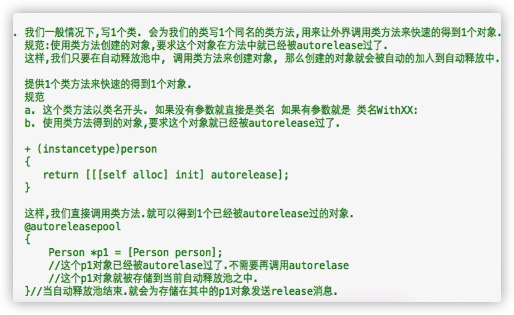

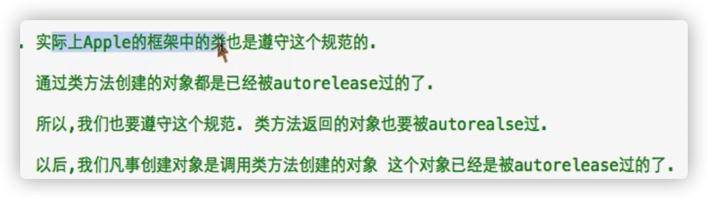

**如果写了一个类方法，返回对象，就要autorelease**

# 微博练习

- 使用结构体还是类？

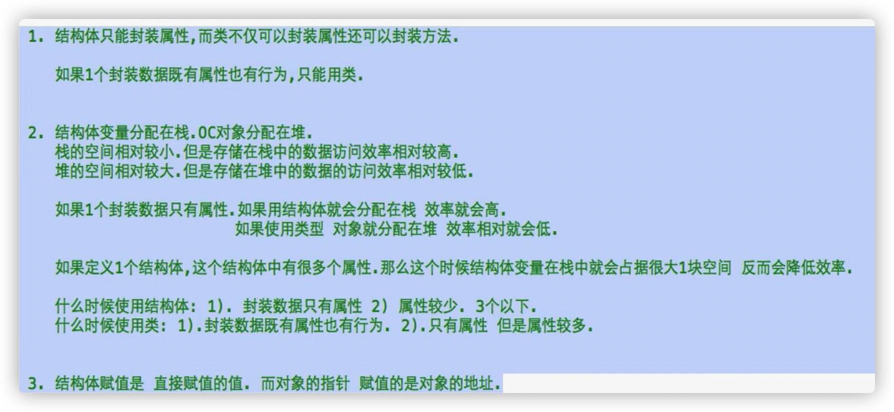

# ARC

- 自动引用计数器 ARC:Automatic Reference Counting

自动计算对象的引用计数器的值

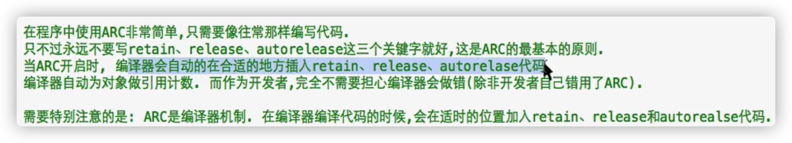

像往常写代码一样

**别手动写：retain,release,autorelease,dealloc**

**在dealloc不写[super dealloc]**

**@property不需要retain参数**

retain参数在MRC标准下，生成setter

ARC是一个编译器机制

- 在ARC机制下，对象何时被释放？

本质：对象的引用计数器为0时

表象：**只要没有强指针指向该对象，该对象就会立即回收**

- **强指针**

**默认**声明的指针就是强指针

也可以在定义指针前面写 __strong

```objective-c
 __strong Person * p1;
 //等价于 Person * p1;
```

- **弱指针**

在定义指针前面写 __wak

```objective-c
__weak Person * p2;
```

- 强指针与弱指针异同

都是指针，储存地址，可以通过该指针访问对象的成员

区别：在ARC模式下，作为回收的基准

只要没有强指针指向该对象，该对象就会立即回收

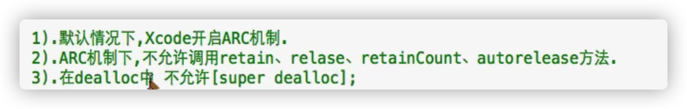

# 单个对象的内存管理

在ARC机制下

- 对象回收的情况:

没有任何强指针指向对象的具体表现：

1、指向对象的所有强指针被回收，对象被立即回收

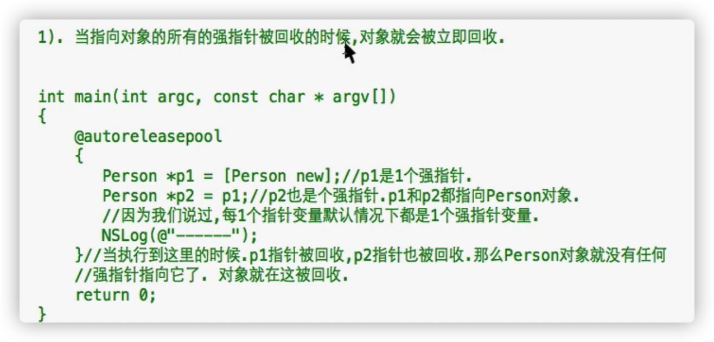

2、当所有指向对象的强指针赋值为nil时，对象就会被立即回收

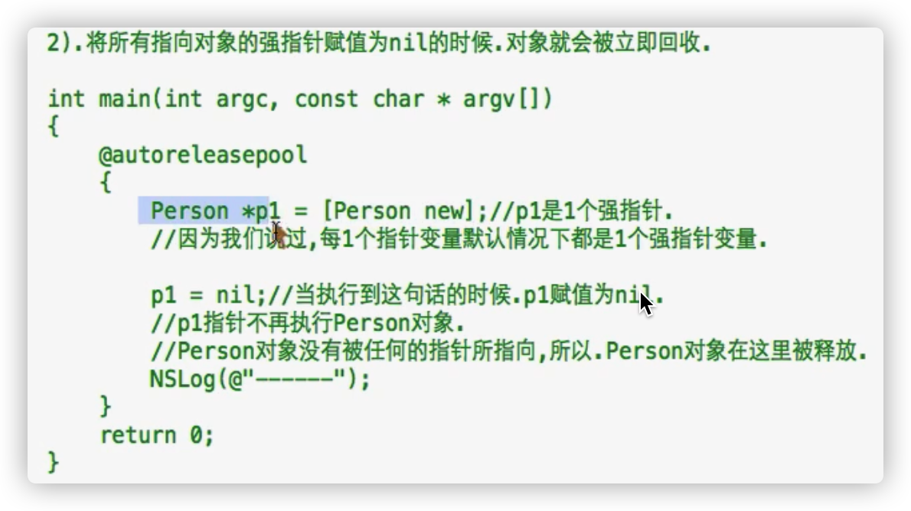

- 当对象被回收是，原来指向该对象的弱指针会被自动设置为nil

# ARC机制下多个对象的内存管理

- **@property不需要retain参数**

retain参数在MRC标准下，生成setter

在ARC机制下，setter方法直接赋值就行

- ARC机制关注重点：

当一个类的属性是一个OC对象时，这个属性应该声明为强类型的还是弱类型的

**应该声明为强类型的**

```objective-c
 Person * p1 = [Person new];
    Car * c1 = [Car new];
    p1.car = c1;
    c1 = nil;
//如果属性是__weak的话，会出现车废了，人还在的情况
```

- 控制@property生成的私有属性是强类型还是弱类型

1、**默认**强类型strong参数

```objective-c
@property(nonatomic,strong)Car * car;
```

2、弱类型weak参数

```objective-c
@property(nonatomic,weak)Car * car;
```

- **使用建议**

**ARC机制下，把MRC的retain换成strong**

1、ARC机制下，如果属性的类型 是OC对象类型，绝大多数使用strong（默认）

2、ARC机制下，如果属性的类型不是OC对象，使用assign

3、strong,weak参数使用范围是，属性是OC对象的情况下

# ARC机制下的循环引用

- 

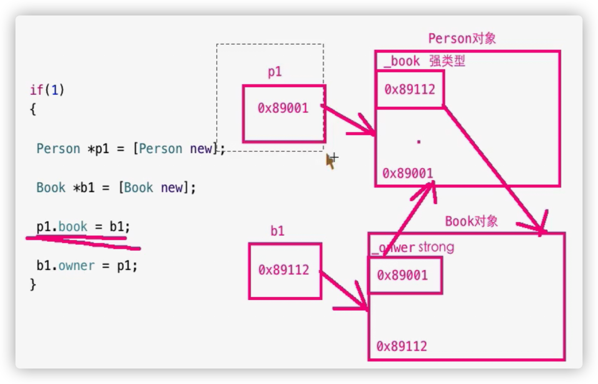

最后两句指令完毕之后，p1,b1释放，只剩下Person对象，Book对象互指（必须让一方的指向死掉，才可以释放全部）

应该把其中一个作为属性的OC对象@property参数改为weak

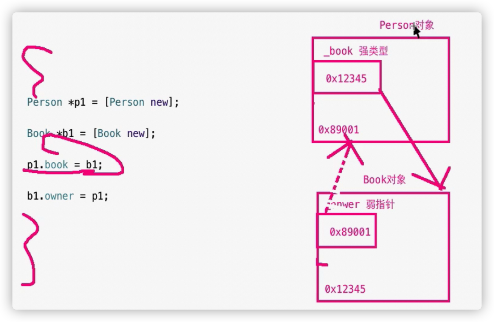

改了之后：Person对象没有强指针指，销毁，Book对象没有强指针指，销毁


# property参数总结

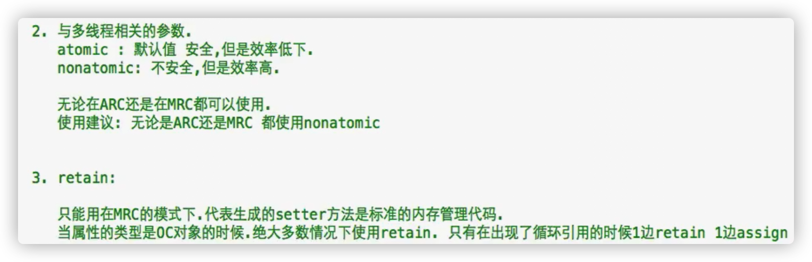

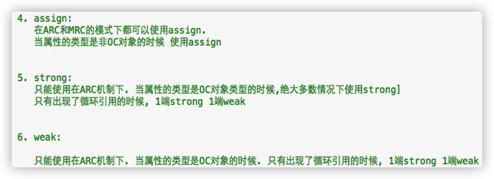

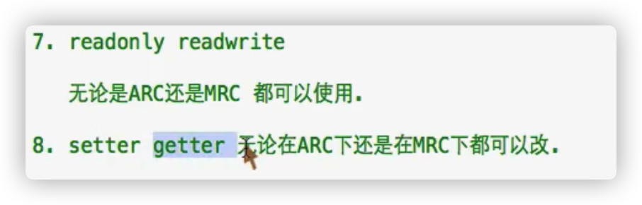

# MRC与ARC的兼容

- 程序使用ARC开发，但是有的类是MRC 

- 转换类型：使指定.m和.h文件使用ARC

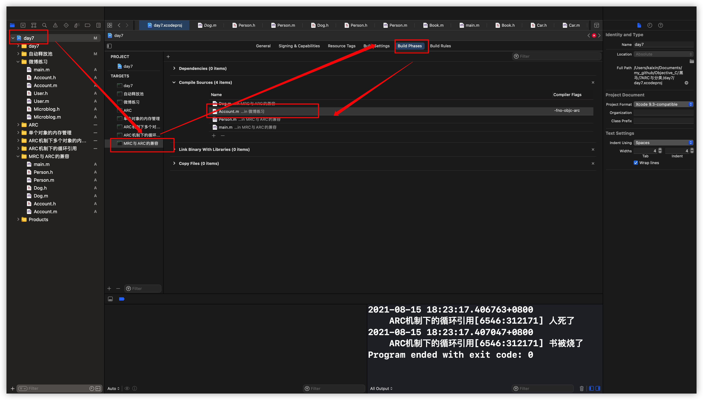

双击目标.m文件，在方框里面输入

-fno-objc-arc

- MRC模式下使用ARC的类

> 在targets的build phases选项下Compile Sources下选择要使用arc编译的文件，双击它，输入 -fobjc-arc 即可

# MRC转化为ARC

- 将整个MRC程序转化成ARC

选中需要转换的程序

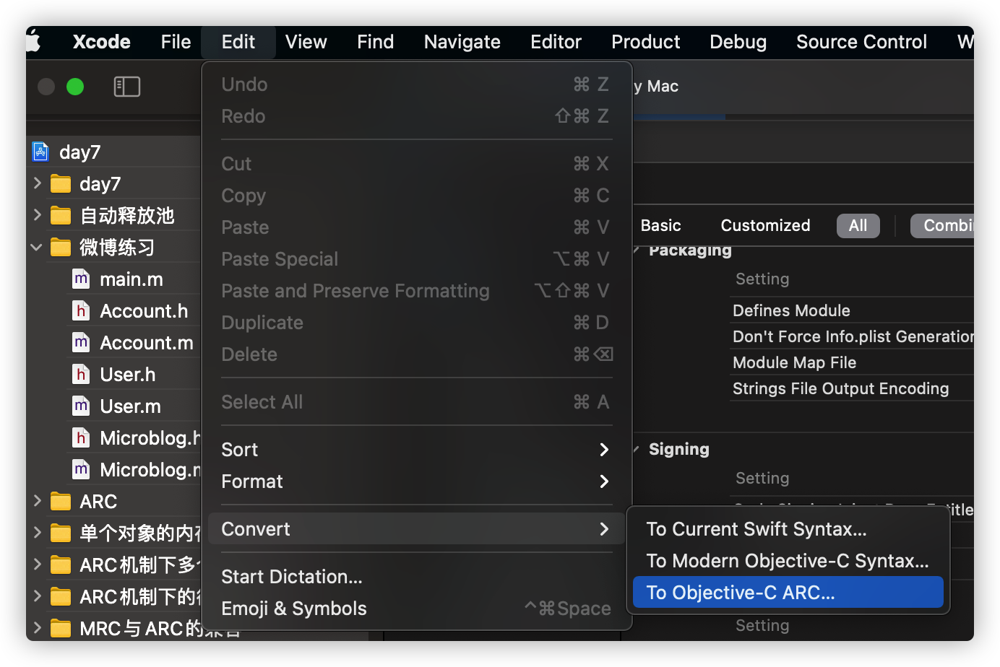

**它就是粗暴把关键词替换，所以可能会出现问题，但是不提供转回去的方法，一定要预先备份无数**

# category分类

- category [ˈkætəɡəri] 分类（类别，类目）：**将一个类分成多个模块**

- 模块：一个.m 加上 一个.h 文件

- 如果类的内容太多了，就分模块写，将功能相似的放在同一个模块里面

优点：方便维护，管理

**一个类占据多个模块**

- 方法

先按照Cocoa Class创建类

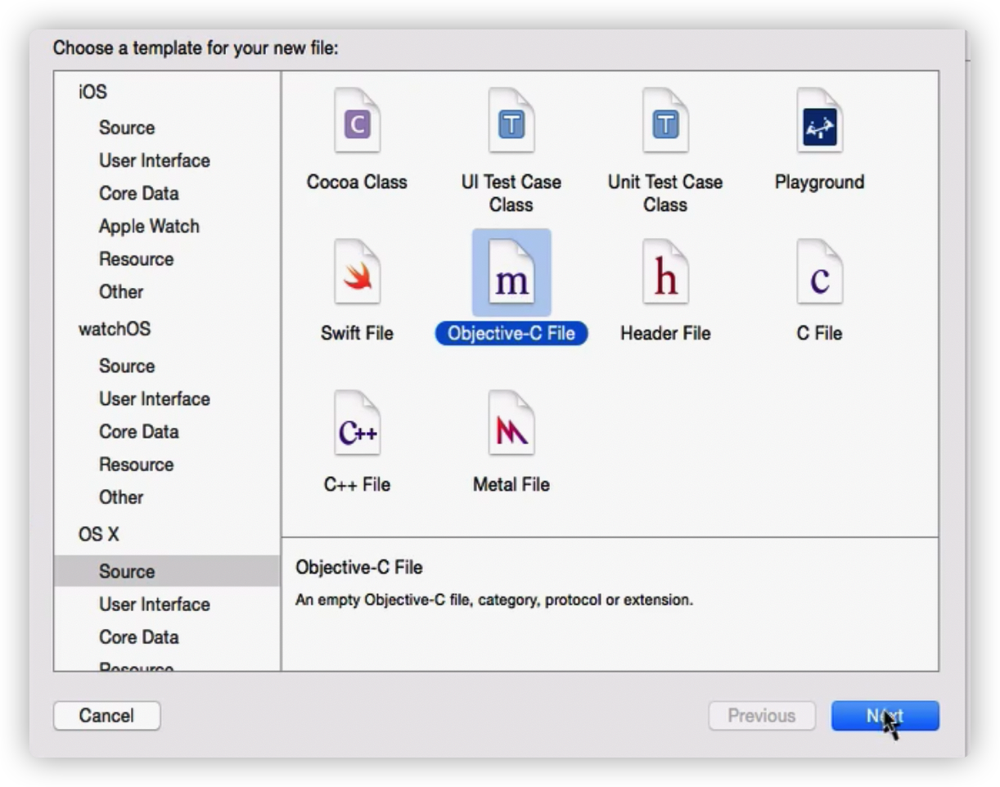


Class 里面写 : 把哪一个类分成多个模块

- 介绍

1、生成一个类的添加分类

2、生成一个.h  .m文件

本类名+分类名+.h/.m

3、新建的分类自动生成声明和实现

本类名之后的括号里写分类名，代表不是创建一个新类，是对已有的类添加一个分类

一个类可以添加多个分类

- 使用：

如果要访问分类中定义的成员，就需要在main里面把分类的头文件引用进来

# 分类注意

1、只能在分类中加方法**不能加属性**

2、在分类中写@property，不会生成私有属性，只会生成getter，setter声明，没有实现，所以需要自己写getter，setter以及在本类中的属性声明

在主类.h里面写的@peoperty 或者 传统大括弧方法的属性声明，可以在分类里面正常使用

3、在分类的方法中，无法直接访问本类的**真私有属性**

本类可以直接访问本类的真私有属性

真私有属性，大括弧，定义在.m文件中（@implementation)

**但是可以通过本地的getter,setter调用**

- 私有属性:被@private修饰的属性,叫做私有属性.

真私有属性:定义在@implementation中的属性叫做真私有属性.

包括@property

4、当分类中有和本类中同名的方法时，优先调用分类方法（哪怕没有引入分类的头文件）

如果多个分类中有相同的方法，优先调用最后编译的分类

- 如何查看最后编译的分类？

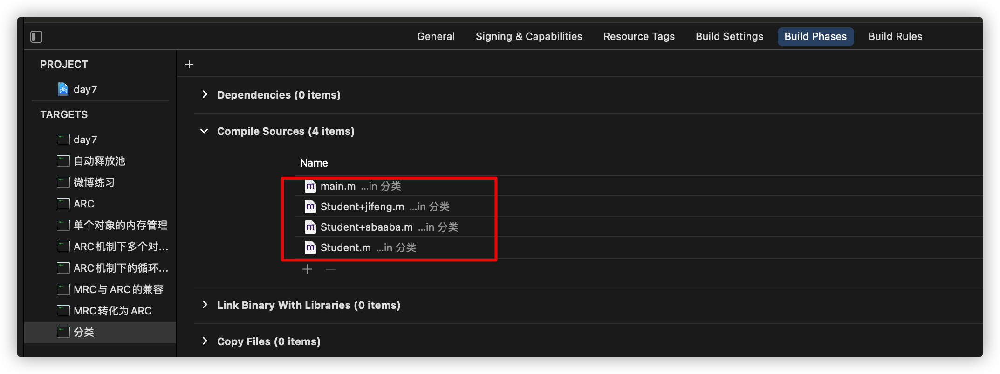

当本类，分类1，分类2都存在时，优先选择分类的方法，图中最后分类是ababa，所以使用ababa中的方法

在图中：越是在上面的越先编译

- 扩展一个类：

继承：新创建了一个类

​           可以扩展任意成员（属性，方法）

分类：没有新创建一个类

​          只能扩展方法

# 非正式协议

- 为系统自带的类写分类，就是非正式协议

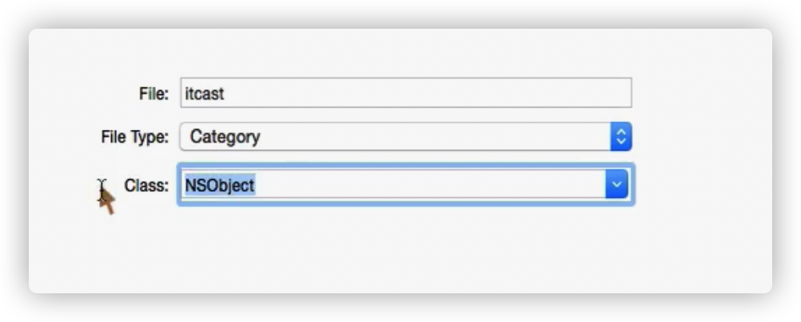

- 分类的作用：为已经存在的类添加方法

- \- (unichar)characterAtIndex:(NSUInteger)index;

unichar: 

typedef unsigned short unichar;

2个字节

- 如果分类里面写方法，方法的参数就是该分类 类 的对象，就不需要引入参数，使用self就可以

# 补充

- ARC机制 与 垃圾回收机制的区别

GC： 程序在**运行**期间，有一个垃圾回收器，不断扫描堆中的对象是否无人使用

ARC：在编译的时候，就在合适的地方插入retain,release,autorelease,

插入代码的目的是，让对象在无人使用的时候，引用计数器变为0

ARC效率高

- 在MRC模式下，方法内如果需要访问对象（其他对象作为属性），使用点语法

如果直接访问的话，不经过getter，setter，就不会经过@property retain参数带来的计数器增减

