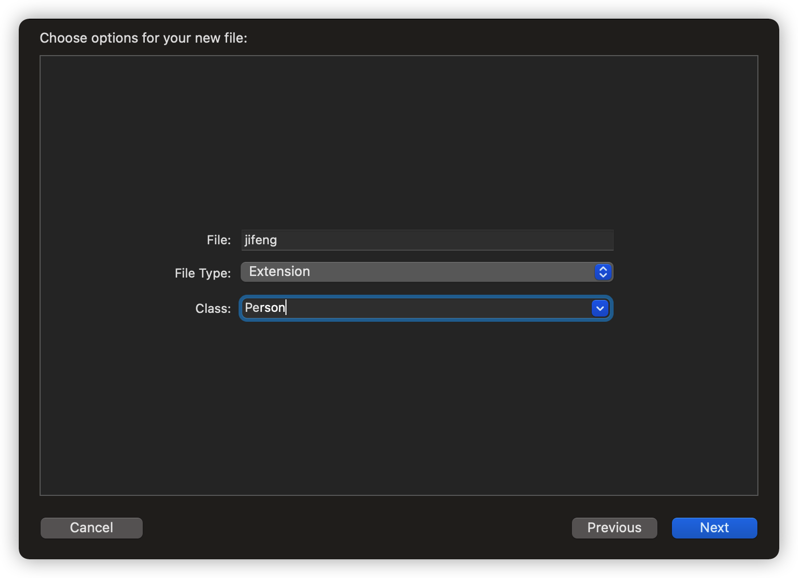
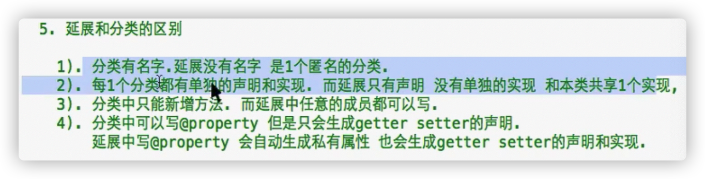
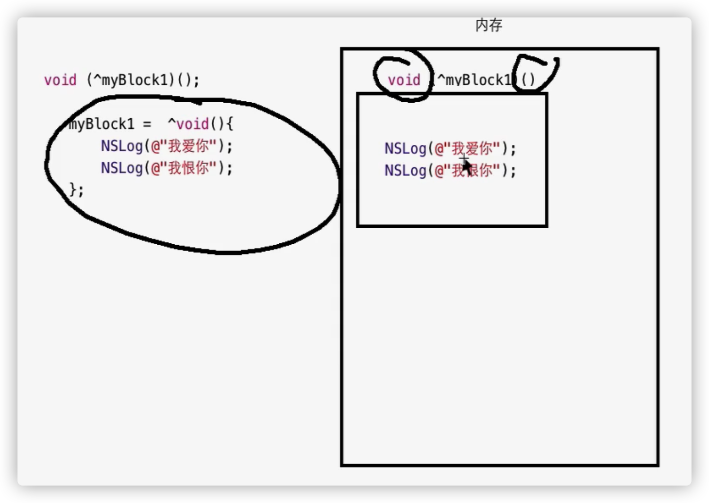
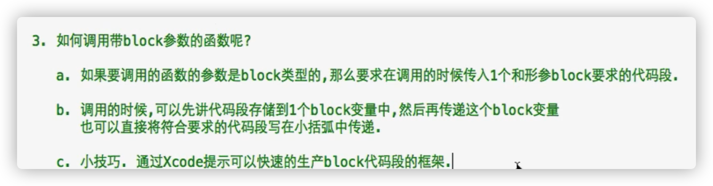
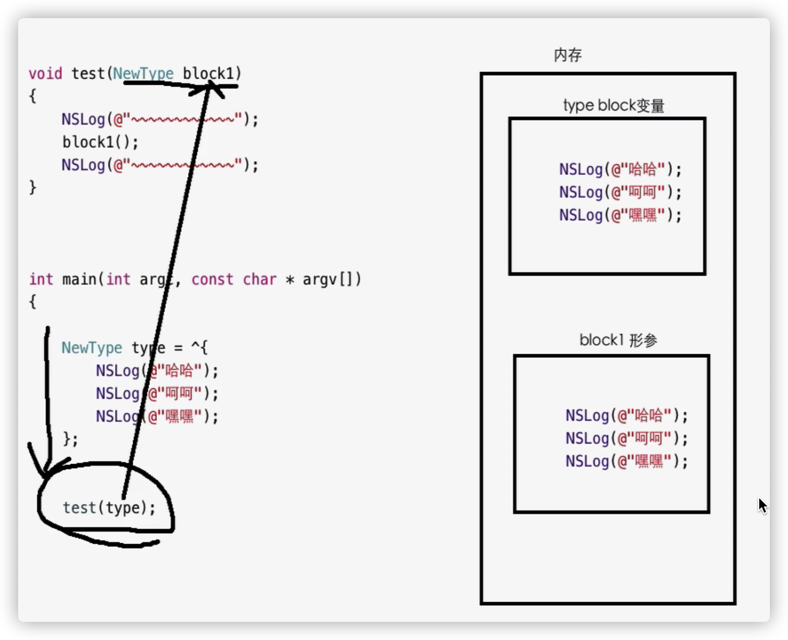
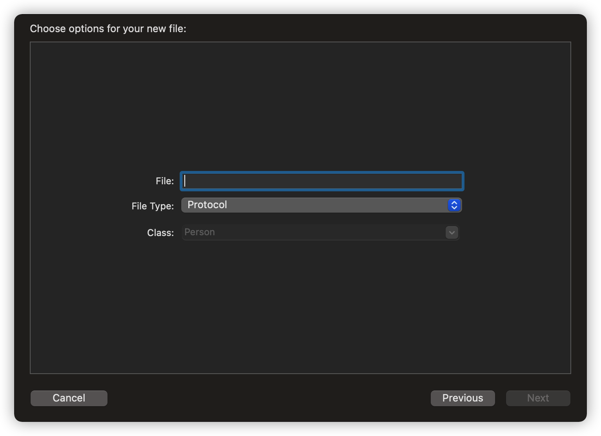
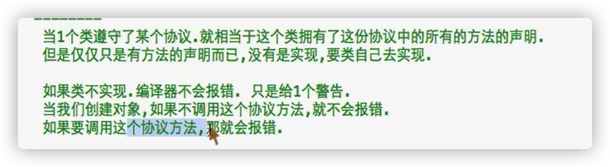
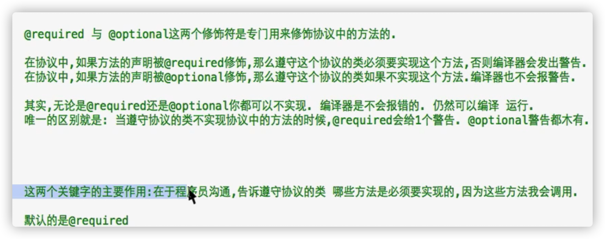

# 延展 Extension

- 延展 Extension [ɪkˈstenʃn]：

**是一个特殊的分类，也是类的一部分**

- 特殊之处：

1、**延展这个特殊分类没有名字**

2、**只有声明，没有实现，实现和本类共享**

- 语法：

```objective-c
@interface 本类名()
  
@end
```



- **方法的实现写在本类的.m文件中，记得引进延展文件**

- 延展和分类的区别



# 延展的应用场景

- 1、要为类写一个私有的@property

即，生成的getter，setter只能在类的内部访问，不能在外界访问

让@property生成私有属性，生成getter，setter实现，不要声明

2、方法：

将@propert写在延展里面

**延展直接写在本类的实现文件中，写在延展里面的成员(属性，方法），是该类的私有成员，只能在本类的实现中访问**

（@property只能写在@interface里面）

（只能#import .h文件）

3、使用延展情况：

**为类定义私有成员（方法，属性）**

**将延展定义在类的实现中.m文件**

4、**真私有 语法**

1）属性

以前：在@implementation里面用大括弧定义属性，可以成为真私有

现在：一律写在延展里面

2）方法

以前：在@implementation里面，只写实现不写声明

现在：一律把声明写在延展里面，实现写在@implementation里面

这样方便把真私有方法与普通方法区别

**延展天生用来私有化类的成员**

# block

- OC在C的基础上新增的数据类型：block [blɒk]  

- block变量类型专门储存一段代码，可以有参数，可以有返回值

声明block变量的时候，必须指定该block变量储存的代码段是否有参数，是否有返回值，**一旦指定以后，该block变量就只能存储这样的代码了**

可以存储的代码：

- 声明的语法

```objective-c
返回值类型 (^block变量的名称)(参数列表)；
//void(^myBlock1)(void);
//声明一个block类型的变量名字是myBlock1，该变量只能存储没有返回值，没有参数的代码段
//int(^myBlock2)(int num1,int num2);
```

- 初始化的语法

写一个符合block要求的代码段

代码段的书写格式

```objective-c
^返回值类型（参数列表)
{
  代码段;
};
----------------------
  ^void()
{
  NSLog(@"你好");
};
//无参数无返回值的代码段
```

- 赋值

```objective-c
myBlock1 = ^void(){
   NSLog(@"你好");
};
```



- **在声明的同时赋值**

```objective-c
void(^myBlock1)(void) = ^void(){
        NSLog(@"你好");
    };
```

- 有返回值无参数的代码段：

```objective-c
int(^myBlock2)(void) = ^int(){
        int num1 = 10;
        return num1;
    };
```

- 有返回值有参数的代码段

```objective-c
 int(^muBlock3)(int num1,int num2) = ^int(int num1,int num2){
        int num3 = num1 + num2;
   //num1,num2已经定义过了，在block代码段内部直接用就可以
        return  num3;
    };
```

- **执行block变量中的代码段：**

```objective-c
语法格式：block变量名();
-----------------------
myBlock1();

int sum = myBlock2();
    NSLog(@"sum = %d",sum);

int res = myBlock3(10,32);
    NSLog(@"res = %d",res);
```

有参数就传参，有返回值就接

# block简写

**建议不要简写，可以提高代码的阅读性**

- 如果**代码段**没有返回值，可以把赋值的代码段（等号右边）void省略

```objective-c
void(^myBlock1)(void) = ^(){
        NSLog(@"你好");
    };
```

- 如果代码段没有参数，代码段的小括弧(等号右边，之前用来传参的）也可以省略

```objective-c
int(^myBlock2)(void) = ^int{
        int num1 = 10;
        return num1;
    };
```

- 在**声明**block的时候，可以只写参数的类型，不写参数的名称

```objective-c
int(^myBlock3)(int,int) = ^int(int num1,int num2){
        int num3 = num1 + num2;
        return  num3;
    };
```

- 无论代码段是否有返回值，可以省略返回值类型（等号右边）

计算机会自动确认返回类型（根据return有无 和 return具体数据的类型）

```objective-c
 int(^myBlock3)(int,int) = ^(int num1,int num2){
        int num3 = num1 + num2;
        return  num3;
    };
```

# typedef简化block定义

- typedef使用场景：将一个长类型定义为一个短类型

- 语法

```objective-c
typedef 返回值类型（^新类型)（参数列表）；
--------------------------------
typedef void (^NewType)(void);
    NewType block1;
//定义了一个类型叫NewType，是一个无参数无返回值的block类型
```

# block内部访问外部变量

- 1、block代码段内部可以访问定义在外部的局部变量和全局变量的值

2、block代码段的内部可以修改全局变量的值，但**不能修改外部局部变量的值**

3、如果希望外部局部变量可以允许在block代码段的内部修改，在外部的局部变量里面加入__block修饰符

```objective-c
  __block int num2 = 20;
    typedef void (^NewType)(void);
    NewType block1 = ^{
        int num3 = 30;
        num2++;
        num1++;
        NSLog(@"num = %d",num2);
    };
```

# block作为函数的参数

- block是一个数据类型，可以作为函数的参数
- 为函数定义block类型的参数

1、在参数小括弧中声明一个指定格式的block变量

```objective-c
void test(void(^block)(void))
{
    NSLog(@"11111111");
    block();
}
```

2、使用typedef

```objective-c
typedef void(^NewType)(void);
void test(NewType block1)
{
    NSLog(@"111111");
    block1();
}
```

- 调用



block提示，回车键两次使用b方法

```objective-c
NewType type = ^{
        NSLog(@"yeyeye");
    };
    test(type);
```



调用函数过程：

1、加载函数

2、声明函数参数

3、将实参**赋值**给形参

4、执行函数体

- 什么时候使用block作为函数的参数

可以将调用者自己写的一段代码 传递到 函数的内部去执行

代码调用者写，函数可以是别人写的且被封装了

# 练习

写一个数组类。将字符串数组提供一个方法来排序

- 数组作为函数参数时，会不能测量数组的大小

显示8个字节，是因为一个地址占据8个字节

- 如果让调用者写一串代码比较这两个字符串的大小

写一个block来储存一串代码，比较[j] [j+1] 的大小，并返回结果

- **什么时候，把block作为方法，函数的参数？**

当方法内部需要执行一个功能，但这个功能的具体实现函数的内部不确定

这时使用block让调用者将这个功能的具体实现传递进来

 # block作为函数的返回值

- block可以作为函数的返回值，此时返回值的类型一定要使用typedef定义的短类型

- 很少见

  多把block是传到函数内部

# block与函数

- 相同点：都是封装一段代码
- 不同点：

1）block是一个数据类型，函数是一个函数

2）可以声明block类型的变量，函数只是函数

3）**block可以作为函数的参数，而函数不能直接作为函数的参数**

# 协议protocol

- 协议protocol [ˈprəʊtəkɒl]：**专门用来声明一堆方法**

只要某个类遵守了这个协议，就相当于拥有这个协议中所有的方法声明，不用自己声明

- 声明

```objective-c
@protocol 协议名称 <NSObject>
  方法的声明
@end
```



- 类遵守协议

协议是用来写方法声明的，是用来被类遵守的

类只要遵守一个协议，该类就拥有了这些协议中定义的所有方法声明了

但是还需要自己实现协议中的**所有**方法（否则编译器会警告）

语法：

```objective-c
#import "协议名"
@interface 类名 : 父类名 <协议名称1，协议名称2>
@end
```

- :表示继承

<>表示遵守的协议

- 类是单继承，协议可以多遵守

一个类只能有一个父类，一个类可以遵守多个协议

```objective-c
@interface Dog : NSObject <MyProtocol,YourProtocol>
```



# @required和@optional

- **Required 和 optional 是专门来修饰协议中方法声明的修饰符**

- **默认**@required

该方法必须被实现，否则会警告

- @optional

该方法就算不实现，也不会有警告



# 协议之间的继承

- 语法

```objective-c
#import "父类协议"
@protocol 协议名称 <父协议名称>
  @end 
```

- 效果：

子协议里面不仅有自己方法的声明，还有父协议里面的所有方法声明

如果一个类遵守了某份协议，那么这个类就拥有了这个协议以及该协议父类的所以方法声明

- NSObject

在Foundation框架中，有一个类，NSObject，是所有OC类的基类

在Foundation框架中，有一个协议，是NSObject

（类的名称可以和协议的名称一致）

NSObject协议被NSObject类遵守，所以NSObject协议中的全部方法，全部的OC类都拥有了

所以都OC类都遵守了NSObject协议，所以它又是**基协议**

- 规范：

所有的协议必须直接或间接从NSObject协议继承

No visible @interface for 'Person' declares the selector 'playLOL'

# 协议的类型限制

- 声明一个指针，该指针可以指向任意的对象，指向的对象要 遵守指定的协议

  不遵守，警告

```objective-c
 NSObject <协议名> * 指针名;
//该指针可以指向任何遵守指定协议的对象，否则会警告
----------------------------------
NSObject <StudtyProtocol> *obj
```

也可以用id指针

```objective-c
id <协议名> 指针名;
//该指针可以指向任何遵守指定协议的对象，否则会警告
------------------------------------
id <StudtyProtocol> id1 = [Student new];
```

- 声明一个指针变量，指向变量的对象必须遵守多个协议

```objective-c
NSObject<StudtyProtocol,AbaProtocol> * obj2 = [Student new];
id <StudtyProtocol,AbaProtocol> obj3 = [Student new];

```

- 为啥这么干？

需要调用这个对象中的协议方法，确定不会出问题

# 代理设计模式：找朋友

- 代理设计模式

传入的对象，代替当前的类完成了某个功能，我们称之为代理模式。在OC中，代理设计模式是经常遇到的一种设计模式。

2，实现代理设计模式思路和步骤

1，定义一个协议（写在外面或者里面随便）并声明代理类需要实现的方法列表。

2，创建一个代理类，并遵守上面的协议。

3，在需要被代理的类中定义一个对象类型为ID并且遵守代理协议的成员变量。

4，在被代理的类中调用上面的成员变量_delegate（代理）的方法，调用代理类的方法。

5，在需要使用代理的地方为被代理的类的成员变量赋值。

- 自己可以作为自己的属性

该对象可以作为该对象的对象属性

