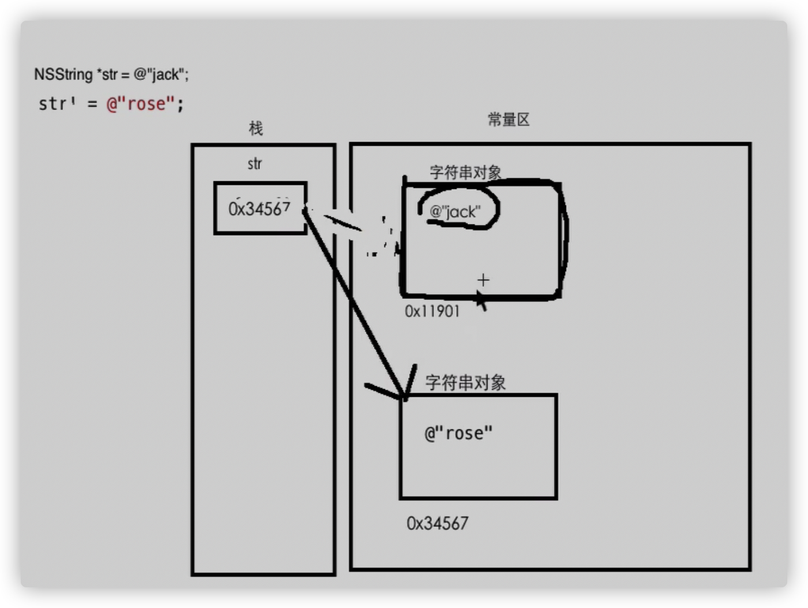
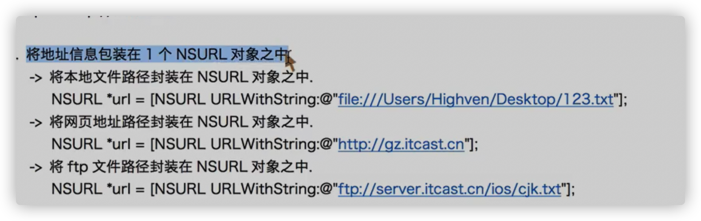
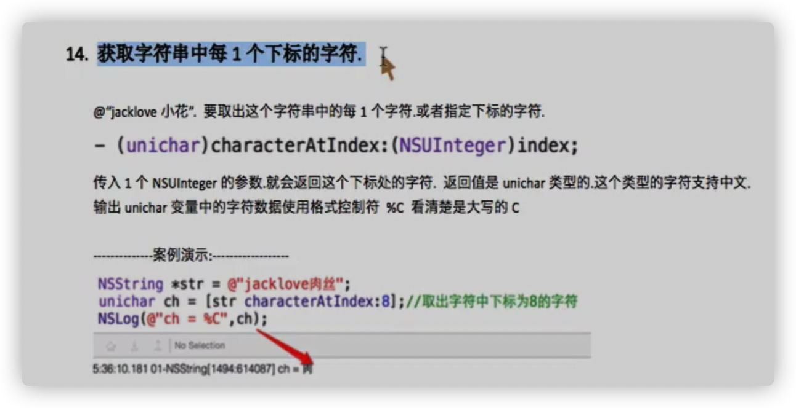
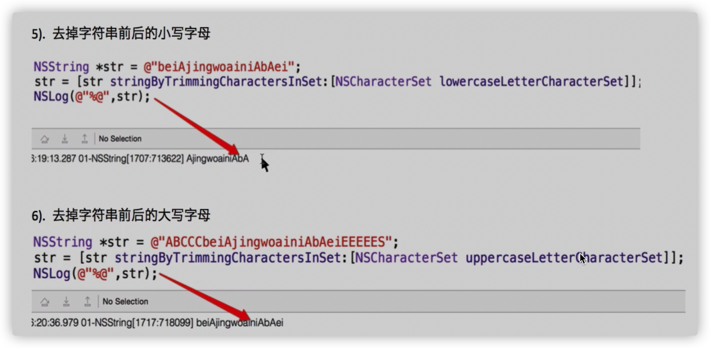
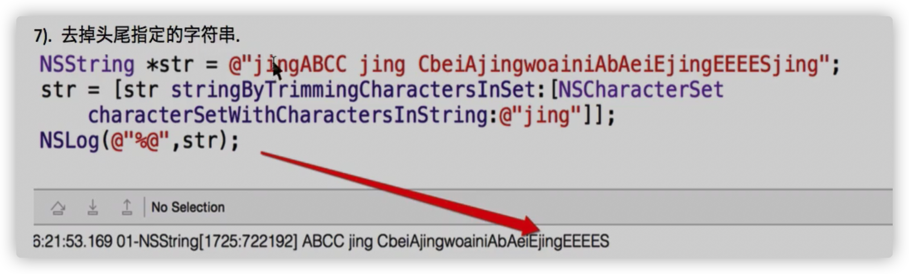
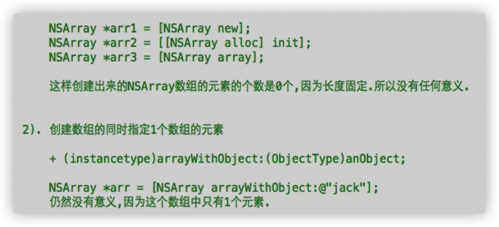
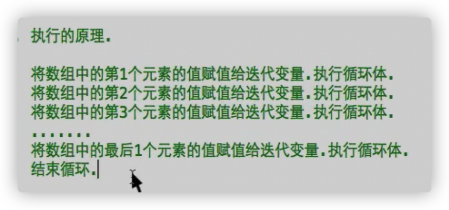

# 框架

- 系统或第三方实现写好的厉害功能的类，我们来用这些类

这些类的集合

类似C语言 函数库

- Foundation框架

有很多类，函数，定义了一些数据类型

这些框架的类都是最基础的类

其他框架就是基于Foundation框架

# NSString

- NSString是一个 数据类型，保存OC字符串

本质是一个类

- 创建NSString对象的语法

```objective-c
NSString * str1 = [NSString new];
NSString * str2 = [[NSString alloc] init];
NSString * str3 = [NSString string];
//以这种方法创建的字符串是一个空的字符@""
```

- 快速创建字符串对象的方法：@

```objective-c
NSString * str1 = @"rose";
```

@"rose"; 创建字符串对象

@"rose"本质是一个NSString 对象，存储的是字符串"rose"。

将该字符串的地址赋值给str1指针

- 格式控制符

%@ 打印指针指向的对象

%p 打印指针变量的值，打印地址

# 字符串的恒定性

- 使用

```objective-c
NSString * str1 = @"rose";
```

​	方法创建字符串对象的时候，也就是使用一个OC字符串常量来初始化字符串指针的时候，该字符串对象**存储在常量区（数据段）**

- 当调用**NSString的类方法来创建对象的时候**

```objective-c
NSString * str = [NSString stringWithFormar:@"jack"];
NSString * str = [NSString new];
NSString * str = [NSString string];
```

**创建的字符串对象存储在堆区**

- 恒定性

当在内存中创建一个字符串对象以后，这个字符串对象的内容就无法更改

重新为字符串指针初始化时，没有修改原来的字符串对象，而是重新创建一个字符串对象将地址赋值给字符串指针变量



- 当系统准备在内存中创建字符串对象时，会先检查内存中（堆区或常量区，根据创建的方式）是否有相同内容的字符串对象，如果有，直接指向，如果没有才重新创建

包括空字符串

**存储在常量区的不会被回收**

# NSString方法

按照频率列举

类方法名字以类名开头返回当前对象

- **使用拼接的方式创建NSString对象**

+ (instancetype)stringWithFormat:(NSString *)format, ... NS_FORMAT_FUNCTION(1,2);

```objective-c
 NSString * name = @"小米";
    NSString * str = [NSString stringWithFormat:@"我是%@,今年%d",name,age];
    NSLog(@"%@",str);
```

- **得到字符串长度**

@property (readonly) NSUInteger length;

Integer [ˈɪntɪdʒə(r)] 整数

```objective-c
NSUInteger len = str.length;
    NSLog(@"%lu",len);
```

- **得到字符串中指定下标的字符**

\- (unichar)characterAtIndex:(NSUInteger)index;

```objective-c
NSString * str = @"jack";
    unichar ch = [str characterAtIndex:2];
    NSLog(@"ch = %C",ch);
```

打印%C

- **判断两个字符串的内容是否相同**

\- (BOOL)isEqual:(id)object;

能否使用==

比较左右两边的数据是否相同

字符串用==比较的是字符串指针的值，即地址。如果字符串存储一个在堆区，一个在常量区，即使字符串数据一样，地址也不一样。所以字符串不能使用==来比较

```objective-c
 BOOL res = [str1 isEqual:str2];
```

- **将C语言字符串转换成OC字符串对象**

\+ (nullable instancetype)stringWithUTF8String:(const char *)nullTerminatedCString;

```objective-c
 char * str = "jack";
    NSString * str1 = [NSString stringWithUTF8String:str];
    NSLog(@"%@",str1);
```

- **将OC字符串转换成C字符串**

@property (nullable, readonly) const char *UTF8String NS_RETURNS_INNER_POINTER;	// Convenience to return null-terminated UTF8 representation

```objective-c
NSString * str = @"jack";
    const char * s = str.UTF8String;
    NSLog(@"%s",s);
```

# NSString不常用方法

- **将字符串写入到磁盘文件中**

\- (BOOL)writeToFile:(NSString *)path atomically:(BOOL)useAuxiliaryFile encoding:(NSStringEncoding)enc error:(NSError **)error;

参数1，路径

参数2:
YES，将文件放在临时文件中，成功后再将临时文件的数据放在指定文件中

NO，直接将文件放在指定目录中。

推荐NO，不安全，但效率高

参数3:指定写入时候使用的编码

一般写   NSUTF8StringEncoding = 4,

参数4:(NSError **)error

发送错误原因

如果不想知道错误原因参数写nil

二级指针，要传递一个NSError的指针的地址


返回值BOOL，写入是否成功

写入成功：字符串指针的值是nil；失败，指针指向一个错误对象，该对象描述了发送错误的信息

```objective-c
NSLog(@"%@",err.localizedDescription);
        //打印出错原因
```

```objective-c
NSString * str = @"学习";
    NSError * err;
    BOOL res = [str writeToFile:@"/Users/kaixin/" atomically:NO encoding: NSUTF8StringEncoding error:&err];
```


- **读取磁盘上文件的内容**

\+ (nullable instancetype)stringWithContentsOfFile:(NSString *)path encoding:(NSStringEncoding)enc error:(NSError **)error;

三个参数：同上

# URL读写字符串

- 优势：

既可以读写本地磁盘文件，还可以读写网页文件，ftp服务器上的文件

- 不同类型URL地址的写法：

1、本地磁盘：

file://

后面加地址

2、网页地址：
http://

后面加地址

3、ftp文件地址:

ftp://

后面加地址



- 将不同类型的地址封装在NSURL对象中

- 读

```objective-c
 NSURL * u1 = [NSURL URLWithString:@"file:///Users/kaixin/Documents/aaa.txt"];
    NSString * str2 = [NSString stringWithContentsOfURL:u1 encoding:NSUTF8StringEncoding error:nil];
    NSLog(@"%@",str2);
```

\+ (nullable instancetype)stringWithContentsOfURL:(NSURL *)url encoding:(NSStringEncoding)enc error:(NSError **)error;

参数同上

- 写

\- (BOOL)writeToURL:(NSURL *)url atomically:(BOOL)useAuxiliaryFile encoding:(NSStringEncoding)enc error:(NSError **)error;

```objective-c
NSURL *u2 = [NSURL URLWithString:@"file:///Users/kaixin/Documents/aaa.txt"];
    NSString * str3 = @"ccccccccccccccc";
BOOL res1 = [str3 writeToURL:u2 atomically:NO encoding:NSUTF8StringEncoding error:nil];
```

# 字符串的比较

- \- (NSComparisonResult)compare:(NSString *)string;

```objective-c
NSString * str1 = @"jack";
    NSString * str2 = @"rose";
    
    NSComparisonResult res = [str1 compare:str2];
    switch (res) {
        case NSOrderedAscending:
            //str1比str2小
            NSLog(@"小");
            break;
        case NSOrderedSame:
            NSLog(@"相等");
            break;
        case NSOrderedDescending:
            //str1比str2大
            NSLog(@"大");
            break;
             default:
            break;
    }
```

- 字符串忽略大小写的比较

\- (NSComparisonResult)compare:(NSString *)string options:(NSStringCompareOptions)mask;

 NSCaseInsensitiveSearch = 1

```objective-c
 NSString * str1 = @"ROSE";
    NSString * str2 = @"rose";
    
    NSComparisonResult res = [str1 compare:str2 options:NSCaseInsensitiveSearch];
    switch (res) {
            case NSOrderedAscending:
                //str1比str2小
                NSLog(@"小");
                break;
            case NSOrderedSame:
                NSLog(@"相等");
                break;
            case NSOrderedDescending:
                //str1比str2大
                NSLog(@"大");
                break;
                 default:
                break;
        }
```

- 字符串比较数字

\- (NSComparisonResult)compare:(NSString *)string options:(NSStringCompareOptions)mask;

NSNumericSearch = 64

**只能比较字母相同的数字**

- 判断字符串是否以指定的字符串开始

\- (BOOL)hasPrefix:(NSString *)str;

```objective-c
NSString * str = @"http://www.hawai.com";
    BOOL res = [str hasPrefix:@"http://"];
    NSLog(@"%d",res);
```

- 判断字符是否以指定的字符串结尾

\- (BOOL)hasSuffix:(NSString *)str;

```objective-c
NSString * path = @"asdadada.h";
    BOOL res = [path hasSuffix:@".h"];
    NSLog(@"%d",res);
```

# 字符串的搜索

- 从前往后：在主字符串中搜索子字符串(第一次出现的）

\- (NSRange)rangeOfString:(NSString *)searchString;


typedef struct _NSRange {

  NSUInteger location;//出现的下标

  NSUInteger length;//子串在主串中匹配的长度

} NSRange;

```objective-c
NSString * str = @"wo bu xiang kai xue";
    NSRange range = [str rangeOfString:@"kw"];
    NSLog(@"location = %lu",range.location);
    NSLog(@"lenth = %lu",range.length);

if(range.length == 0)
    {
        NSLog(@"没找到");
    }else
    {
        NSLog(@"找到了");
    }
//同理
if(range.location == NSNotFound)
    {
        NSLog(@"没找到");
    }else
    {
        NSLog(@"找到了");
    }
```

如果主串没有子串，location是unsigned long 的最大值；lenth是0

static const NSInteger NSNotFound = NSIntegerMax;

NSNotFound是NSIntegerMax的最大值

- 从后往前搜索：在主字符串中搜索子字符串(第一次出现的）

(NSRange)rangeOfString:(NSString *)searchString options:(NSStringCompareOptions)mask;

NSBackwardsSearch = 4,		/* Search from end of source string */

```objective-c
NSRange range = [str rangeOfString:@"kai" options:NSBackwardsSearch];
```

# NSRange结构体

- 是Foundation框架中定义的一个结构体

```objective-c
typedef struct _NSRange {

  NSUInteger location;

  NSUInteger length;

} NSRange;

NSRange range;
//用来保存一段范围，特别子串在主串中的范围
```

- 声明并初始化一个NSRange结构体

```objective-c
//法1
NSRange range;
range.location = 1;
range.length = 9;
//法2
NSRange range = {1,9};
//法3
NSRange range = {.location = 1, .length = 9};
//法4
//使用Foundation框架中定义的函数
NSRange ran = NSMakeRange(1, 9);
```

**建议法4**

法4:NS_INLINE NSRange NSMakeRange(NSUInteger loc, NSUInteger len) {

  NSRange r;

  r.location = loc;

  r.length = len;

  return r;

}

- Foundation框架中定义的函数：将NSRange结构体变量转化成NSString

FOUNDATION_EXPORT NSString *NSStringFromRange(NSRange range);

```objective-c
NSRange ran = NSMakeRange(1, 9);
    NSLog(@"%@",NSStringFromRange(ran));
```

# 字符串的截取

取到字符串的一部分

- 从指定的下标一直截取到最后

substring 截取子串

\- (NSString *)substringFromIndex:(NSUInteger)from;

```objective-c
NSString * str0 = @"我不想去学校";
    NSString * newStr = [str0 substringFromIndex:3];
    NSLog(@"%@",newStr);
```

- 截取直到指定的下标

\- (NSString *)substringToIndex:(NSUInteger)to;

```objective-c
NSString * newStr = [str0 substringToIndex:3];
//可以理解成：从第一个开始截取，截取三个
```

- 截取指定的一段范围

\- (NSString *)substringWithRange:(NSRange)range;        // Use with rangeOfComposedCharacterSequencesForRange: to avoid breaking up character sequences

```objective-c
NSString * newStr = [str0 substringWithRange:NSMakeRange(2, 3)];
```

# 字符串的替换

- 将字符串中的第一个参数替换成第二个参数

**会把第一个参数全部替换成第二个参数**（不论个数）

\- (NSString *)stringByReplacingOccurrencesOfString:(NSString *)target withString:(NSString *)replacement API_AVAILABLE(macos(10.5), ios(2.0), watchos(2.0), tvos(9.0));

```objective-c
 NSString * str2 = @"我爱希腊吗？";
    str2 = [str2 stringByReplacingOccurrencesOfString:@"希腊" withString:@"日本"];
    NSLog(@"%@",str2);
```

因为字符串的恒定性（字符串无法修改），所以必须要让字符串指针指向另外一个字符串才可以

- 也可以做删除，把需要删的字符串数据替换成空字符串@""



# 字符串数据转换其他类型

- 需要转换成那个用哪个

```objective-c
@property (readonly) double doubleValue;
@property (readonly) float floatValue;
@property (readonly) int intValue;
@property (readonly) NSInteger integerValue API_AVAILABLE(macos(10.5), ios(2.0), watchos(2.0), tvos(9.0));
@property (readonly) long long longLongValue API_AVAILABLE(macos(10.5), ios(2.0), watchos(2.0), tvos(9.0));
@property (readonly) BOOL boolValue API_AVAILABLE(macos(10.5), ios(2.0), watchos(2.0), tvos(9.0)); 
```

比如转换成int

```objective-c
NSString * str = @"22";
    int num = str.intValue;
    NSLog(@"%d",num+2);
```

- 转换注意

从头开始转换，能转换多少就转换多少，遇到不能转换的就停止

（比如：23hi232ih,只转换23)

# 其他字符串方法

- 去掉字符串**前后**的空格

\- (NSString *)stringByTrimmingCharactersInSet:(NSCharacterSet *)set;

Trimming [ˈtrɪmɪŋ] 裁剪

```objective-c
NSString * str1 = @"     s  sd  ssd   ad  ";
    str1 = [str1 stringByTrimmingCharactersInSet:[NSCharacterSet whitespaceCharacterSet]];
    NSLog(@"%@",str1);
```

- 将字符串转换成**大写**

@property (readonly, copy) NSString *uppercaseString;

uppercase 大写

```objective-c
NSString * str2 = @"zhale xuexiao qu";
    str2 = str2.uppercaseString;
    NSLog(@"%@",str2);
```

- 将字符串转换成**小写**

@property (readonly, copy) NSString *lowercaseString;

lowercase 小写

```objective-c
NSString * str3 = @"ABABAB";
    str3 = str3.lowercaseString;
    NSLog(@"%@",str3);
```





# NSMutableString

- 字符串的恒定性，字符串对象一旦创建就无法更改

修改字符串的实质是重新创建一个字符串对象

- NSMutableString   [ˈmjuːtəbl] 可变的

是一个Foundation里面的类，从NSString里面继承（拥有NSString里面的所有方法）

也是用来存储字符串数据

**存储在NSSMutableString对象中字符串数据可以更改，具备可变性**

可以直接更改NSSMutableString对象中的字符串数据，不会新创建对象

- 创建语法

```objective-c
    NSMutableString * str = [NSMutableString string];
```

- 往可变字符串对象中追加字符串

Append 追加

1、\- (void)appendString:(NSString *)aString;

```objective-c
 NSMutableString * str = [NSMutableString string];
    [str appendString:@"jack"];
    [str appendString:@"rose"];
    NSLog(@"%@",str);
```

2、以拼接的方式从可变字符串对象里面添加内容(可以使用占位符）

\- (void)appendFormat:(NSString *)format, ... NS_FORMAT_FUNCTION(1,2);

```objective-c
    [str appendFormat:@"年龄%d",num];
```

- 创建NSMutableString对象的时候

```objective-c
NSMutableString * str = @"jack";
//@"jack"是一个NSString（父类）对象，不能给子类指针赋值。编译检查会报错，因为指针类型与指向对象不匹配。
[str appendString:@"cctv"];
//NSString对象没有append系列方法，使用上面语句会报错
```

- 因为是继承，所以使用父类的地方可以用子类代替

- 使用建议： **平时还是使用NSString，效率高**稳定性

NSMultableString只是在做**大批量**（5次以上）的字符串拼接的时候使用

# NSArray

- C语言数组特点

1、存储多个数据

2、类型相同

3、长度固定

4、每一个元素紧密相连，下标

- NSArray是Foundation框架中的一个类，来存储多个数据，OC数组

- 特点：

1、**只能存储OC对象（任意对象,一个NSArray数组里面可以存储多种OC对象）**

2、长度固定，无法增减元素

3、每一个元素都是紧密相连的，每一个元素都有下标

4、**元素的类型是id**类型

- 创建



\+ (instancetype)arrayWithObjects:(ObjectType)firstObj, ... NS_REQUIRES_NIL_TERMINATION;

```objective-c
NSArray * arr = [NSArray arrayWithObjects:@"jack", @"rose", @"helen" ,nil];
NSLog(@"%@",arr);
```

注意：

1、只能存储OC对象

2、哪个元素的值，或者列举元素的时候是nil，到哪里就停止存储

nil表示元素到此结束

- **创建NSArray简要方式**

```objective-c
    NSArray * arr1 = @[@"aaa",@"bbb",@"ccc"];
    NSLog(@"%@",arr1);
//这种方法 不 需要写nil
//nil是0，不是OC对象
```

# NSArray数组的使用

- 直接用%@输出所有元素

```objective-c
NSArray * arr1 = @[@"aaa",@"bbb",@"ccc"];
    NSLog(@"%@",arr1);
```

- NSArray数组只能存储OC对象，不能存储nil(本质0)

- 取出NSArray数组元素的值

1、下标

```objective-c
 NSArray * arr1 = @[@"aaa",@"bbb",@"ccc"];
    NSLog(@"%@",arr1[0]);
    NSLog(@"%@",arr1[1]);
    NSLog(@"%@",arr1[2]);
```

如果下标越界，直接报错

2、方法

\- (ObjectType)objectAtIndex:(NSUInteger)index;

(ObjectType)：OC对象

```objective-c
NSArray * arr1 = @[@"aaa",@"bbb",@"ccc"];
    NSString * str = [arr1 objectAtIndex:1];
    NSLog(@"%@",str);
```

# NSArray其他方法

- 得到NSArray数组元素的个数

@property (readonly) NSUInteger count;

Integer [ˈɪntɪdʒə(r)] 整数

```objective-c
NSArray * arr1 = @[@"aaa",@"bbb",@"ccc"];
    NSLog(@"arr1.count = %lu",arr1.count);
```

- 判断数字里面是否有指定的元素

\- (BOOL)containsObject:(ObjectType)anObject;

```objective-c
NSArray * arr1 = @[@"aaa",@"bbb",@"ccc"];
    BOOL res = [arr1 containsObject:@"cc"];
    NSLog(@"%d",res);
```

- 取得数组的第一个元素

@property (nullable, nonatomic, readonly) ObjectType firstObject API_AVAILABLE(macos(10.6), ios(4.0), watchos(2.0), tvos(9.0));

```objective-c
 NSArray * arr3 = @[@"babab",@"zazaza"];
    NSLog(@"%@",arr3.firstObject);
---------------------------------
   NSArray * arr3 = @[];
    NSLog(@"%@",arr3.firstObject);
//打印null
--------------------------------
   NSArray * arr3 = @[];
    NSLog(@"%@",arr3[0]);
//报错,超出了限额
```

- 取到最后一个元素

@property (nullable, nonatomic, readonly) ObjectType lastObject;

```objective-c
NSArray * arr1 = @[@"11111",@"22222",@"33333"];
    NSLog(@"%@",arr1.lastObject);
---------------------------------------
   NSArray * arr1 = @[];
    NSLog(@"%@",arr1.lastObject);
//打印null
```

- 查找指定的元素**第一次**在NSArray数组出现的下标

\- (NSUInteger)indexOfObject:(ObjectType)anObject;

typedef unsigned long NSUInteger;

```objective-c
 NSArray * arr1 = @[@"11111",@"33333",@"22222",@"33333"];
    NSUInteger index = [arr1 indexOfObject:@"33333"];
    NSLog(@"%lu",index);

if(index == NSNotFound)
{
NSLog(@"没有找到");
}
else
{
  NSLog(@"找到了");
}
```

如果没有找到，返回NSUInteger的最大值

# NSArray数组的遍历

- for循环

```objective-c
NSArray * arr = @[@"jack",@"rose",@"helen"];
    for(int i = 0; i < arr.count; i++)
    {
        NSLog(@"%@",arr[i]);
      //或者
        NSLog(@"%@",[arr objectAtIndex:i]);
    }
```

- 使用增强for循环，遍历

原理：把数组的一个个元素赋值给迭代变量，执行循环体

直到所有元素赋值完毕



```objective-c
for(元素类型 变量名 in 数组名)
  //声明在for小括号里面的变量叫做迭代变量
{
直接通过变量名就可以拿到数组的每一个元素
}
-------------------------------
  NSArray * arr = @[@"jack",@"rose",@"helen"];
    for(int i = 0; i < arr.count; i++)
    {
        //NSLog(@"%@",arr[i]);
        NSLog(@"%@",[arr objectAtIndex:i]);
    }
```

**迭代变量的类型和数组元素类型一致**

```objective-c
 Person * p1 = [Person new];
    Person * p2 = [Person new];
    Person * p3 = [Person new];
    Person * p4 = [Person new];
    NSArray* arr1 = @[p1,p2,p3,p4];
    for(Person * per in arr1)
    {
        NSLog(@"%@",per);
    }
```

**如果数组OC类型不一致**

迭代变量类型用**id**类型

```objective-c
 Person * p1 = [Person new];
    Person * p2 = [Person new];
    Person * p3 = [Person new];
    Person * p4 = [Person new];
    NSArray* arr1 = @[p1,p2,p3,p4,@"aaaa"];
    for(id item in arr1)
    {
        NSLog(@"%@",item);
    }
```

- 使用block遍历

\- (void)enumerateObjectsUsingBlock:(void (NS_NOESCAPE ^)(ObjectType obj, NSUInteger idx, BOOL *stop))block API_AVAILABLE(macos(10.6), ios(4.0), watchos(2.0), tvos(9.0));

遍历NSArray数组中的每一个元素

enumerate [ɪˈnjuːməreɪt] 枚举

参数：

**obj是每一个元素**

idx是下标

如果想停止遍历，stop指针指向的BOOL变量的值改为**YES**

```objective-c
 NSArray * arr2 = @[@"jack",@"rose",@"helen"];
    [arr2 enumerateObjectsUsingBlock:^(id  _Nonnull obj, NSUInteger idx, BOOL * _Nonnull stop) {
        NSLog(@"%@",obj);
        NSLog(@"idx = %lu",idx);
        if(idx == 1)
        {
            * stop = YES;
        }
    }];
```

# NSArray与字符串的两个方法

- 把数组的所有元素连成一个字符串

参数是连接符号（每一个元素之间连接的数据，如果不想要就空字符@""）

\- (NSString *)componentsJoinedByString:(NSString *)separator;

component [kəmˈpəʊnənt] 组成

```objective-c
 NSArray * arr2 = @[@"jack",@"rose",@"helen"];
    NSString * str = [arr2 componentsJoinedByString:@"$"];
    NSLog(@"%@",str);
```

- 将字符串以指定分隔符分成一个数组，每一个部分都是数组的一个元素

\- (NSArray<NSString *> *)componentsSeparatedByString:(NSString *)separator;

```objective-c
 NSString * str1 = @"啊哈哈,吧啊吧,哦哦";
    NSArray * arr3 = [str1 componentsSeparatedByString:@","];
    for(NSString * item1 in arr3)
    {
        NSLog(@"%@",item1);
    }
```

# NSMutableArray

是NSArray的子类

是一个数组，具备NSArray数组的特点，只能存储OC对象

NSMutableArray数组的元素可以动态**增减**

- 创建

```objective-c
  NSMutableArray * arr1 = [NSMutableArray new];
    NSMutableArray * arr2 = [[NSMutableArray alloc]init ];
    NSMutableArray * arr3 = [NSMutableArray array];
//这样创建出来的数组有意义，之后可以动态增减
    NSMutableArray * arr4 = [NSMutableArray arrayWithObjects:@"jack",@"rose", nil];
//使用NSArray方法创建
```

注意

```objective-c
    NSMutableArray * arr5 = @[@"11",@"22",@"33"];
//错，对象是NSArray数组，指针是NSMutableArray类型，不匹配，编译检查不能过
//子类指针指向父类对象可能会出现问题
```

- 按道理来说，任意指针可以指向任意对象，编译器只会警告

但是别这么干，运行时可能会出错，当我们调用指针类型特有的方法时会出错

- 往可变数组中新增元素

1、增加**一个**元素

\- (void)addObject:(ObjectType)anObject;

```objective-c
NSMutableArray * arr4 = [NSMutableArray arrayWithObjects:@"jack",@"rose", nil];
    [arr4 addObject:@"1212"];
    NSLog(@"%@",arr4);
```

2、增加**一个NSArray数组**作为元素

```objective-c
  NSMutableArray * arr4 = [NSMutableArray arrayWithObjects:@"jack",@"rose", nil];
    [arr4 addObject:@"1212"];
//1
    NSArray * arr5 = @[@"aaaa",@"bbbb",@"ccccc"];
    [arr4 addObject:arr5];
//2 将整个NSArray数组作为一个NSMutableArray的元素
    NSLog(@"%lu",arr4.count);
    NSLog(@"%@",arr4);
```

3、把NSArray数组的**每一个元素**作为NSMutableArray的元素

\- (void)addObjectsFromArray:(NSArray<ObjectType> *)otherArray;

```objective-c
 NSMutableArray * arr4 = [NSMutableArray arrayWithObjects:@"jack",@"rose", nil];
    NSArray * arr5 = @[@"aaaa",@"bbbb",@"ccccc"];
    [arr4 addObjectsFromArray:arr5];
    NSLog(@"%lu",arr4.count);
    NSLog(@"%@",arr4);
```

- 在可变数组指定的下标处插入一个元素

\- (void)insertObject:(ObjectType)anObject atIndex:(NSUInteger)index;

```objective-c
 NSMutableArray * arr4 = [NSMutableArray arrayWithObjects:@"jack",@"rose",@"ababba", nil];
    [arr4 insertObject:@"hahah" atIndex:2];
    NSLog(@"%@",arr4);
```

- 按照下标删除数组元素

\- (void)removeObjectAtIndex:(NSUInteger)index;

```objective-c
arrayWithObjects:@"jack",@"rose",@"ababba", nil];
    [arr4 removeObjectAtIndex:1];
    NSLog(@"%@",arr4);
```

- 删除所有指定元素

**有几个一样的删除几个**

\- (void)removeObject:(ObjectType)anObject;

```objective-c
arrayWithObjects:@"jack",@"rose",@"ababba",@"rose", nil];
    [arr4 removeObject:@"rose"];
    NSLog(@"%@",arr4);
```

- 删除指定范围内的元素

\- (void)removeObject:(ObjectType)anObject inRange:(NSRange)range;


NS_INLINE NSRange NSMakeRange(NSUInteger loc, NSUInteger len) {

  NSRange r;

  r.location = loc;

  r.length = len;

  return r;

}

```objective-c
NSMutableArray * arr5 = [NSMutableArray arrayWithObjects:@"aaa",@"aa1",@"aaa",@"aaa",@"aaa",@"aaa",@"aaa2", nil];
    [arr5 removeObject:@"aaa" inRange:NSMakeRange(2,3)];
    NSLog(@"%@",arr5);
```

- 删除最后一个元素

\- (void)removeLastObject;

```objective-c
arrayWithObjects:@"jack",@"rose",@"ababba",@"rose", nil];
    [arr4 removeLastObject];
    NSLog(@"%@",arr4);
```

- 删除所有元素

\- (void)removeAllObjects;

```objective-c
arrayWithObjects:@"jack",@"rose",@"ababba",@"rose", nil];
    [arr4 removeAllObjects];
    NSLog(@"%@",arr4);
```

# NSNumber

- NSArray, NSMutableArray里面只能存储OC对象，不能存储基本数据类型

- NSNumber是Foundation框架中定义好的类，用来包装基本数据类型

步骤：

1、将基本数据类型封装到NSNumber对象中

2、将NSNumber对象存储在NSArray数组中  

- 比如int

需要什么数据类型用对应的什么方法

```objective-c
 NSNumber * number1 = [NSNumber numberWithInt:10];//numberWith数据类型
    NSNumber * number2 = [NSNumber numberWithInt:20];
    NSNumber * number3 = [NSNumber numberWithInt:30];
    NSArray * arr = @[number1,number2,number3];
    for(NSNumber *num in arr)
    {
        NSLog(@"%d",num.intValue);//数据类型Value,将字符串数据转换成相应的基本数据类型
    }
```

- 创建NSNumber对象的简写方式

```objective-c
 NSNumber * number1 = @10;
//@10直接就是一个NSNumber对象，里面存储一个整型的10,等价于 NSNumber * number1 = [NSNumber numberWithInt:10];
//也可以直接：
  NSArray * arr = @[@10,@20,@30];
```

- 注意：

如果@后面的数据是一个变量，必须用小括弧括起来

```objective-c
 int num0 = 50;
    NSNumber * num1 = @(num0);
```

