# 有关样式

- 默认情况下不显示detailLable

```objective-c
    UITableViewCell * cell = [[UITableViewCell alloc] initWithStyle:UITableViewCellStyleDefault reuseIdentifier:nil];
```

- 可以显示detailLable

```objective-c
    UITableViewCell * cell = [[UITableViewCell alloc] initWithStyle:UITableViewCellStyleSubtitle reuseIdentifier:nil];
```

# 自定义单元格右边的accessory

```objective-c
    //想要右边添加什么都可以，accessoryView是UIView类型，想放什么控件都行
    //cell.accessoryView = [[UISwitch alloc]init];
```

# 单元格的属性

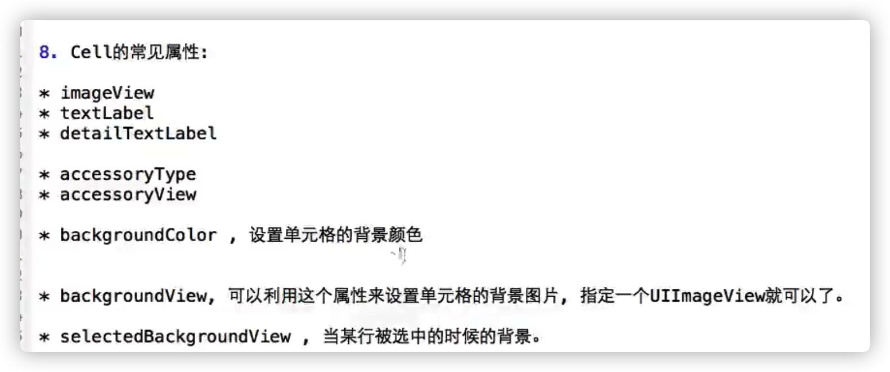

# 设置行高

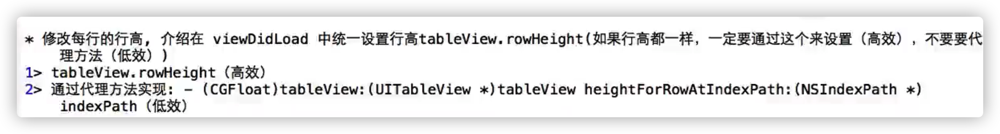

   # tableView的属性

以下都在-viewDidLoad里面写

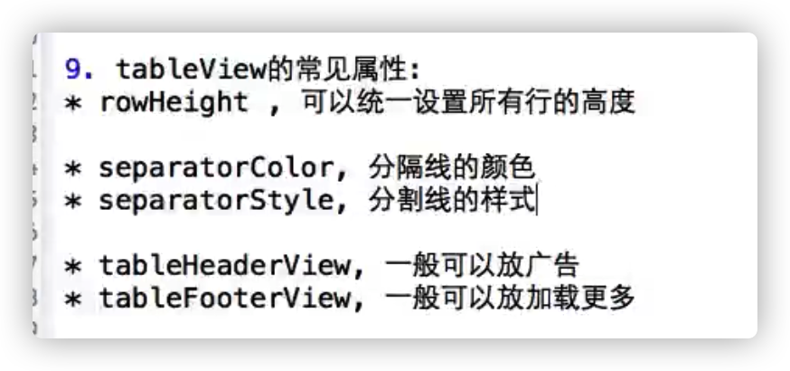

# 有关单元格创建内存动态

```objective-c
- (UITableViewCell *)tableView:(UITableView *)tableView cellForRowAtIndexPath:(NSIndexPath *)indexPath;
```

创建显示在屏幕上面的单元格，如果单元格滚出屏幕，就自动销毁，再次进入屏幕再次创建

频繁创建销毁对象，不利于运行效率

所以需要单元格重用

# 单元格重用

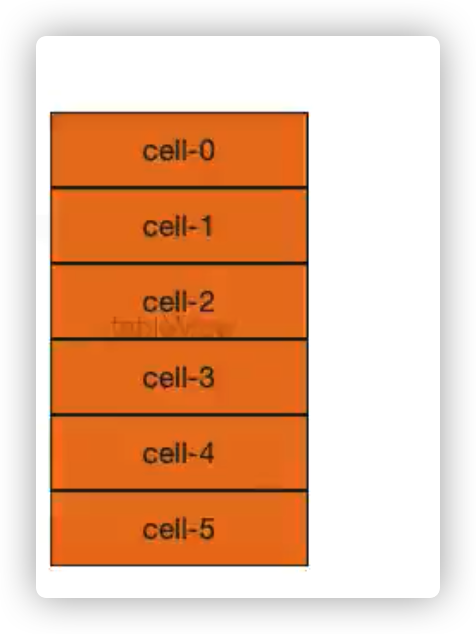

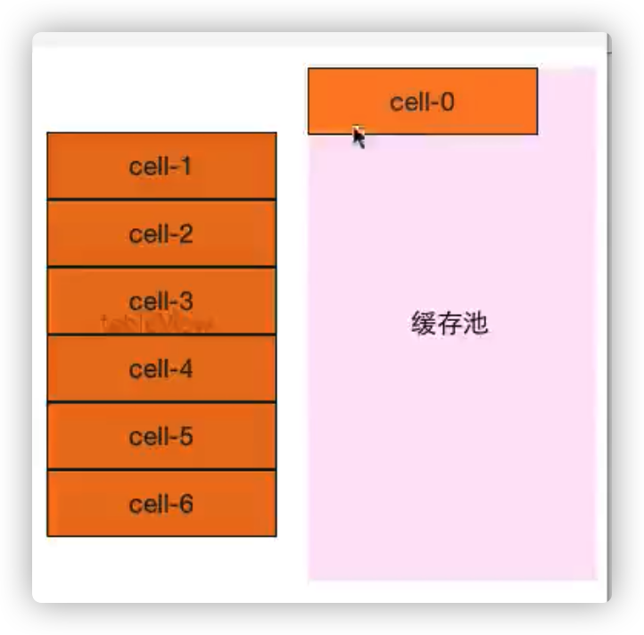

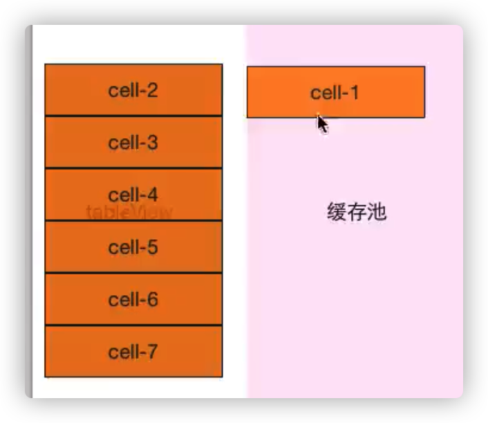

**前提：所有单元格样式一样**

就像电梯一样，重复使用单元格，没有销毁，只是改变里面的内容

- 如果单元格样式不一样，需要把单元格按照样式做以标记id，即**重用id**

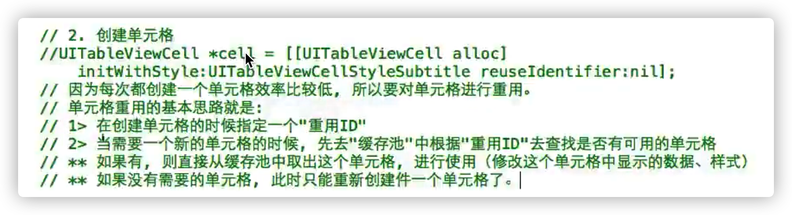

- 为了避免id被反复创建销毁，我们加static关键词

加上关键词之后id一直保留着，不会反复创建销毁

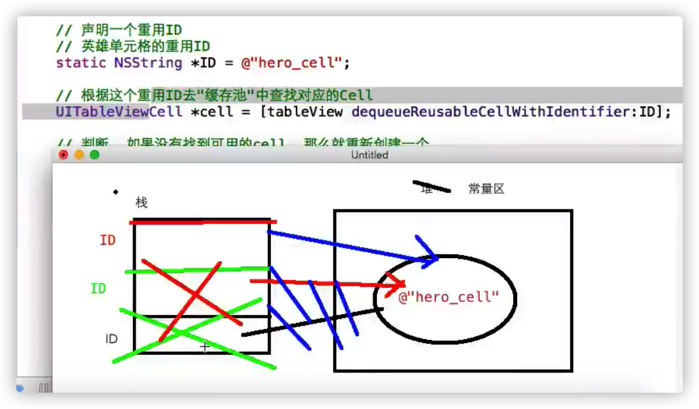

```objective-c
     static NSString * ID = @"hero_cell";
```

# 右侧索引栏

- 数据源方法

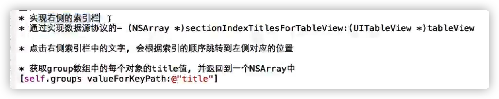

# KVC的一个方法

```objective-c
    return [self.groups valueForKey:@"title"];
```

- 

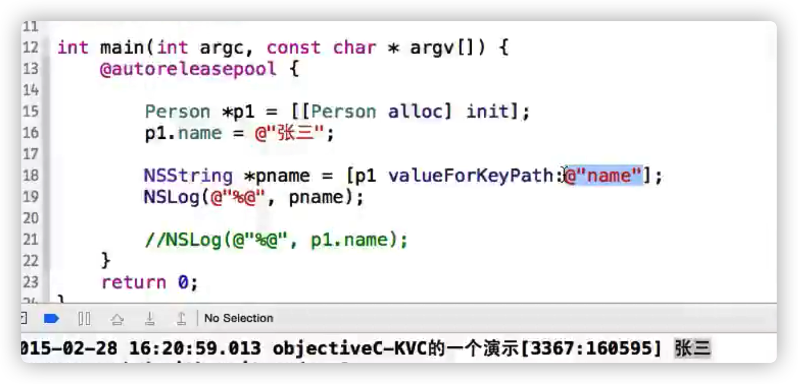

valueForKeyPath里面写属性的名字

使用valueForKeyPath会更灵活

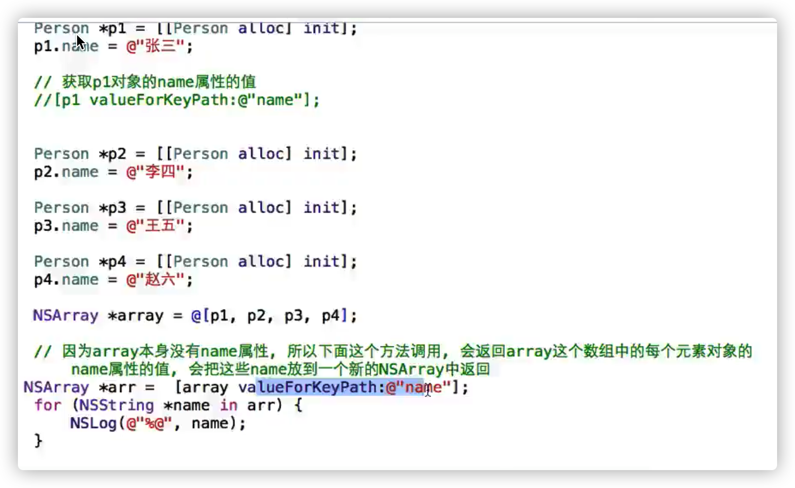

valueForKeyPath会一直往下取，一直取到最后一辈儿

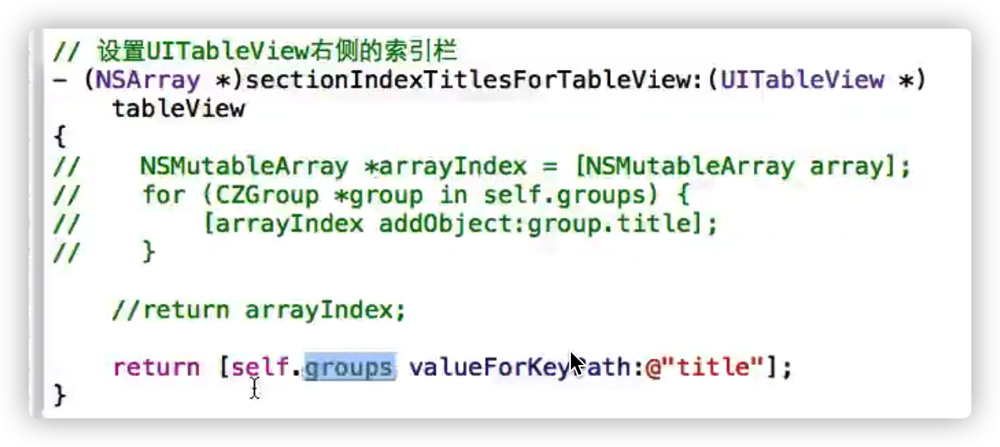

两者等价  

# 数据刷新

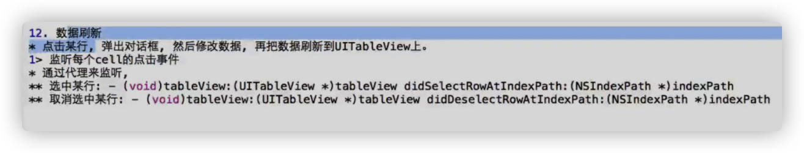

通过代理来监听

