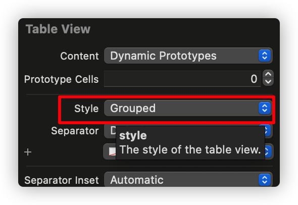

# UITableView表格控件

- 表格：按照行和列的方式来显示内容（数据，控件等等）

**多行，但是只有一列**

- ```
  @interface UITableView : UIScrollView
  ```

UITableView继承UIScrollView

- 两种样式：

UITableViewStylePlain

UITableViewStyleGrouped 分组数据



# 如果展示数据


- **数据源对象一般都是当前控制器，即self**
- 设置数据源对象的两种方式

1、代码

2、拖线


