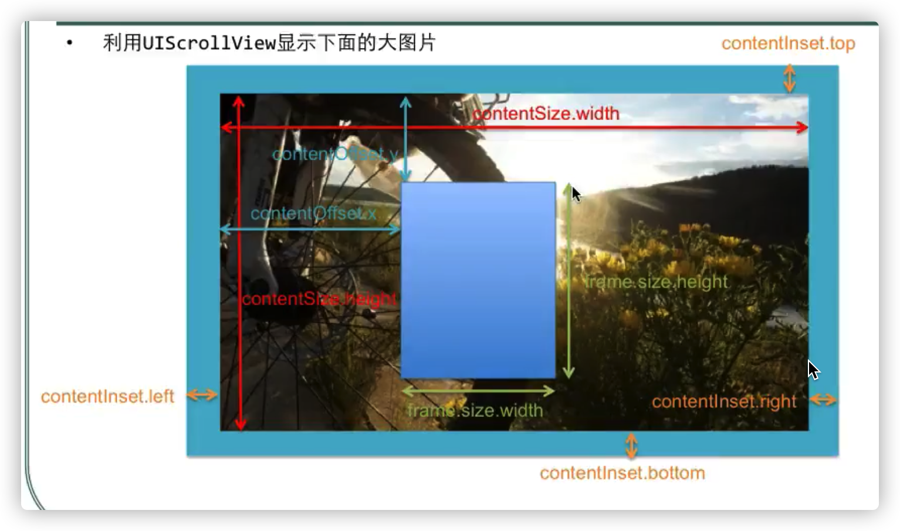
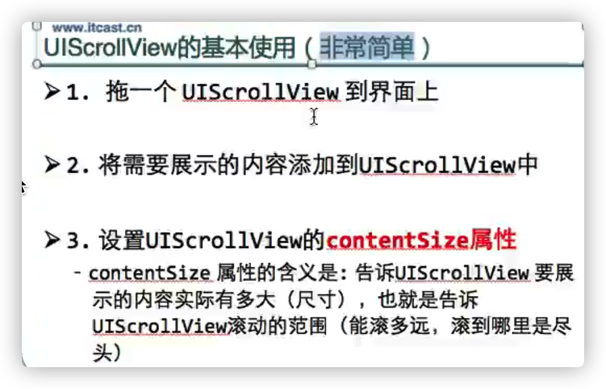
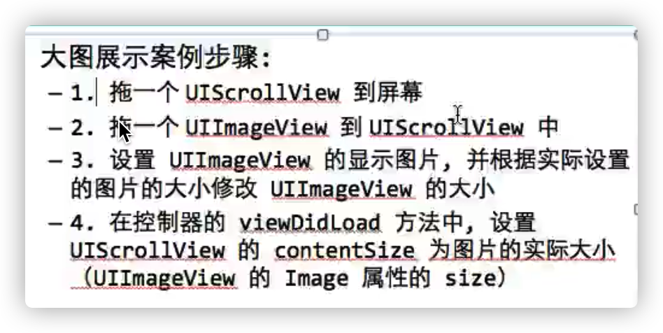
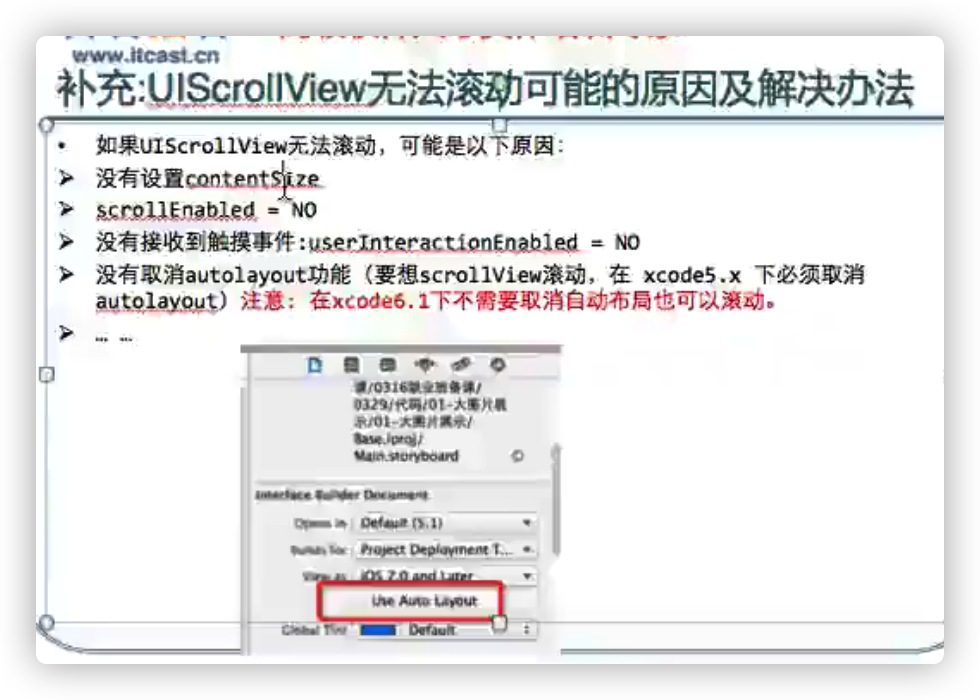
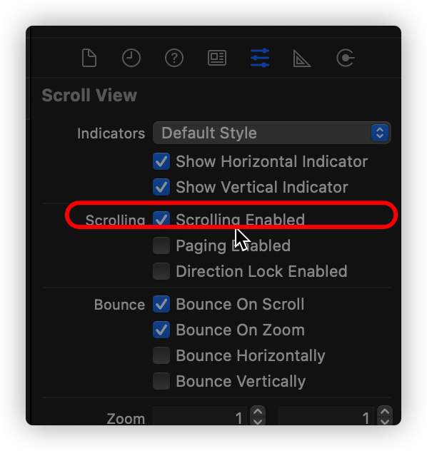
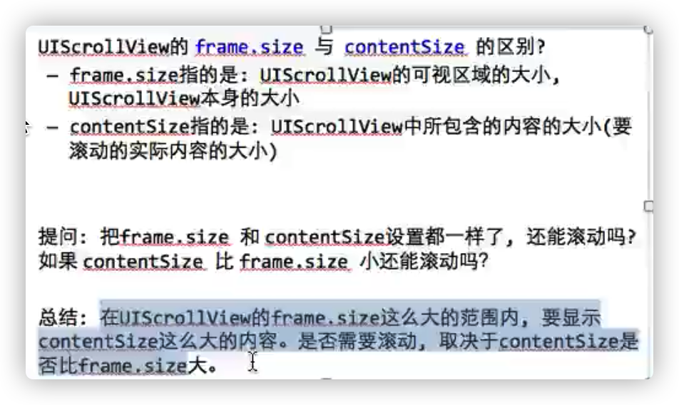
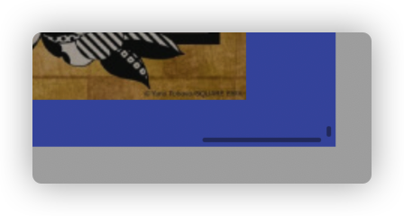
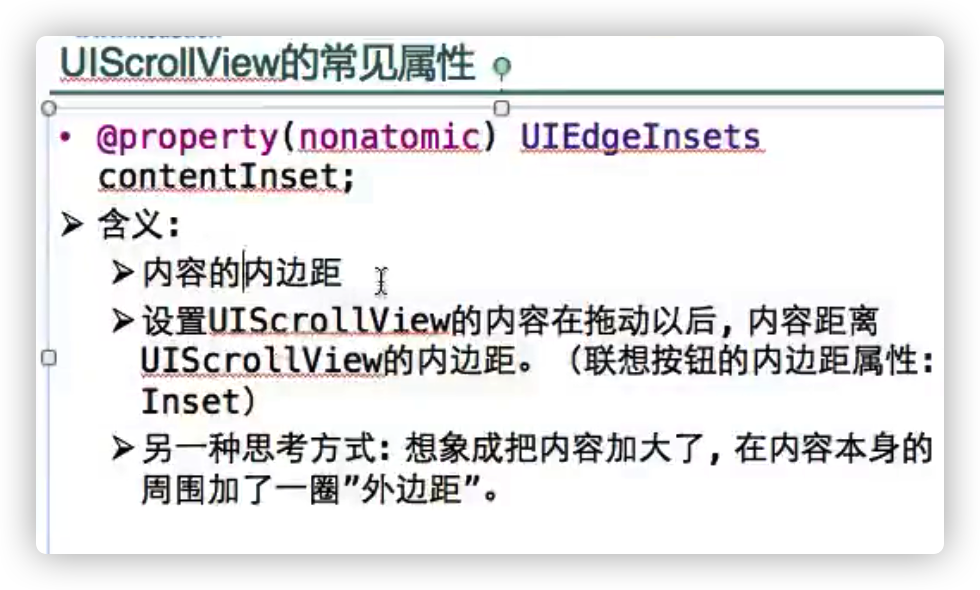
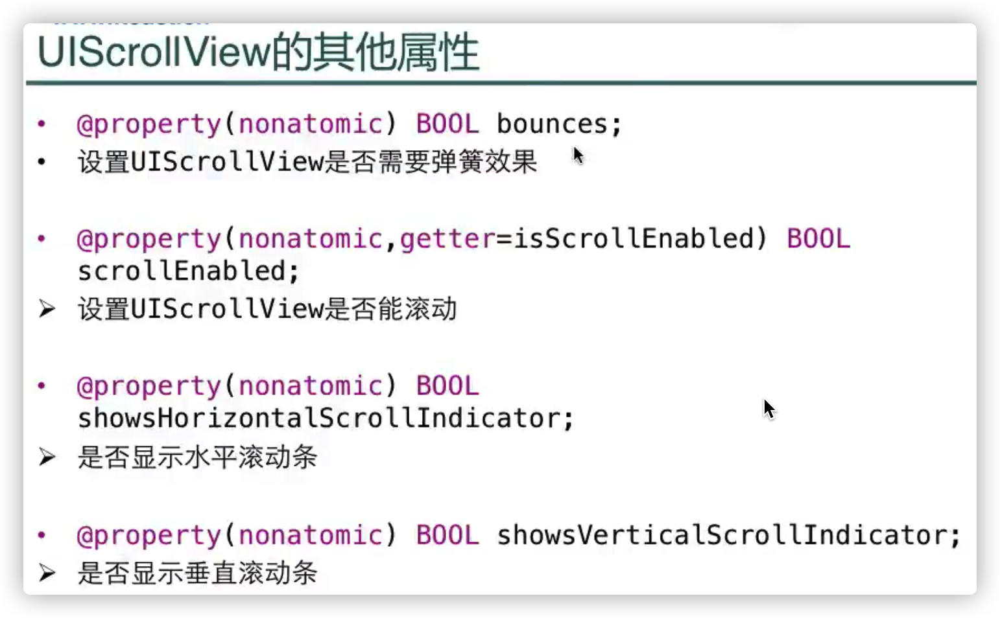

# UIScrollView

- Scroll [skrəʊl]滚屏; 滚动;

用来实现滚动和缩放的控件（显示不下的情况下）

 滚动和缩放的由UIScrollView里面的内容进行

 



 

 



# UIScrollView的属性contentOffset

- Offset 偏移

 是scrollview当前显示区域顶点相对于frame顶点的偏移量

scrollView的偏移：scrollView距离图片框的距离（想象scrollView在图片框里面移动）

希望看到下面内容，用户向上滚动，scrollView向下移动，偏移正数

希望看到上面内容，用户向下滚动，scrollView向上移动，偏移负数


 # 隐藏滚动指示器



- **在viewDidLoad里面**

```objective-c
    self.scrollView.showsHorizontalScrollIndicator = NO;
    self.scrollView.showsVerticalScrollIndicator = NO;
```

Indicator [ˈɪndɪkeɪtə(r)]   标志; 迹象;

# UIScrollView的属性UIEdgeInsets

- inset内边距



```objective-c
 //设置UIScrollView内容的内边距
    self.scrollView.contentInset = UIEdgeInsetsMake(100, 50, 30, 5);
```

- 拖拽完了之后会展示内容的内边距



 
