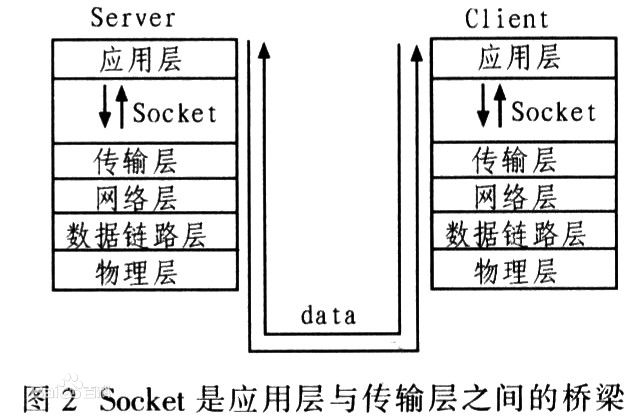
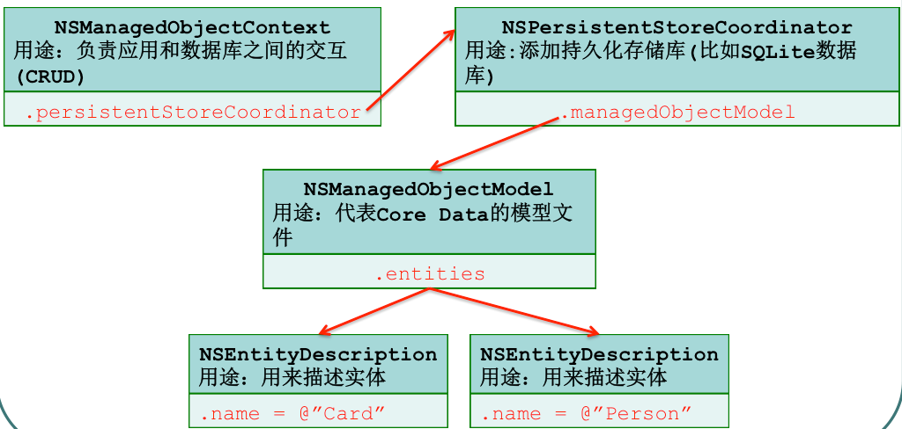

# 网络概念第一天

## 两台电脑怎么通过网络传输数据？怎样才能知道传输的是数据？谁摸过网线？

看电影，怎么看的？
通过电流，把数据传过来，主机操作系统会把电流转换成二进制。
对数据做了打包封装，传到网络上。
在网络线路上看到很多路，条条大路通罗马，得选一个最优路径，以确保最快最安全的到达目的地。

## OSI七层模型（开放系统互连参考模型 ）
 * （了解）开放系统互连参考模型 (Open System Interconnect 简称OSI）是国际标准化组织(ISO)和国际电报电话咨询委员会(CCITT)联合制定的开放系统互连参考模型，为开放式互连信息系统提供了一种功能结构的框架。，它从低到高分别是：物理层、数据链路层、网络层、传输层、会话层、表示层和应用层。

 * （了解）物理层、数据链路层、网络层、传输层、会话层、表示层和应用层。每一层的功能是独立的。它利用其下一层提供的服务并为其上一层提供服务，而与其他层的具体实现无关。这里所谓的“服务”就是下一层向上一层提供的通信功能和层之间的会话规定，一般用通信原语实现。两个开放系统中的同等层之间的通信规则和约定称之为协议。通常把1～4层协议称为下层协议，5～7层协议称为上层协议。

  * 物理层：主要定义物理设备标准，如网线的接口类型、光纤的接口类型、各种传输介质的传输速率等。它的主要作用是传输比特流（就是由1、0转化为电流强弱来进行传输,到达目的地后在转化为1、0，也就是我们常说的数模转换与模数转换）。这一层是数据的比特流。例：摸网线
  *  数据链路层：定义了如何让格式化数据以进行传输，以及如何让控制对物理介质的访问。这一层通常还提供错误检测和纠正，是一种对比特流的一种包装，以确保数据的可靠传输和可识别。这一层是数据的帧。

*  网络层：在位于不同地理位置的网络中的两个主机系统之间提供连接和路径选择。Internet的发展使得从世界各站点访问信息的用户数大大增加，而网络层正是管理这种连接的层。这一层数据传送的单位是分组或包。
 
  *  传输层：定义了一些传输数据的协议和端口号（如HTTP的端口80等），TCP（传输控制协议，传输效率低，可靠性强，可以用于传输可靠性要求高，数据量大的数据），UDP（用户数据报协议，与TCP特性恰恰相反，用于传输可靠性要求不高，数据量小的数据，如QQ聊天数据就是通过这种方式传输的）。 主要是从下层接收的数据进行分段和传输，到达目的地址后再进行重组。常常把这一层数据叫做报文段。
  *  会话层：通过传输层（端口号：传输端口与接收端口）建立数据传输的通路。主要在你的系统之间发起会话或者接受会话请求（设备之间需要互相认识可以是IP也可以是MAC或者是主机名）
  *  表示层：可确保一个系统的应用层所发送的信息可以被另一个系统的应用层读取。例如，PC程序与另一台计算机进行通信，其中一台计算机使用扩展二一十进制交换码（EBCDIC），而另一台则使用美国信息交换标准码（ASCII）来表示相同的字符。如有必要，表示层会通过使用一种通格式来实现多种数据格式之间的转换。
  *
  *  应用层： 是最靠近用户的OSI层。这一层为用户的应用程序（例如电子邮件、文件传输和终端仿真）提供网络服务。
  *
##什么是客户端服务器
* 服务端的特征：
被动的角色（从）。 等待来自客户端的要求。 处理要求并传回结果。
* 客户端的特征：
主动的角色（主）。 发送要求。 等待直到收到回应。 服务器可是有状态或者无状态的。无状态的服务器不会保留任何两个请求之间的信息，有状态服务器会记住请求之间的信息。这些信息的作用域可以是全局的或者某个事务 （session）的。静态 HTML 页面服务器是一个无状态服务器的例子，Apache Tomcat 是一个有状态服务器。

* C/S框架和p2p（peer to peer）P2P 框架比较
另一种已知的网络架构类型是点对点技术(peer-to-peer architecture)，不同于客户端服务器，网络上的每个使用端或程式的实体都拥有相同的等级，同时扮演用户端与服务器的角色。Peer to peer 常被缩写成 P2P。
此两种架构目前都被广范使用，可以找寻有关`中心式网络(Client-Server)或非中心式网络(Peer-to-peer)`得到更详细的资讯，此两种架构都可于 Windows 与Linux上面使用

> 传输层协议和传输协议一样吗？

> 答:传输层（TransportLayer）是OSI中最重要,答：最关键的一层,是唯一负责总体的数据传输和数据控制的一层.传输层提供端到端的交换数据的机制，检查分组编号与次序。传输层对其上三层如会话层等，提供可靠的传输服务,对网络层提供可靠的目的地站点信息.

# 传输层中的协议（了解）

> 传输层（又称主机到主机传输层）为应用层提供会话和数据报通信服务。传输层承担OSI传输层的职责。传输层的核心协议是TCP和UDP。TCP提供一对一的、面向连接的可靠通信服务。TCP建立连接，对发送的数据包进行排序和确认，并恢复在传输过程中丢失的数据包。与TCP不同，UDP提供一对一或一对多的、无连接的不可靠通信服务。
> 不论是TCP/IP还是在OSI参考模型中，任意相邻两层的下层为服务提供者，上层为服务调用者。下层为上层提供的服务可分为两类：面向连接服务和无连接服务。
1. 面向连接的网络服务
> 面向连接的网络服务又称为虚电路（Virtual Circuit）服务，它具有网络连接建立、数据传输和网络连接释放三个阶段。是按顺序传输可靠的报文分组方式，适用于指定对象、长报文、会话型传输要求。
> 面向连接服务以电话系统为模式。要和某个人通话，首先拿起电话，拨号码，通话，然后挂断。同样在使用面向连接的服务时，用户首先要建立连接，使用连接，然后释放连接。连接本质上像个管道：发送者在管道的一端放入物体，接收者在另一端按同样的次序取出物体；其特点是收发的数据不仅顺序一致，而且内容也相同。
2. 无连接的网络服务
> 无连接网络服务的两实体之间的通信不需要事先建立好一个连接。无连接网络服务有3种类型：数据报（Datagram）、确认交付（Confirmed Delivery）与请求回答（Request reply。
> 无连接服务以邮政系统为模式。每个报文（信件）带有完整的目的地址，并且每一个报文都独立于其他报文，由系统选定的路线传递。在正常情况下，当两个报文发往同一目的地时，先发的先到。但是，也有可能先发的报文在途中延误了，后发的报文反而先收到；而这种情况在面向连接的服务中是绝对不可能发生的。

# 传输控制协议（TCP）（重点了解）
#### TCP全称是Transmission Control Protocol，中文名为传输控制协议
1. TCP工作原理 ：TCP的连接建立过程又称为TCP三次握手。
    *  首先客户端向服务器发起一个建立连接的同步（SYN）请求；
    *  服务器在收到这个请求后向客户端回复一个同步/确认（SYN/ACK）应答；
    *  客户端收到此应答确认之后再向服务器发送一个确认（ACK），，此时TCP连接成功建立.
    *  一旦初始的三次握手完成，在发送和接收主机之间将按顺序发送和确认数据段，数据传输完成之后，关闭连接之前，TCP使用类似的握手过程验证两个主机是否都完成发送和接收全部数据。

2.  它可以提供可靠的、面向连接的网络数据传递服务。传输控制协议主要包含下列任务和功能。
    *  确保IP数据报的成功传递。
    *  对程序发送的大块数据进行分段和重组。
    * 确保正确排序及按顺序传递分段的数据。
    * 通过计算校验和，进行传输数据的完整性检查。
    * 根据数据是否接收成功发送肯定消息。通过使用选择性确认，也对没有收到的数据发送否定确认。
	为必须使用可靠的、基于会话的数据传输程序，如客户端/服务器数据库和电子邮件程序，提供首选传输方法。

## TCP工作过程比较复杂，包括的内容如下。

	*TCP连接关闭*：客户端和服务器建立TCP连接并完成数据传输后，会发送一个结束标记值1的数据包，以关闭这个TCP连接，并同时释放该连接占用的缓冲区资源。
	*TCP重置*：TCP允许在传输的过程中突然中断连接。
	*TCP数据排序和确认*：在传输的过程中使用序列号和确认号来跟踪数据的接收情况。
	*TCP重传*：在TCP的传输过程中，如果在重传超时的时间内没有收到客户端对某数据包的确认回复，客户端就认为此数据包丢失，并再次向服务器发送这个数据包。
	*TCP延迟确认*：TCP并不总是在接收到数据后立即对其进行确认，它允许主机在接收数据的同时发送自己的确认信息给对方。
	*TCP数据保护*（校验）：TCP是可靠传输的协议，它提供校验和计算来实现数据在传输过程中的完整性。
- TCP与端口号
> TCP和UDP都是IP层面的传输协议，是IP与上层之间的处理接口。TCP和UDP端口号被设计来区分运行在单个设备上的多重应用程序的IP地址。由于同一台计算机上可能会运行多个网络应用程序，所以计算机需要确保目标计算机上接收源主机数据包的软件应用程序的正确性，以及响应能够被发送到源主机的正确应用程序上。该过程正是通过使用TCP或UDP端口号来实现的。
> 在TCP和UDP头部分，有“源端口”和“目标端口”段，  主要用于显示发送和接收过程中的身份识别信息。IP 地址和端口号合在一起被称为“套接字”。TCP端口比较复杂，其工作方式与UDP端口不同。UDP端口对于基于UDP的通信作为单一消息队列和网络端点来操作，而所有TCP通信的终点都是唯一的连接。每个TCP连接由两个端点唯一识别。由于所有TCP连接由两对 IP 地址和TCP端口唯一识别（每个所连主机都有一个地址/端口对），因此每个TCP服务器端口都能提供对多个连接的共享访问

#### 用户数据报协议（UDP）（重点了解）
> UDP全称是User Datagr2am Protocol，中文名为用户数据报协议。UDP 提供无连接的网络服务，该服务对消息中传输的数据提供不可靠的、最大努力传送。这意味着它不保证数据报的到达，也不保证所传送数据包的顺序是否正确。
 同学们也许会问：“既然UDP是一种不可靠的网络协议，那么还有这种协议的出现是为什么呢？”其实在有些情况下UDP可能会变得非常有用。因为UDP具有效率优势。虽然TCP中植入了各种安全保障功能，正因为有安全你的保障，所以对效率的保障就会很低，在实际执行的过程中会占用大量的系统开销，无疑效率受到严重的影响。反观UDP由于排除了信息可靠传递机制，将安全和排序等功能移交给上层应用来完成，极大地降低了执行时间，使效率得到了保证。

###   网关：网关(Gateway)又称网间连接器、协议转换器。(了解)
* 网关(Gateway)又称网间连接器、协议转换器。默认网关在网络层上以实现网络互连，是最复杂的网络互连设备，仅用于两个高层协议不同的网络互连。网关的结构也和路由器类似，不同的是互连层。网关既可以用于广域网互连，也可以用于局域网互连。
* 在OSI中，网关有两种：一种是面向连接的网关，一种是无连接的网关。
 （简单理解下：举例）把自己想成网络数据，从一个房间走到另一个房间，相当于从一个网络走到另一个网络，需要穿过一扇门，这扇门就是起到的网关的作用。通过网关才能进入下一个房间，也就是一个网络进入下一个网络。这个门就是网关，他管理你的进出，也就是管理网络的连接和解析数据。

#### （了解）局域网（Local Area Network，LAN）是在一个局部的地理范围内（如一个学校、工厂和机关内），一般是方圆几千米以内，将各种计算机，外部设备和数据库等互相联接起来组成的计算机通信网
#### （了解）广域网（WAN，Wide Area Network）也称远程网（long haul network ）。通常跨接很大的物理范围，所覆盖的范围从几十公里到几千公里，它能连接多个城市或国家，或横跨几个洲并能提供远距离通信，形成国际性的远程网络

传输协议概念广泛的多，基本上所有的协议都是做数据传输的。
#### **常见的传输协议有哪些？**

*ARP(Address Resolution Protocol)地址解析协议*
　　它是用于映射计算机的物理地址和临时指定的网络地址。
启动时它选择一个协议(网络层)地址，并检查这个地址是否已经有别的计算机使用，
 如果没有被使用，此结点被使用这个地址，如果此地址已经被别的计算机使用，
 正在使用此地址的计算机会通告这一信息，只有再选另一个地址了。
*DHCP(Dynamic Host Configuration Protocol)动态主机配置协议*
　　它是在TCP/IP网络上使客户机获得配置信息的协议，它是基于BOOTP协议，
 并在BOOTP协议的基础上添加了自动分配可用网络地址等功能。
 这两个协议可以通过一些机制互操作。
 DHCP协议在安装TCP/IP协议和使用TCP/IP协议进行通迅时，
 必须配置IP地址、子网掩码、缺省网关三个参数，这三个参数可以手动配置，也可以使用DHCP自动配置。

*Discard Protocol抛弃协议*
　　它的作用就是接收到什么抛弃什么，它对调试网络状态的一定的用处。
 基于TCP的抛弃服务，如果服务器实现了抛弃协议，服务器就会在TCP端口9检测抛弃协议请求，在建立连接后并检测到请求后，就直接把接收到的数据直接抛弃，直到用户中断连接。而基于UDP协议的抛弃服务和基于TCP差不多，检测的端口是UDP端口9，功能也一样。

　　*Echo Protocol协议*
　　这个协议主要用于调试和检测中。这个协议的作用也十分简单，接收到什么原封发回就是了。
 它可以基于TCP协议，服务器就在TCP端口7检测有无消息，如果有发送来的消息直接返回就是了。
 如果使用UDP协议的基本过程和TCP一样，检测的端口也是7。

　　*FTP(File Transfer Protocol)文件传输协议*
　　它是一个标准协议，是在计算机和网络之间交换文件的最简单的方法。
 像传送可显示文件的HTTP和电子邮件的SMTP一样，FTP也是应用TCP/IP协议的应用协议标准。
FTP通常用于将网页从创作者上传到服务器上供人使用，
而从服务器上下传文件也是一种非常普遍的使用方式。
 作为用户，您可以用非常简单的DOS界面来使用FTP，
 也可以使用由第三方提供的图形界面的FTP来更新(删除，重命名，移动和复制)服务器上的文件。
 现在有许多服务器支持匿名登录，允许用户使用FTP和ANONYMOUS作为用户名进行登录，
 通常可使用任何口令或只按回车键。

　　*HDLC(High-Level Data Link Control)高层数据链路协议*
　　它是一组用于在网络结点间传送数据的协议。
 在HDLC中，数据被组成一个个的单元(称为帧)通过网络发送，并由接收方确认收到。
 HDLC协议也管理数据流和数据发送的间隔时间。HDLC是在数据链路层中最广泛最使用的协议之一。
 现在作为ISO的标准，HDLC是基于IBM的SDLC协议的，SDLC被广泛用于IBM的大型机环境之中。
 在HDLC中，属于SDLC的被称为通响应模式(NRM)。
 在通常响应模式中，基站(通常是大型机)发送数据给本地或远程的二级站。
不同类型的HDLC被用于使用X.25协议的网络和帧中继网络，
 这种协议可以在局域网或广域网中使用，无论此网是公共的还是私人的。

　　*HTTP1.1(Hypertext Transfer Protocol Vertion 1.1)超文本传输协议-版本1.1*
　　它是用来在Internet上传送超文本的传送协议。
 它是运行在TCP/IP协议族之上的HTTP应用协议，它可以使浏览器更加高效，使网络传输减少。
 任何服务器除了包括HTML文件以外，还有一个HTTP驻留程序，用于响应用用户请求。
 您的浏览器是HTTP客户，向服务器发送请求，
 当浏览器中输入了一个开始文件或点击了一个超级链接时，浏览器就向服务器发送了HTTP请求，
 此请求被送往由IP地址指定的URL。驻留程序接收到请求，在进行必要的操作后回送所要求的文件。

　　*HTTPS(Secure Hypertext Transfer Protocol)安全超文本传输协议*
　　它是由Netscape开发并内置于其浏览器中，用于对数据进行压缩和解压操作，
 并返回网络上传送回的结果。
 HTTPS实际上应用了Netscape的完全套接字层(SSL)作为HTTP应用层的子层。
(HTTPS使用端口443，而不是象HTTP那样使用端口80来和TCP/IP进行通信。)
 SSL使用40 位关键字作为RC4流加密算法，这对于商业信息的加密是合适的。
 HTTPS和SSL支持使用X.509数字认证，如果需要的话用户可以确认发送者是谁。

　　*ICMP(Internet Control Message Protocol)Internet控制信息协议*
　　它是一个在主机和网关之间消息控制和差错报告协议。
ICMP使用IP数据报，但消息由TCP/IP软件处理，对于应用程序使用者是不可见的。
 在被称为Catenet的系统中，IP协议被用作主机到主机的数据报服务。网络连接设备称为网关。
 这些网关通过网关到网关协议(GGP)相互交换用于控制的信息。
 通常，赡养或目的主机将和源主机通信，例如，为报告在数据报过程中的错误。
 为了这个目的才使用了ICMP，它使用IP做于底层支持，好象它是一个高层协议，
 而实际上它是IP的一部分，必须由其它IP模块实现。
 ICMP消息在以下几种情况下发送:当数据报不能到达目的地时，
当网关的已经失去缓存功能，当网关能够引导主机在更短路由上发送。
 IP并非设计为设计为绝对可靠，这个协议的目的是为了当网络出现问题的时候返回控制信息，
 而不是使IP协议变得绝对可靠，并不保证数据报或控制信息能够返回。
 一些数据报仍将在没有任何报告的情况下丢失。

　　IMAP4(Internet Mail Access Protocol Version 4)Internet邮件访问协议-版本4它是用于从本地服务器上访问电子邮件的标准协议，它是一个C/S模型协议，
 用户的电子邮件由服务器负责接收保存。
 IMAP4改进了POP3的不足，用户可以通过浏览信件头来决定是不是要下载此信，
 还可以在服务器上创建或更改文件夹或邮箱，删除信件或检索信件的特定部分。
 在用户访问电子电子邮件时，IMAP4需要持续访问服务器。
 在POP3中，信件是保存在服务器上的，当用户阅读信件时，所有内容都会被立刻下载到用户的机器上。
 我们有时可以把IMAP4看成是一个远程文件服务器，把POP3可以看成是一个存储转发服务。

　*IPv6(Internet Protocol Version 6)Internet协议-版本6*
　　它是Internet协议的最新版本，已作为IP的一部分并被许多主要的操作系统所支持。
 IPv6也被称为“Ipng”(下一代IP)，它对现行的IP(版本4)进行重大的改进。
 使用IPv4和IPv6的网络主机和中间结点可以处理IP协议中任何一层的包。
 用户和服务商可以直接安装IPv6而不用对系统进行什么重大的修改。
 相对于版本4,新版本的最大改进在于将IP地址从32位改为128位，
 这一改进是为了适应网络快速的发展对IP地址的需求，也从根本上改变了IP地址短缺的问题。
 简化IPv4首部字段被删除或者成为可选字段，减少了一般情况下包的处理开销以及IPv6首部占用的带宽。
 改进IP 首部选项编码方式的修改导致更加高效的传输，在选项长度方面更少的限制，
 以及将来引入新的选项时更强的适应性。加入一个新的能力，
 使得那些发送者要求特殊处理的属于特别的传输流的包能够贴上标签，
 比如非缺省质量的服务或者实时服务。
 为支持认证，数据完整性以及(可选的)数据保密的扩展都在IPv6中说明。
 本文描述IPv6基本首部以及最初定义的IPv6 扩展首部和选项。
 还将讨论包的大小问题，数据流标签和传输类别的语法，以及IPv6对上层协议的影响。
 IPv6 地址的格式和语法在其它文章中单独说明。IPv6版的 ICMP 是所有IPv6应用都需要包含的。

　　*IPX/SPX(Internetwork Packet Exchange/Sequential PacketExchange)*
*互连网包交换/顺序包交换*
　　它是由Novell提出的用于客户/服务器相连的网络协议。
使用IPX/SPX协议能运行通常需要NetBEUI支持的程序，通过IPX/SPX协议可以跨过路由器访问其他网络。

　　*MIME(Multi-Purpose Internet Mail Extensions)多功能Internet邮件扩展*
　　MIME是扩展SMTP协议，是1991年Nathan Borenstein向IETF提出。
 在传输字符数据的同时，允许用户传送另外的文件类型，
 如声音，图像和应用程序，并将其压缩在MIME附件中。
 因此，新的文件类型也被作为新的被支持的IP文件类型。

　　*POP3(Post Office Protocol Version 3)邮局协议-版本3*
　　它是一个关于接收电子邮件的客户/服务器协议。
 电子邮件由服务器接收并保存，在一定时间之后，由客户电子邮件接收程序检查邮箱并下载邮件。
 POP3它内置于IE和Netscape浏览器中。另一个替代协议是交互邮件访问协议(IMAP)。
 使用IMAP您可以将服务器上的邮件视为本地客户机上的邮件。
在本地机上删除的邮件还可以从服务器上找到。
 E-mail 可以被保存在服务器上，并且可以从服务器上找回。

　*PPP(Point to Point Protocol)点对点协议*
　　它是用于串行接口的两台计算机的通信协议，
 是为通过电话线连接计算机和服务器而彼此通信而制定的协议。
 网络服务提供商可以提供您点对点连接，这样提供商的服务器就可以响应您的请求，
 将您的请求接收并发送到网络上，然后将网络上的响应送回。
 PPP是使用IP协议，有时它被认为是TCP/IP协议族的一员。
 PPP协议可用于不同介质上包括双绞线，光纤和卫星传输的全双工协议，它使用HDLC进行包的装入。
 PPP协议既可以处理同步通信也可以处理异步通信，可以允许多个用户共享一个线路，
 又可发进行SLIP协议所没有的差错控制。

　　*RIP(Routing Infomation Protocol)路由信息协议*
　　RIP是最早的路由协议之一，而且现在仍然在广泛使用。
 它从类别上应该属于内部网关协议(IGP)类，它是距离向量路由式协议，
 这种协议在计算两个地方的距离时只计算经过的路由器的数目，
 如果到相同目标有两个不等速或带宽不同的路由器，但是经过的路由器的个数一样，
 RIP认为两者距离一样，而实际传送数据时，很明显一个快一个慢，
 这就是RIP协议的不足之处，而OSPF在它的基础上克服了RIP的缺点。

　　*SLIP(Serial Line Internet Protocol)串行线路Internet协议*
　　它是一个TCP/IP协议，它用于在两台计算机之间通信。
 通常计算机与服务器连接的线路是串行线路，而不是如T1的多路线路或并行线。
 您的服务器提供商可以向您提供SLIP连接，这样他的服务器就可以响应您的请求，
 并将请求发送到网络上，然后将网络返回的结果送至您的计算机。
 现已逐渐被功能更好的PPP点对点协议所取代。

　　*SMTP(Simple Mail Transfer Protocol)简单邮件传送协议*
　　它是用来发送电子邮件的TCP/IP协议。它的内容由IETF的RFC 821定义。
 另外一个和SMTP相同功能的协议是X.400。
 SMTP的一个重要特点是它能够在传送中接力传送邮件，传送服务提供了进程间通信环境(IPCE)，
 此环境可以包括一个网络，几个网络或一个网络的子网。
 理解到传送系统(或IPCE)不是一对一的是很重要的。
 进程可能直接和其它进程通过已知的IPCE通信。邮件是一个应用程序或进程间通信。
 邮件可以通过连接在不同IPCE上的进程跨网络进行邮件传送。
 更特别的是，邮件可以通过不同网络上的主机接力式传送。

　　*Talk协议*
　　Talk协议能使远程计算机上的两个用户以实时方式进行通信。

　　*TCP/IP(Transmission Control Protocol/Internet Protocol)传输控制协议/Internet协议*
　　TCP/IP协议起源于美国国防高级研究计划局。
 提供可靠数据传输的协议称为传输控制协议TCP，好比货物装箱单，保证数据在传输过程中不会丢失;
 提供无连接数据报服务的协议称为网络协议IP，好比收发货人的地址姓名，保证数据到达指定的地点。
 TCP/IP协议是互联网上广泛使用的一种协议，
 使用TCP/IP协议的因特网等网络提供的主要服务有:
 电子邮件、文件传送、远程登录、网络文件系统、电视会议系统和万维网。
 它是Interent的基础，它提供了在广域网内的路由功能，而且使Internet上的不同主机可以互联。
 从概念上，它可以映射到四层:
 网络接口层，这一层负责在线路上传输帧并从线路上接收帧;Internet层，这一层中包括了IP协议，
 IP协议生成Internet数据报，进行必要的路由算法，
 IP协议实际上可以分为四部分:ARP，ICMP，IGMP和IP;
 再上向就是传输层，这一层负责管理计算机间的会话，这一层包括两个协议TCP和UDP，
 由应用程序的要求不同可以使用不同的协议进行通信;最后一层是应用层，
 就是我们熟悉的FTP，DNS，TELNET等。熟悉TCP/IP是熟悉Internet的必由之路。

　　*TELNET Protocol虚拟终端协议*
　　TELNET协议的目的是提供一个相对通用的，双向的，面向八位字节的通信方法，
 它主要的目标是允许接口终端设备的标准方法和面向终端的相互作用。
 是让用户在远程计算机登录，并使用远程计算机上对外开放的所有资源。

　　*Time Protocol时间协议*
　　该协议提供了一个独立于站点的，机器可读的日期和时间信息。
 时间服务返回的是以秒数，是从1900年1月1日午夜到现在的秒数。
 设计这个协议的一个重要目的在于，网络上的许多主机并没有时间的观念，在分布式的系统上，
 我们可以想一想，北京的时间和东京的时间如何分呢?
 主机的时间往往可以人为改变，而且因为机器时钟内的误差而变得不一致，
 因此需要使用时间服务器通过选举方式得到网络时间，让服务器有一个准确的时间观念。
 不要小看时间，这对于一些以时间为标准的分布运行的程序简单是太重要了。
 这个协议可以工作在TCP和UDP协议下。
 时间是由32位表示的，是自1900年1月1日0时到当前的秒数，我们可以计算一下，
 这个协议只能表示到2036年就不能用了，但是我们也知道计算机发展速度这么快，
 到时候可能就会有更好的协议代替这个协议.

　　*TFTP(Trivial File Transfer Protocol)小文件传输协议*
　　它是一个网络应用程序，它比FTP简单也比FTP功能少。
 它在不需要用户权限或目录可见的情况下使用，它使用UDP协议而不是TCP协议。

　　*UDP(User Datagram Protocol)用户数据报协议*
　　它是定义用来在互连网络环境中提供包交换的计算机通信的协议，
 此协议默认认为网路协议(IP)是其下层协议。
 UDP是TCP的另外一种方法，象TCP一样，UDP使用IP协议来获得数据单元(叫做数据报)，不象TCP的是，
 它不提供包(数据报)的分组和组装服务。
 而且，它还不提供对包的排序，这意味着，程序程序必须自己确定信息是否完全地正确地到达目的地。
 如果网络程序要加快处理速度，那使用UPD就比TCP要好。
 UDP提供两种不由IP层提供的服务，它提供端口号来区别不同用户的请求，而且可以提供奇偶校验。
 在OSI模式中，UDP和TCP一样处于第四层，传输层。

　　*UUCP(UNIX-to-UNIX Copy Protocol)UNIX至UNIX拷贝协议*
　　它是一组用于在不同UNIX系统之间复制(传送)文件或传送用于其它UNIX系统执行命令的一组指令，
 是UNIX网络的基础。

　  *X.25协议*
　　它是CCITT标准的通讯协议，制定于1976年，用于定义同步传输的数据包。
 是国际上分组数据网(PDN)上使用的一种协议。
 它允许不同网络中的计算机通过一台工作在网络层的中间计算机进行相互通信。

　  *X.400协议*
　　它是一个电子邮件协议，它由ITU-TS制定，它可以发挥和SMTP相同的功能。
 X.400在欧洲和加拿大使用比较多，它实际上是一个标准集，每个标准的序号都在此400到499之间。
 X.400地址能够提供许多SMTP地址所不能够提供的功能，因此X.400的地址会比较长而且比较麻烦。
 X.400的确提供了比SMTP更多的功能，然而这些功能却很少能够用到。
 X.400的主要部分有以下几个:用户代理(UA)，消息传送代理(MTA)和消息传输系统(MTS)。

　　*Z39.50协议*
　　它是一个标准的通信协议，它用于检索和获得在线数据库中的著书目录。
 Z39.50用于在互联网上检索图书馆的在线公共访问目录(Online Public Access Catalogues，OPAC)，
 也可以用于把多个分离的OPAC连接起来，它是ANSI/NISO标准

## Socket（重点）
### Socket原意为插座，意译为套接字
**本地上的两个进程如何通信?**
1. 内存共享
2. 消息队列
3. 管道  NSPipe NSTask
4. RPC  remote  protocol control
5. 本地Socket

**网络上的两个进程如何通信？**
- 本地进程间通信(IPC)通过PID可以唯一确定彼此，然后通过共享内存，消息队列等来通信。
- 网络上的两个进程确定彼此需要IP与端口号，通过传输层(TCP/UDP)协议进行通信
socket的特点—>在TCP/UDP 加一个端口绑定

由于端口号是被进程独占，因此**socket通信**经常与**进程通信**画上等号

假设电脑是一个大插座，有不同的插座型号，socket就是遍布在上面的插孔，可以为不同的插头提供服务
这个比喻不恰当的地方是一个插孔可以让多个插头插进来
反过来
上述比喻中，服务端进程即为服务本身，区别一台主机的不同服务则是通过端口来区分
因此只要是在这个特定的端口建立起来的TCP/IP连接就应该通往对应的进程
所以唯一确定这个socket的前提是找到这个插板(主机IP)，找到这个插孔(端口)
Socket通信就是一种确定了端口号的TCP/IP通信
上面那句话写成这样也要认识: Socket通信与IP通信差别就是端口确定，协议确定

端口的打开是双方的，很多人在C/S结构的TCP连接中只注意到S的端口(监听的)，实际上C也开了一个端口，而C端的端口是动态端口，TCP连接建立的时候，C端的端口会在三次握手结束后确定，动态打开一个,这个端口不受用户/程序员的控制

### 服务端socket通信步骤
0. 提供一些服务
1. 将这个服务与自己的IP地址、端口绑定
2. 监听任何到这个IP+端口的TCP请求
3. 接受/拒绝 建立这个TCP连接
4. 读写 数据
5. 断开TCP连接

BSD提供了一套底层API来处理这些过程

目前基本上互联网的所有服务都基于socketAPI，所以socket通信技术的基础。

### SocketServer 框架 GCDAsyncSocket
XMPP的框架就是用的她
我们把TCP的Socket 叫做 流式  stream  UDP 的socket 叫做 报文或报式 Socket

 动态端口是大于49151的
 可以百度服务端口了解更多。

0. 记录每一个客户端的连接信息(IP,端口,连接时间,断开时间),以列表的形式展现出来
1. 服务器(MAC应用)和客户端(MAC+iOS)之间能够进行数据传输
2. 服务器能够将所有消息转发给其他的客户端

# CoreData （重点）

  Core Data是iOS5之后才出现的一个框架，它提供了对象-关系映射(ORM)的功能，即能够将OC对象转化成数据，保存在SQLite数据库文件中，也能够将保存在数据库中的数据还原成OC对象。在此数据操作期间，我们不需要编写任何SQL语句，这个有点类似于著名的Hibernate持久化框架，不过功能肯定是没有Hibernate强大的。简单地用下图描述下它的作用：

CoreData本质是一个ORM框架
ORM Objective-Relational Mapping
这个映射就是我们的模型文件,一般ORM框架都用XML格式来映射 实体Entity+属性数据库表,列

托管对象(entity) —既不是单纯的 内存对象,也不是数据库中的具体的数据,它介于这两个状态之间的,我们叫他游离态的数据

CoreData 不能执行SQL语句 取而代之,操作的是对象,
FMDB SQLite 可以直接SQL语句

* 需要手画图！
左边是关系模型，即数据库，数据库里面有张person表，person表里面有id、name、age三个字段，而且有2条记录；
右边是对象模型，可以看到，有2个OC对象；
利用Core Data框架，我们就可以轻松地将数据库里面的2条记录转换成2个OC对象，也可以轻松地将2个OC对象保存到数据库中，变成2条表记录，而且不用写一条SQL语句。

#coredata中的核心对象

注：黑色表示类名，红色表示类里面的一个属性
开发步骤总结：
1.初始化NSManagedObjectModel对象，加载模型文件，读取app中的所有实体信息
2.初始化NSPersistentStoreCoordinator对象，添加持久化库(这里采取SQLite数据库)
3.初始化NSManagedObjectContext对象，拿到这个上下文对象操作实体，进行CRUD(创建（Create）、更新（Update）、读取（Read）和删除（Delete）)操作

### CoreData的4个存储方式:
1. SQLite  *NSSQLiteStoreType*
2. XML  *NSXMLStoreType*
3. Binary  *NSBinaryStoreType*
4. 内存存储   *NSInMemoryStoreType*

### CoreData 持久化协调器 - NSPersistentStoreCoordinator
	NSPersistentStoreCoordinator *coordinator = [[NSPersistentStoreCoordinator alloc] initWithManagedObjectModel:[self managedObjectModel]]
### CoreData 对象映射模型 - NSManagedObjectModel
	_managedObjectModel = [[NSManagedObjectModel alloc] initWithContentsOfURL:modelURL];
### CoreData 托管对象上下文 - NSManagedObjectContext
1. 指定队列
	\_managedObjectContext = [[NSManagedObjectContext alloc] initWithConcurrencyType:NSMainQueueConcurrencyType];
2. 指定协调器
	 [\_managedObjectContext setPersistentStoreCoordinator:coordinator];
### CoreDate 实体描述器 - NSEntityDescription
### CoreData 托管对象 - NSManageObject

#如何快速从iOS开发者角色转换到Mac开发者？

1. 所有的UI前缀(UIKit)替换成NS前缀(AppKit),基本上都有同类型的类
2. 从单Window模式快速切换到多Window模式
3. 所有的NSView **默认无layer**，需要调用setWantsLayer:YES打开!
4. 在viewController->view,Mac中加一个windowController->viewController->view
#### NSTableView快速适应(相当于UI进阶部分)
1. NSTableView每个cell一般都不止一列子cell(多列模式)
2. 只有两个必须的代理(NSTableViewDatasource)
		- (NSInteger)numberOfRowsInTableView:(nonnull NSTableView *)tableView
		- (nullable id)tableView:(NSTableView *)tableView objectValueForTableColumn:(nullable NSTableColumn *)tableColumn row:(NSInteger)row
3. 两个重要模式:
	- 基于 text Cell Based
	- 基于 View Cell Based

4. 基于View的tableView:
	-实现数据源代理:
		- (NSView *) tableView:(nonnull NSTableView *)tableView viewForTableColumn:(nullable NSTableColumn *)tableColumn row:(NSInteger)row

