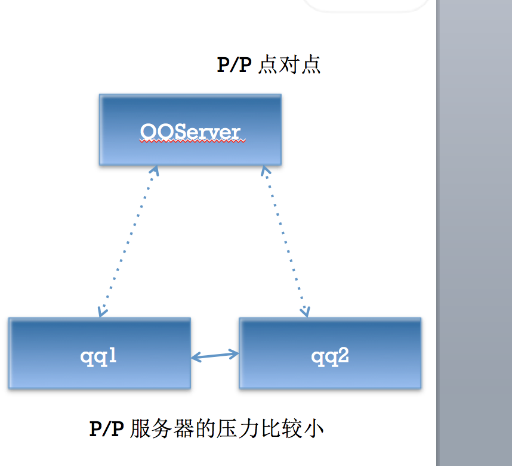
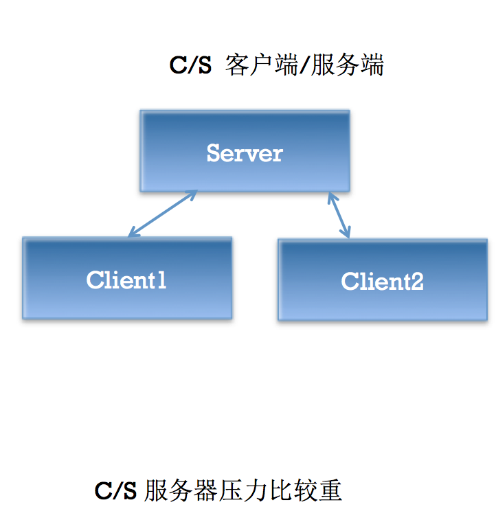

# 第二天 XMPP入门
# 即时通信(Instant Message /IM)的含义
### 即时通信软件发展
产品最早的创始人是三个以色列青年，是他们在1996年做出来的，取名叫**ICQ**。

1998年当ICQ注册用户数达到1200万时，被AOL看中，以2.87亿美元的天价买走。ICQ有1亿多用户，主要市场在美洲和欧洲，已成为世界上最大的即时通信系统。

即时通讯技术（IM -- Instant Messaging）支持用户在线实时交谈。如果要发送一条信息，用户需要打开一个小窗口，以便让用户及其朋友在其中输入信息并让交谈双方都看到交谈的内容

有许多的IM系统，如AOL、Yahoo IM、 MSN以及QQ，它们最大的区别在于各自通讯协议的实现，所以即时通讯技术的核心在于它的传输协议

协议用来说明信息在网络上如何传输，如果有了统一的传输协议，那么应当可以实现各个IM之间的直接通讯，为了创建即时通讯的统一标准，目前已经出现过的IM协议包括：IETF的对话初始协议（SIP）和即时通讯对话初始协议和表示扩展协议（SIMPLE）、应用交换协议（APEX）、显示和即时通讯协议（PRIM）及基于XML且开放的可扩展通讯和表示协议（XMPP）协议（常称为 Jabber 协议）

人们多次努力，试图统一各大主要IM供应商的标准（AOL、Yahoo 及 Microsoft），但无一成功，且每一种IM仍然继续使用自己所拥有的协议

##XMPP起源
XMPP是基于XML的协议，用于即时消息（IM）以及在线现场探测。最初，XMPP作为一个框架开发，`目标是支持企业环境内的即时消息传递和联机状态应用程序`。
XMPP前身是`Jabber（1998年`），是一个开源组织定义的网络即时通信协议

`XMPP是一个分散型通信网络`，这意味着，只要网络基础设施允许，任何XMPP用户都可以向其他任何XMPP用户传递消息。多个XMPP服务器也可以通过一个专门的“`服务器-服务器`”协议相互通信，提供了创建`分散型社交网络和协作框架`的可能性

尽管XMPP的出现是为了满足“个人-个人”即时消息传递的要求，但它完全不必局限于此任务
XMPP概述
`XMPP是一种基于XML的协议`，它继承了在XML环境中灵活的发展性。这表明`XMPP是可扩展`的。可以通过发送扩展的信息来处理用户的需求，以及在 XMPP的顶端建立如内容发布系统和基于地址的服务等应用程序。而且，`XMPP包含了针对服务器端的软件协议`，使之能与另一个进行通话，这使得开发者更容易建立客户应用程序或给一个配置好的系统添加功能
`XMPP的核心XML流传输协议`的定义使得XMPP能够在一个比以往网络通信协议更规范的平台上。借助于XML易于解析和阅读的特性，使得XMPP的协议能够非常漂亮
XMPP的即时通讯扩展应用部分是根据IETF在这之前对即时通讯的一个抽象定义的，与其他业已得到广泛使用的即时通讯协议，诸如AIM，QQ等有功能完整，完善等先进性
XMPP的扩展协议Jingle使得其支持语音和视频，目前iOS尚不支持
XMPP的官方文档是RFC 3920
XMPP协议曾经是Google力推的即时通信协议，其代表作品是GTalk

##XMPP定义
XMPP：The Extensible Messaging and Presence Protocol（可扩展通讯和表示协议）

XMPP可用于服务类`实时通讯、表示和需求响应`服务中的XML数据元`流式传输`。XMPP以Jabber协议为基础，而Jabber是即时通讯中常用的开放式协议

XMPP是基于XML的协议，`用于即时消息（IM）以及在线现场探测`。促进服务器之间的`准即时`操作。这个协议可能最终允许因特网用户向因特网上的其他任何人发送即时消息，即使其操作系统和浏览器不同

##XMPP工作原理
节点连接到服务器
服务器利用本地目录系统中的证书对其认证
节点指定目标地址，让服务器告知目标状态
服务器查找、连接并进行相互认证
节点之间进行交互

**QQ，MSN，GoogleTalk，AIM，Jabber(XMPP别名)，百度hi，网易泡泡，盛大圈圈，淘宝旺旺，易信，iChat**等等。
QQ的前身OICQ在1999年2月第一次推出，几乎接近垄断中国在线即时通讯软件市场。
百度Hi具备文字消息、音视频通话、文件传输等功能，您可通过它找到志同道合的朋友，并随时与好友联络感情；
另一类是*企业用IM，简称EIM*，如：E话通，UC，EC企业即时通信软件，UcSTAR、商务通等
### 即时通信中除了基本信息，特殊指令如何传输？
即时通讯相关的指令。在以前这些命令要么用2进制的形式发送（比如QQ），要么用纯文本指令加空格加参数加换行符的方式发送（比如MSN）。而XMPP传输的即时通讯指令的逻辑与以往相仿，只是协议的形式变成了XML格式的纯文本。

#XMPP入门
* XMPP :Extensible Messaging and Presence Protocol,以Jabber协议(XMPP协议前身)为基础
XMPP协议基于可扩展标记语言XML，建立TPC/IP连接，完成C/S、C/C、S/S之间的数据传输。XMPP是一个消息传输国际化标准协议。
XMPP官网:http://xmpp.org
XMPP官方中文wiki:Jabber/XMPP中文翻译计划

## 四个概念
- XMPP服务器(不需要我们自己写)
	- XMPP客户端(iOS android win)
	- XMPP协议
	- XMPPFramework(三方框架)
### 经典服务器端Openfire
OpenFire是由JiveSoftware推出的一款经典XMPP Server，用Java编写，并且开源。OpenFire由XMPPServer+JavaWebServer(嵌入式jetty容器)组成，前者基于XMPP协议进行通信，后者是一个Web管理后台(HTTP/HTTPS).
Openfire基于MINA框架，MINA框架是Java体系中目前应用非常广泛的一个通信框架。
MINA基于NIO，前身是Netty2，Netty2的架构不是很好，由Trustin Lee在2004年重写并改名为MINA。
NIO自JAVA 1.4之后加入JDK中，其核心内容便是非阻塞的，高性能的底层IO。换言之JDK 4之前的IO阻塞问题需要开发者自行解决。
#### Openfire的数据库选择
OpenFire是server端，因此数据库一般来说用C/S型DBMS比较好(SQLServer,MySQL,Oracle等)，为了良好的并发性能，基本上不考虑SQLite这种嵌入式数据库(OpenFire的实现中也没有这个选项)。
- 外接数据库：如果OpenFire使用的数据库是独立的数据库服务器，那么这个配置过程叫做数据库外接，数据库外接可以让Openfire的数据库表写入一个已经存在的数据库中，方便我们做数据同步。
- 内置数据库：偶尔也会使用Openfire内置的数据库(PostgreSQL)，Openfire称之为嵌入式数据库，但是不代表PostgreSQL是一款像SQLite的嵌入式数据库，PostgreSQL仍然是一款C/S架构的DBMS，只不过Openfire将其源码附加在自己的安装包中可以直接使用而已。
### Openfire的安装
 如果需要卸载MySQL,先停止MySQL服务在执行清理脚本,否则会出现问题

1. 先准备好数据库，如果是外接数据库，需要先在对应的数据库中准备好相应的Schema，例如:
		CREATE SCHEMA HMOpenFire;
		CREATE DATABASE HMOpenFire;
	在MySQL中以上两句SQL效果一样。

2. 如果使用的是MySQL数据库，提前配置好schema的字符集为UTF8，因为MySQL的默认字符集是拉丁文，如果稍微不注意可能以后不方便保存中文。
3. 安装好Openfire
4. 安装好之后，访问localhost:9090 配置本地域，管理员账户,端口等一些简单配置。这些配置都可以通过XML配置文件修改。
5. **配置正确的数据库连接URL**
	java中的数据库连接为jdbc，java中直接连接数据库与jdbc-odbc桥有所不同，jdbc不需要配置数据源，只需要加载对应数据库的jdbc驱动即可。这些驱动已经附加在openfire安装包中，我们只需要选择即可。
	而URL需要自己配置，例如mysql的数据库连接url为:
	 jdbc:mysql://host:port/dbname?key1=value1&key2=value2….
	 常见参数：(openfire有单独处理用户名和密码，不必写入url)

    *	user     用户名
    *   password        密码
    *   autoReconnect          联机失败，是否重新联机（true/false）
    *   maxReconnect            尝试重新联机次数
    *   initialTimeout           尝试重新联机间隔
    *   maxRows                     传回最大行数
    *   useUnicode                 是否使用Unicode字体编码（true/false）
    *   characterEncoding             何种编码（GB2312/UTF-8/…）
    *   relaxAutocommit                是否自动提交（true/false）
    *   capitalizeTypeNames       数据定义的名称以大写表示
5. 结束openfire的配置，进入对应的数据库schema，检查openfire的系统表是否建表成功，以及初始数据是否插入成功，如果没问题就可以开始使用。

无效的JabberID  —  JID
什么才是合法的JabberID:    zhangsan@czhost.local  ->bare  zhangsan@czhost.local/[设备名或资源名（可改动）resource] - full

## 使用 信息App 或者 Spark 等尝试登陆我们的OpenFire服务器进行聊天
1. 由于MacOS自带的信息App支持Jabber协议，比较方便我们测试服务器的功能是否正常。当然JiveSoftware提供的Spark也能登陆我们的服务器，只不过这个软件需要相应的JAVA环境才可以运行(JDK)。
2. 登陆时，如果本地域可以被正确解析为server的IP地址，那么无需单独配置IP。反之需要填写IP地址。默认的端口为5222。
3. 登陆完成后，进入9090后台，查看会话列表，观察我们的上下线状态。

## 导入XMPPFramework-iOS框架进行我们自己的客户端编写
    1. 在Build Setting 搜索Header Search Paths 添加头文件搜索路径:/usr/include/libxml2
    2. 在Build Phasses  添加2个动态链接库:libxml2.dylib  libresolve.dylib
    3. 在Build Setting 搜索prefix 在Prefix Header中添加$SRCROOT/$(PRODUCT_NAME)/PrefixHeader.pch 添加pch文件，导入UIKit
    4. build成功

# 框架初步认识
1. Core核心库
	- XMPPStrem
		- 负责处理Socket流的连接断开读写等
	- XMPPElement
		-  DDXMLElement子类
		-  from
		-  to
		-  id
	- XMPPJID
		-  JabberID 对象，由  **用户名@本地域/资源类型** 组成
		-  bare只包含用户名和本地域的NSString，缺少资源类型
		-  full 完整的JID的NSString，包含资源类型
	- XMPPMessage
		  < message type = “unkown”\>
		-  基础消息XML对象。
		-  消息正文位于\<body\>\</body\>中
		-  type属性一般有:normal,chat,groupChat
	- XMPPPresence
		  \<presence type =“”\>
		-  出席XML对象
		-  子节点: show(有固定的类型) status
		-  type属性一般有:available(上线 默认值),unavailable,subscribe,subscribed,unsubscribe,unsubscribed,probe等
	- XMPPIQ
		-  信息/查询 XML对象
		-  子节点: error
		-  type属性一般有: result,error,set,get等
XMPPMessage，XMPPIQ，XMPPMessage都是XMPPElement的子类
- XMPPModule
	- 可以理解为功能模块的抽象类，基本上不可能直接实例化这个类
		-  一些公有方法: active deactive等
- 扩展库
	- XMPPReconnect,XMPPAutoPing ,XMPPRoster，XMPPMessageArchiving，XMPPRoom，XMPPFileTransfer，XMPPVCardTemp，XMPPAvatar等附加功能模块，基本上都是继承XMPPModule
	- XMPPCoreDataStorage —CoreData存储器抽象类，基本上上述模块对应都有各自的实现
	- XMPPXXXXCoreDataStorageObject — 各个模块中的托管对象
- GCDAsyncSocket、GCDMulticastDelegate，DDLog，XCodeColors
等三方框架
- Xcode插件失效解决办法

* 1.打开xcode插件所在的目录：
/{当前用户名}/Library/Application\ Support/Developer/Shared/Xcode/Plug-ins

`cd Library/Application\ Support/Developer/Shared/Xcode/Plug-ins`
输入 open ./
*	2.选择已经安装的插件例如VVDocument，右键点击show package contents，
*  3.找到info.plist 文件，找到DVTPlugInCompatibilityUUIDs的项目，
*	4.添加C4A681B0-4A26-480E-93EC-1218098B9AA0（当前xcode的一个号码），这个号码怎么得到？
在终端执行
defaults read /Applications/Xcode.app/Contents/Info DVTPlugInCompatibilityUUID
*	5.再右键“打开包内容”双击contents\MacOS目录下的一个黑色图标，会打开终端窗口，最后打印“进程已完成”之类，
*    6.重启xcode
- 开启XCodeColors 运行
1. 配置DDLog颜色，开启enable属性
2. schema中添加环境变量 XcodeColors = YES

## 实战练习：使用XMPPFramework完成注册、登陆、上线、发送最简单的消息,以及激活2个最简单的模块
## 实战练习：Openfire通信过程分析
1. stream 特性
\<stream:features xmlns:stream="http://etherx.jabber.org/streams"\>
\<starttls xmlns="urn:ietf:params:xml:ns:xmpp-tls"/\>
\<mechanisms xmlns="urn:ietf:params:xml:ns:xmpp-sasl"\>
\<mechanism\>DIGEST-MD5\</mechanism\>
\<mechanism\>PLAIN 明文\</mechanism\>
\<mechanism\>ANONYMOUS 匿名\</mechanism\>
\<mechanism\>CRAM-MD5 \</mechanism\>
\</mechanisms\>
\<compression xmlns="http://jabber.org/features/compress"\>
\<method\>zlib\</method\>
 \</compression\>
\<auth xmlns="http://jabber.org/features/iq-auth"/\>
\<register xmlns="http://jabber.org/features/iq-register"/\>
\</stream:features\>

上面这个特性告诉我们什么信息:没有账号可以注册/匿名登录,有账号呢 选择一个加密方式 然后登录

2. 匿名登录
3. 明文登录
4. 加密登录
5. 注册
	- 带内注册 发送IQ
	- 带外注册 密文密码,
	- 如果密文密码为NULL ,那么openfire在校验的时候用明文密码来校验
	- 如果密文密码不为NULL,那么明文密码 你设了也没用 形同虚设
    -	http://xmpp.org
    -	wiki.jabbercn.org
