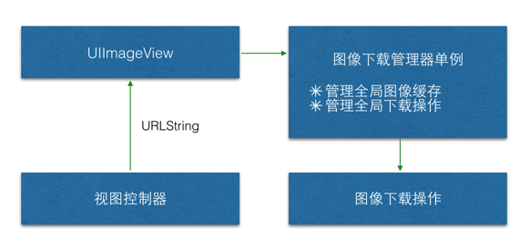

# 测试下载操作

```objc
- (void)touchesBegan:(NSSet *)touches withEvent:(UIEvent *)event {

    int seed = arc4random_uniform((UInt32)self.appList.count);
    AppInfo *app = self.appList[seed];

    // 取消之前的下载操作
    if (![app.icon isEqualToString:self.currentURLString]) {
        // 取消之前操作
        [self.operationCache[self.currentURLString] cancel];
    }

    // 记录当前操作
    self.currentURLString = app.icon;

    // 创建下载操作
    DownloadImageOperation *op = [DownloadImageOperation downloadImageOperationWithURLString:app.icon finished:^(UIImage *image) {
        self.iconView.image = image;

        // 从缓冲池删除操作
        [self.operationCache removeObjectForKey:app.icon];
    }];

    // 将操作添加到缓冲池
    [self.operationCache setObject:op forKey:app.icon];
    // 将操作添加到队列
    [self.downloadQueue addOperation:op];
}
```

## 框架结构设计


