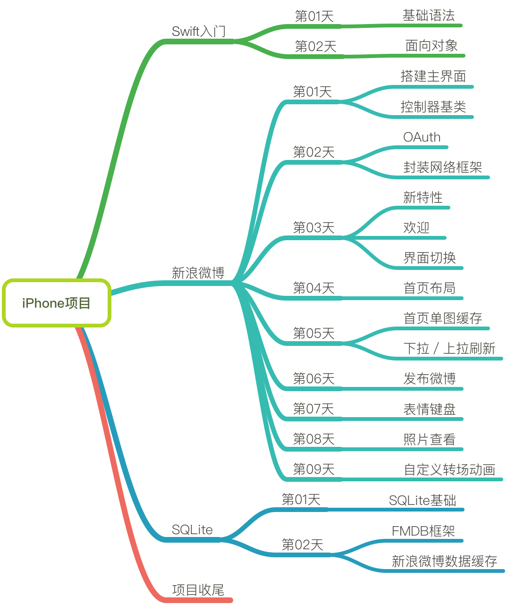

# 新浪微博开发笔记

## iPhone 项目目标

* 项目掌控能力
* 工具使用能力
* 开发技巧能力

### 课程提纲

### 新浪微博接口地址

* 微博开放平台地址
[http://open.weibo.com](http://open.weibo.com)

* 微博接口文档地址
[http://open.weibo.com/wiki/微博API](http://open.weibo.com/wiki/微博API)

## 项目主题框架

走向工作岗位之后，一般会遇到两种工作情况：

1. 新项目开发
    * 通常在项目开始之前，公司的产品经理会提供完整的产品原型图，或功能设计文档
    * 通过对这些文档的解读，能够梳理出目标项目的整体架构，从而协助项目框架的搭建

2. 旧项目维护
    * 很多老项目是缺乏文档的，这种情况在一些小公司中表现的尤为突出
    * 要想快速上手一个老项目，首先运行项目，并且整理项目整体框架结构
    * 然后用整理出的框架结构与代码结构相互印证，无疑可以对了解项目的整体架构起到重要的辅助

综上所述，无论是新项目，还是老项目，在开发之前确定项目的主体架构都是非常重要，也是十分必要的！

### 主体架构确认的好处

开发之前，明确项目的主体架构具有以下好处：

1. 明确开发目标，项目一旦启动，始终锁定目标前进！
2. 明确功能模块的数量，方便工期核算
3. 根据开发进度，预判开发周期，及时与相关部门沟通、协调
4. 根据主体架构搭建项目框架，方便团队开发，各个功能模块齐头并进，提高开发效率！
5. 确定项目开发中的重点难点，提前安排攻关能力强的同事进行技术攻关，待需要时能够享受攻关成果，或者及时调整产品设计
6. 新增或调整功能时，能够高屋建瓴，在最合适的位置添加相关功能模块

## 新浪微博

作为中国移动互联网的代表性产品之一，新浪微博涵盖了大量的移动互联网元素，通过对新浪微博的研究及模仿，可以：

- 对这些元素在实际产品中的应用有深入的了解和认识
- 知道如何在一个真实的项目中运用相关技术点
- 对大型项目的架构、开发及掌控有更全面的认识和理解

