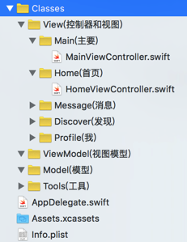

# 创建文件

## 准备工作

* 删除模板文件

    * ViewController.swift
    * Main.storyboard
    * LaunchScreen.xib

## 创建项目目录结构

### 创建目录

* 主目录 `Classes`
* 二级目录

| 目录名 | 说明 |
| -- | -- |
| View | 控制器和视图 |
| ViewModel | 视图模型 |
| Model | 模型 |
| Tools | 工具类 |

* `View` 子目录

| 目录名 | 说明 |
| -- | -- |
| Main | 主要 |
| Home | 首页 |
| Message | 消息 |
| Discover | 发现 |
| Profile | 我 |

### 创建项目文件

* `Main` 目录

| 目录 | Controller |
| -- | -- |
| Main | MainViewController.swift(`:UITabBarController`) |

* 功能模块文件

| 目录 | Controller |
| -- | -- |
| Home | HomeViewController.swift |
| Message | MessageViewController.swift |
| Discover | DiscoverViewController.swift |
| Profile | ProfileViewController.swift |

* 以上四个 `ViewController` 继承自 `UITableViewController`
* 搭建完成的文件结构图如下：




* 修改 `AppDelegate` 中的 `didFinishLaunchingWithOptions` 函数，设置启动控制器

```swift
window?.rootViewController = MainViewController()
```
