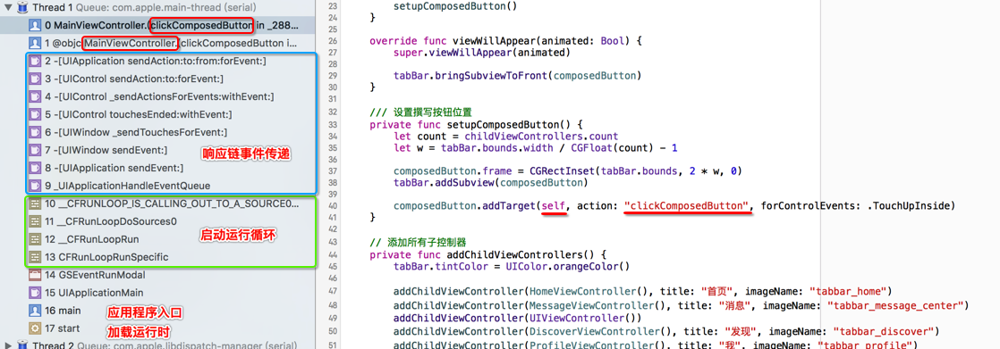
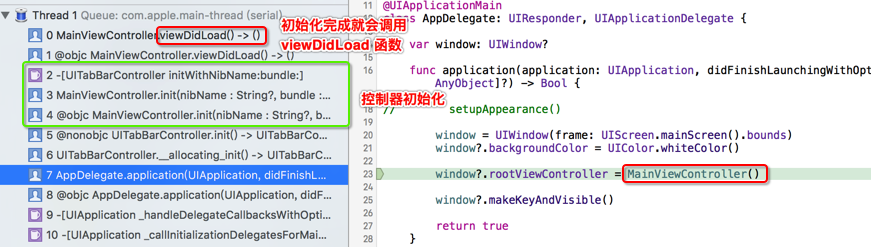
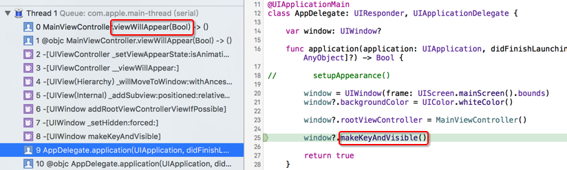

# 阶段性小结

* 整体开发思路与使用 OC 几乎一致
* Swift 语法更加简洁
* Swift 对类型校验更加严格，不同类型的变量不允许直接计算

```swift
let w = tabBar.bounds.width / CGFloat(count) - 1
```

* Swift 中的懒加载本质上是一个闭包，因此引用当前控制器的对象时需要使用 self.

* 不希望暴露的方法，应该使用 `private` 修饰符
* 按钮点击事件的调用是由 `运行循环` 监听并且以`消息机制`传递的，因此，按钮监听函数不能单纯设置为 `private`，否则必须添加 `@objc` 修饰符



* `viewDidLoad` 函数中添加子控制器只会完成控制器的添加，而不会为 `tabBar` 创建 `tabBarButton`

* `viewDidLoad` 函数调用关系



* `viewWillAppear` 函数调用关系



## 代码结构

由于 `Swift` 中没有了 .h，同时所有`函数`和`属性`都会包在当前类的 `{}` 中，会让 OC 的程序员感觉不适应，现提供以下代码编写顺序供参考：

```swift
// MARK: - 外部访问属性 & 重要变化属性

// MARK: - 外部访问方法

// MARK: - 监听方法

// MARK: - 内部属性 & 懒加载控件

// MARK: - 设置界面
```

* 提示：某一类相关方法可以使用 `extension` 进行包装
