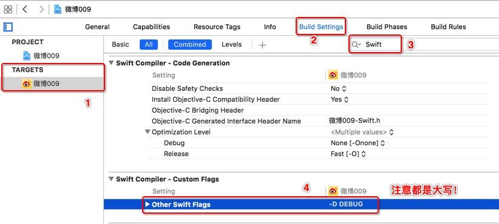

# 调试输出

## Objective-C

* 新建 pch 文件
* 在 build settings 中搜索 `prefix header`
* 添加 `项目名称/pch 文件`
* 在 pch 文件中输入以下内容

```objc
#ifdef __OBJC__

#ifdef DEBUG
#define NSLog(...) NSLog(__VA_ARGS__);
#else
#define NSLog(...)
#endif

#endif
```

## Swift

* 新建 `Common.swift`
* 将以下代码复制到文件中

```swift
/// 输出日志
///
/// - parameter message:  日志消息
/// - parameter logError: 错误标记，默认是 false，如果是 true，发布时仍然会输出
/// - parameter file:     文件名
/// - parameter method:   方法名
/// - parameter line:     代码行数
func printLog<T>(message: T,
    logError: Bool = false,
    file: String = __FILE__,
    method: String = __FUNCTION__,
    line: Int = __LINE__)
{
    if logError {
        print("\((file as NSString).lastPathComponent)[\(line)], \(method): \(message)")
    } else {
        #if DEBUG
            print("\((file as NSString).lastPathComponent)[\(line)], \(method): \(message)")
        #endif
    }
}
```

* 如下图所示，设置 DEBUG 标记



* 程序发布前，将 `-D DEBUG` 标记删除即可

## QorumLogs

* 官方网站 https://github.com/goktugyil/QorumLogs
* 带颜色的异步 log 

### 使用步骤

* 从 https://github.com/robbiehanson/XcodeColors 下载安装 `XcodeColors`
* 将 `QorumLogs.swift` 拖拽到项目中
* 在 `AppDelegate` 中添加以下代码

```swift
// 设置调试输出
QorumLogs.enabled = true
QorumLogs.test()
QorumLogs.minimumLogLevelShown = 1
```

* 将 `print` 替换成 `QL2Info` 即可
* 程序发布前，将 `minimumLogLevelShown` 修改为 `4` 即可

#### 其他技巧

* 限定输出的文件

```swift
QorumLogs.onlyShowThisFile(AppDelegate)
```

* 输出调试行

```swift
QLShortLine()
```
