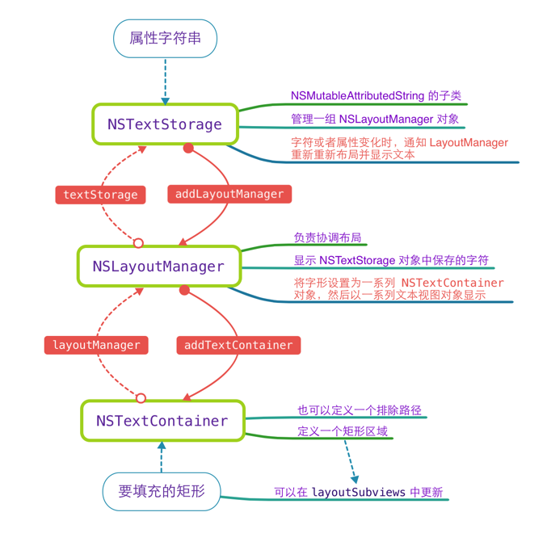

# TextKit

# Text Kit

## URL 正则表达式 Pattern

```swift
let pattern = "[a-zA-Z]*://[a-zA-Z0-9/\\.]*"
```

## TextKit 类图



## 自定义 UILabel

* 自定义 `DemoLabel` 继承自 `UILabel`

```swift
// MARK: - 懒加载属性
/// 内容
private lazy var textStorage = NSTextStorage()
/// 布局管理器
private lazy var layoutManager = NSLayoutManager()
/// 文本容器
private lazy var textContainer = NSTextContainer()
```

* 在 `layoutSub` 设置文本区域

```swift
override func layoutSubviews() {
    super.layoutSubviews()
    
    // 设置文本容器的大小
    textContainer.size = bounds.size
}
```

* 实现构造函数，准备文本系统

```swift
override init(frame: CGRect) {
    super.init(frame: frame)
    
    prepareTextSystem()
}

required init?(coder aDecoder: NSCoder) {
    super.init(coder: aDecoder)
    
    prepareTextSystem()
}

/// 准备文本系统
private func prepareTextSystem() {
    
    // 2. 添加对象关系
    textStorage.addLayoutManager(layoutManager)
    layoutManager.addTextContainer(textContainer)
}
```

* 实现绘图函数

```swift
override func drawTextInRect(rect: CGRect) {
    let range = NSRange(location: 0, length: textStorage.length)
    
    layoutManager.drawGlyphsForGlyphRange(range, atPoint: CGPointZero)
}
```

> 运行测试，发现内容没了，原因：textStorage 没有内容

* 准备 textStorage

```swift
/// 准备文本系统
private func prepareTextSystem() {
    // 1. 准备文本内容
    prepareTextStorage()
    
    // 2. 添加对象关系
    textStorage.addLayoutManager(layoutManager)
    layoutManager.addTextContainer(textContainer)
}

/// 准备文本内容
private func prepareTextStorage() {
    
    if attributedText != nil {
        textStorage.setAttributedString(attributedText!)
    } else if text != nil {
        textStorage.setAttributedString(NSAttributedString(string: text!))
    } else {
        textStorage.setAttributedString(NSAttributedString(string: ""))
    }
}
```

> 运行测试，发现内容又来了！


## 下一步目标

1. 使用正则表达式拆分内容
2. 设置链接文本的显示属性

## 使用正则表达式拆分内容

* 查找 URL 的范围

```swift
// MARK: - 正则表达式
extension DemoLabel {
    
    /// 字符串中的超文本链接数组
    private var rangesForUrl: [NSRange] {
        
        let pattern = "[a-zA-Z]*://[a-zA-Z0-9/\\.]*"
        let regex = try! NSRegularExpression(pattern: pattern, options: [])
        let results = regex.matchesInString(textStorage.string,
            options: [],
            range: NSRange(location: 0, length: textStorage.length))
        
        var ranges = [NSRange]()
        for m in results {
            ranges.append(m.rangeAtIndex(0))
        }
        
        return ranges
    }
}
```

* 修改 `prepareTextStorage` 函数

```swift
/// 准备文本内容
private func prepareTextStorage() {
    
    if attributedText != nil {
        textStorage.setAttributedString(attributedText!)
    } else if text != nil {
        textStorage.setAttributedString(NSAttributedString(string: text!))
    } else {
        textStorage.setAttributedString(NSAttributedString(string: ""))
    }
    
    for r in rangesForUrl {
        textStorage.addAttribute(NSForegroundColorAttributeName, value: UIColor.blueColor(), range: r)
    }
}
```

* 重写 `text` 的 didSet 

```swift
override var text: String? {
    didSet {
        prepareTextStorage()
    }
}
```

* 重写 `attributedText` 的 `didSet` 

```swift
override var attributedText: NSAttributedString? {
    didSet {
        prepareTextStorage()
    }
}
```