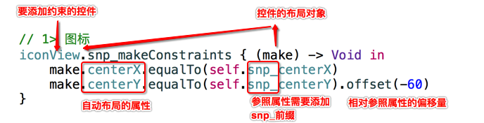

# SnapKit

`SnapKit` 是 `Masonry` 框架的团队针对 Swift 全新开发的一套自动布局框架

* 官方网站：http://snapkit.io
* github网站：https://github.com/SnapKit/SnapKit
* 文档地址：http://snapkit.io/docs/
 
* SnapKit语法示意图如下：



## 代码演练

* 使用 `SnapKit` 替换访客视图中的自动布局代码

* 导入框架

```swift
import SnapKit
```

* 设置布局

```swift
// 1> 图标
iconView.snp_makeConstraints { (make) -> Void in
    make.centerX.equalTo(self.snp_centerX)
    make.centerY.equalTo(self.snp_centerY).offset(-60)
}
// 2> 小房子
homeIconView.snp_makeConstraints { (make) -> Void in
    make.center.equalTo(iconView.snp_center)
}
// 3> 消息文字
messageLabel.snp_makeConstraints { (make) -> Void in
    make.centerX.equalTo(iconView.snp_centerX)
    make.top.equalTo(iconView.snp_bottom).offset(16)
    make.width.equalTo(224)
    make.height.equalTo(35)
}
// 4> 注册按钮
registerButton.snp_makeConstraints { (make) -> Void in
    make.left.equalTo(messageLabel.snp_left)
    make.top.equalTo(messageLabel.snp_bottom).offset(16)
    make.width.equalTo(100)
    make.height.equalTo(35)
}
// 5> 登录按钮
loginButton.snp_makeConstraints { (make) -> Void in
    make.right.equalTo(messageLabel.snp_right)
    make.top.equalTo(messageLabel.snp_bottom).offset(16)
    make.width.equalTo(100)
    make.height.equalTo(35)
}
// 6> 遮罩视图 VFL
maskIconView.snp_makeConstraints { (make) -> Void in
    make.left.equalTo(self.snp_left)
    make.top.equalTo(self.snp_top)
    make.right.equalTo(self.snp_right)
    make.bottom.equalTo(registerButton.snp_bottom)
}
```