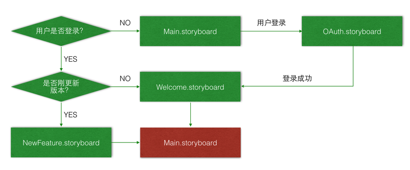

# 界面切换

## 目标

* 程序启动后根据用户登录状态选择启动控制器
* 用户登录后，利用通知切换控制器

## 界面切换流程图



## 代码实现

### AppDelegate

* 判断新版本

```swift
/// 是否新版本
private var isNewVersion: Bool {
    // 1. 获取当前版本
    let currentVersion = NSBundle.mainBundle().infoDictionary!["CFBundleShortVersionString"] as! String
    let version = Double(currentVersion)!
    
    // 2. 从沙盒加载之前保存的版本
    let sandboxVersionKey = "sandboxVersionKey"
    let sandboxVersion = NSUserDefaults.standardUserDefaults().doubleForKey(sandboxVersionKey)
    
    // 3. 将当前版本保存至沙盒
    NSUserDefaults.standardUserDefaults().setDouble(version, forKey: sandboxVersionKey)
    
    // 4. 返回比较结果
    return version > sandboxVersion
}
```

* 要显示的默认控制器

```swift
/// 默认根控制器
private var defaultRootViewController: UIViewController {
    
    // 判断是否登录
    if UserAccountViewModel.sharedUserAccount.userLogon {
        return isNewVersion ? NewFeatureViewController() : WelcomeViewController()
    }
    return MainViewController()
}
```

* 应用程序启动

```swift
window?.rootViewController = defaultRootViewController
```

### 多视图控制器切换

#### 定义通知

* 在 `Common` 中定义通知常量

```swift
/// 切换根视图控制器通知
let WBSwitchRootViewControllerNotification = "WBSwitchRootViewControllerNotification"
```

* 注册通知

```swift
NSNotificationCenter.defaultCenter().addObserverForName(WBSwitchRootViewControllerNotification, object: nil, queue: nil) { [weak self] (n) in
    
    print(n)
    print(NSThread.currentThread())
    self?.window?.rootViewController = MainViewController()
}
```

* 注销通知

```swift
deinit {
    // 注销通知
    NSNotificationCenter.defaultCenter().removeObserver(self,
        name: WBSwitchRootViewControllerNotification,
        object: nil)
}
```

#### 登录界面

```swift
// 4. 加载 accessToken & 用户信息
UserAccountViewModel.sharedUserAccount.loadAccessToke(code) { (isSuccessed) -> () in
    
    if !isSuccessed {
        SVProgressHUD.showInfoWithStatus("登录失败")
        delay(1.0) {
            self.close()
        }
    } else {
        // 发送通知
        SVProgressHUD.dismiss()
        self.dismissViewControllerAnimated(false) {
            NSNotificationCenter.defaultCenter().postNotificationName(WBSwitchRootViewControllerNotification,
                object: "welcome")
        }
    }
}
```

#### 欢迎界面

```swift
// 发送通知
NSNotificationCenter.defaultCenter().postNotificationName(
    WBSwitchRootViewControllerNotification,
    object: nil)
```

#### 新特性界面

```swift
// 发送通知
NSNotificationCenter.defaultCenter().postNotificationName(
    WBSwitchRootViewControllerNotification,
    object: nil)
```

## 小结

* 在商业级应用中，切换视图控制器的根视图是非常常见的功能，注意切换控制器的工作，应该统一在 `AppDelegate` 中修改
* 由于通知方法是同步执行的，在切换控制器前，一定要确保当前控制器已经被完全卸载
