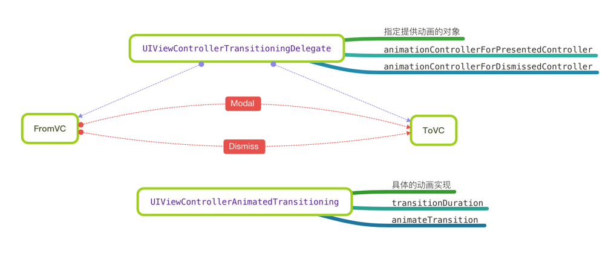

# 转场动画

* 定义动画代理对象 - 负责控制转场动画

```swift
/// 转场动画代理对象
class PhotoBrowserAnimator: NSObject, UIViewControllerTransitioningDelegate {
    
}
```

* 在 `HomeTableViewController` 中添加 `动画代理` 懒加载属性

```swift
/// 照片浏览转场动画代理
private lazy var photoBrowserAnimator = PhotoBrowserAnimator()
```

* 设置 `modal` 转场代理

```swift
let vc = PhotoBrowserViewController(urls: urls, indexPath: indexPath)

// 1. 设置转场动画类型
vc.modalPresentationStyle = UIModalPresentationStyle.Custom
// 2. 设置转场动画代理
vc.transitioningDelegate = self?.photoBrowserAnimator
// 3. Modal 展现
self?.presentViewController(vc, animated: true, completion: nil)
```

> 运行测试，如下图所示


* 实现协议方法

```swift
/// 转场动画代理对象
class PhotoBrowserAnimator: NSObject, UIViewControllerTransitioningDelegate {
    
    /// 返回`提供展现动画`的对象
    func animationControllerForPresentedController(presented: UIViewController, presentingController presenting: UIViewController, sourceController source: UIViewController) -> UIViewControllerAnimatedTransitioning? {
        
        return self
    }
}
```

> `UIViewControllerTransitioningDelegate` 协议只是返回具体提供动画的对象

* 遵守 `UIViewControllerAnimatedTransitioning` 协议

```swift
// MARK: - UIViewControllerAnimatedTransitioning
/// 提供具体的转场动画实现
extension PhotoBrowserAnimator: UIViewControllerAnimatedTransitioning {
    
}
```

* 实现协议方法

```swift
/// 动画时长
///
/// - parameter transitionContext: 转场上下文
///
/// - returns: 动画时长
func transitionDuration(transitionContext: UIViewControllerContextTransitioning?) -> NSTimeInterval {
    return 0.5
}

/// 转场动画实现方法 － 一旦实现此函数，系统的动画方法，将由程序员负责
///
/// - parameter transitionContext: 转场上下文 - 提供转场动画的所有细节
func animateTransition(transitionContext: UIViewControllerContextTransitioning) {
    
}
```



* 测试动画方法

```swift
/// 转场动画方法 - 一旦实现就需要自己来实现动画
///
/// - parameter transitionContext: transitionContext 提供转场动画的所有细节
func animateTransition(transitionContext: UIViewControllerContextTransitioning) {
    let fromVC = transitionContext.viewControllerForKey(UITransitionContextFromViewControllerKey)!
    let toVC = transitionContext.viewControllerForKey(UITransitionContextToViewControllerKey)!
    
    printLog(fromVC)
    printLog(toVC)
}
```

## 展现转场

* 准备动画方法

```swift
/// 转场动画实现方法 － 一旦实现此函数，系统的动画方法，将由程序员负责
///
/// - parameter transitionContext: 转场上下文 - 提供转场动画的所有细节
func animateTransition(transitionContext: UIViewControllerContextTransitioning) {
    
    presentAnimation(transitionContext)
}

/// 展现转场动画
///
/// - parameter transitionContext: 转场上下文
private func presentAnimation(transitionContext: UIViewControllerContextTransitioning) {
    
    let toView = transitionContext.viewForKey(UITransitionContextToViewKey)!
    
    transitionContext.containerView()?.addSubview(toView)
    
    transitionContext.completeTransition(true)
}
```

> 注意：转场动画结束后，一定要调用 `transitionContext.completeTransition(true)` 通知系统动画结束

* 实现自定义动画转场

```swift
/// 展线转场动画
///
/// - parameter transitionContext: 转场上下文
private func presentAnimation(transitionContext: UIViewControllerContextTransitioning) {
    
    let toView = transitionContext.viewForKey(UITransitionContextToViewKey)!
    toView.alpha = 0.0
    
    transitionContext.containerView()?.addSubview(toView)

    UIView.animateWithDuration(transitionDuration(transitionContext), animations: {
        
        toView.alpha = 1.0
        
        }) { _ in
            
            transitionContext.completeTransition(true)
    }
}
```

## 解除转场

* 定义属性区分转场和解除转场状态

```swift
/// 是否展现标记
private var isPresented = false
```

* 实现 `UIViewControllerTransitioningDelegate` 协议方法

```swift
/// 转场动画代理对象
class PhotoBrowserAnimator: NSObject, UIViewControllerTransitioningDelegate {
    
    /// 是否展现标记
    private var isPresented = false
    
    /// 返回`提供展现动画`的对象
    func animationControllerForPresentedController(presented: UIViewController, presentingController presenting: UIViewController, sourceController source: UIViewController) -> UIViewControllerAnimatedTransitioning? {
        
        isPresented = true
        return self
    }
    
    /// 返回`提供解除转场动画`的对象
    func animationControllerForDismissedController(dismissed: UIViewController) -> UIViewControllerAnimatedTransitioning? {
        
        isPresented = false
        return self
    }
}
```

* 创建解除转场动画函数

```swift
/// 解除转场动画
///
/// - parameter transitionContext: 转场上下文
private func dismissAnimation(transitionContext: UIViewControllerContextTransitioning) {
    
    let fromView = transitionContext.viewForKey(UITransitionContextFromViewKey)!
    
    UIView.animateWithDuration(transitionDuration(transitionContext), animations: {
        
        fromView.alpha = 0.0
        
        }) { _ in
            
            fromView.removeFromSuperview()
            transitionContext.completeTransition(true)
    }
}
```

* 调用转场函数

```swift
/// 转场动画实现方法 － 一旦实现此函数，系统的动画方法，将由程序员负责
///
/// - parameter transitionContext: 转场上下文 - 提供转场动画的所有细节
func animateTransition(transitionContext: UIViewControllerContextTransitioning) {
    
    isPresented ? presentAnimation(transitionContext) : dismissAnimation(transitionContext)
}
```

## 修改照片浏览器`保存按钮`布局

```swift
saveButton.snp_makeConstraints { (make) -> Void in
    make.bottom.equalTo(view.snp_bottom).offset(-8)
    make.right.equalTo(view.snp_right).offset(-28)
    make.size.equalTo(CGSize(width: 100, height: 36))
}
```
