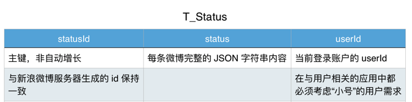

# 数据模型设计

## 数据表设计



## 准备 SQL

* 使用新浪微博返回的 `statusId` 作为主键，主键不再使用自动增长
* 数据表中设置 `userId`，保证同一个数据库中能够缓存多人的微博信息
* 建立 `status` 字段保存从服务器返回的完整微博 `JSON` 字符串

```sql
-- 微博数据表 --
CREATE TABLE IF NOT EXISTS "T_Status" (
    "statusId" INTEGER NOT NULL,
    "status" TEXT,
    "userId" INTEGER,
    PRIMARY KEY("statusId")
);
```

# 准备工作

## 导入 FMDB 框架

* 将 fmdb 文件夹拖入项目
* 建立桥接文件
* 将 `Swift extensions` 拖入项目
* 添加 `libsqlite3.tdb`

## 导入封装好的 `SQLiteManager.swift` 数据库管理工具
