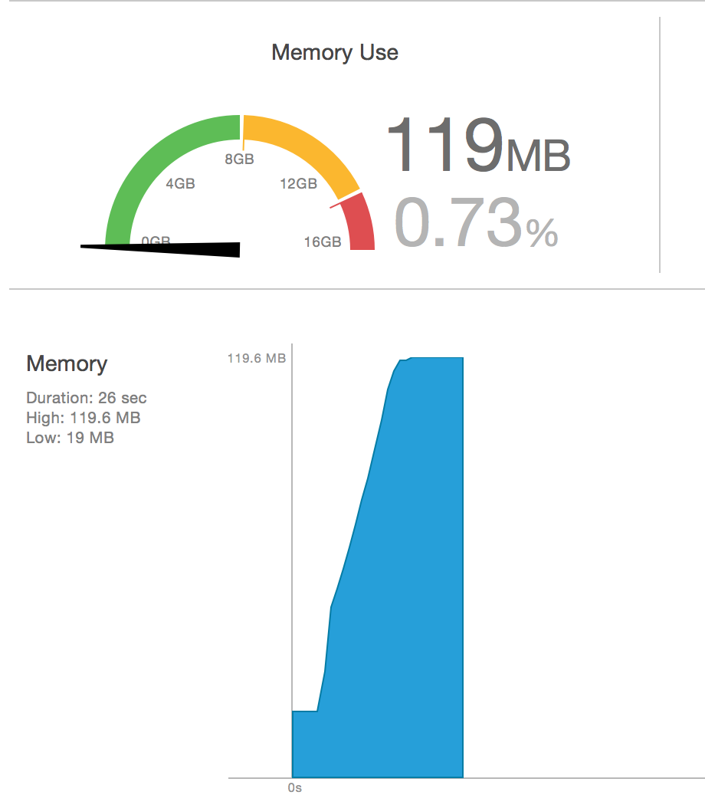

# NSURLConnection下载

## 课程目标

* `NSURLConnection下载`是一个网络多线程的综合性演练项目
* 充分体会 `NSURLConnection` 开发中的细节
* 虽然 `NSURLConnection` 在 `iOS 9.0` 中已经被废弃，但是作为资深的 iOS 程序员，必须要了解 `NSURLConnection` 的细节
* 利用 `HTTP` 请求头的 `Range` 实现断点续传
* 利用 `NSOutputStream` 实现文件流拼接
* `自定义 NSOperation`及操作缓存管理
* `Block` 的综合演练
* 利用 `IB_DESIGNABLE` 和 `IBInspectable` 实现在 `Stroybaord` 中自定义视图的实时渲染
* `NSURLSession` 从 `Xcode 6.0` 到 `Xcode 6.3.1` 都存在内存问题，历时7个月，如下图所示：



## NSURLConnection 的历史

- iOS 2.0 推出的，至今有10多年的历史
- 苹果几乎没有对 NSURLConnection 做太大的改动
- `sendAsynchronousRequest` 方法是 iOS 5.0 之后，苹果推出的
- 在 iOS 5.0 之前，苹果的网络开发是处于**黑暗时代**
- 需要使用`代理`方法，还需要使用运行循环，才能够处理复杂的网络请求！

## 使用异步方法下载

```objc
- (void)downloadWithURL:(NSURL *)url {

    // 请求
    NSURLRequest *request = [NSURLRequest requestWithURL:url cachePolicy:1 timeoutInterval:kTimeout];

    NSLog(@"start");
    // 下载
    [NSURLConnection sendAsynchronousRequest:request queue:[NSOperationQueue mainQueue] completionHandler:^(NSURLResponse *response, NSData *data, NSError *connectionError) {

        // 将文件写入磁盘
        [data writeToFile:@"/Users/liufan/Desktop/123" atomically:YES];
        NSLog(@"下载完成");
    }];
}
```

### 问题：

1. 没有进度跟进，用户体验不好
2. 会出现内存峰值，如果文件太大，在真机上会闪退

### 解决办法：

* 使用代理方法来解决下载进度跟进的问题
