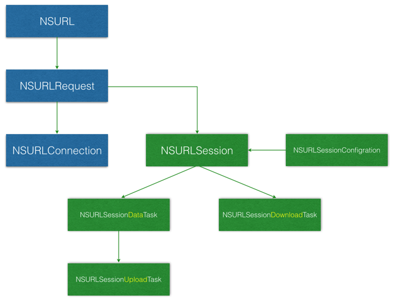

# NSURLSession

## 简介

* 用于替代 `NSURLConnection`
* 支持后台运行的网络任务
* 暂停、停止、重启网络任务，不再需要 `NSOperation` 封装
* 请求可以使用同样的`配置容器`
* 不同的 `session` 可以使用不同的私有存储
* `block` 和`代理`可以同时起作用
* 直接从文件系统上传、下载

## 结构图

* 为了方便程序员使用，苹果提供了一个全局 `session`
* 所有的 `任务(Task)` 都是由 `Session` 发起的
* 所有的任务默认是`挂起`的，需要 `Resume`
