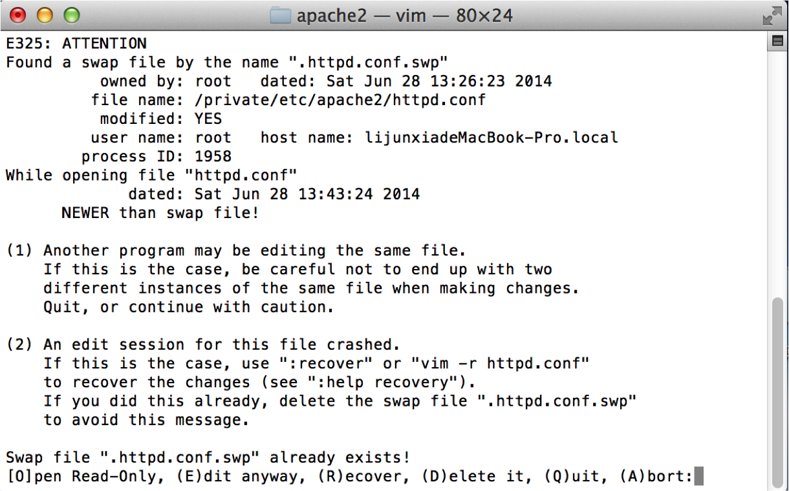

# 配置 Apache 服务器

## 目的：
* 能够有一个测试的服务器，不是所有的特殊网络服务都能找到免费的！

## 为什么是 `Apache`

1. 使用最广的 Web 服务器，`IIS`(微软 Intenet Infomation Server)
2. Mac自带，只需要修改几个配置就可以，简单，快捷
3. 有些特殊的服务器功能，Apache都能很好的支持
例如：HTTP `PUT`/`DELETE` 操作，知识补充涉及的 `HTTPS` 服务

## 准备工作
* 设置用户密码

## 配置

1.  配置服务器的工作
    * 在 `Finder` 中创建一个 `Sites` 的文件夹，直接创建在 `/Users/apple`(当前用户名)目录下
    * 修改配置文件中的`两个路径`，指向刚刚创建的文件夹
    * 拷贝一个文件

2.	配置服务器注意事项
    * 关闭中文输入法
    * 命令和参数之间需要有`空格`
    * 修改系统文件一定记住`sudo`，否则会没有权限
    * 目录要在 `/Users/apple`(当前用户名)

3.	配置服务器

> 提示：$开头的，可以拷贝，但是不要拷贝$

```bash
# 切换工作目录
$ cd /etc/apache2
```

常用命令
* `cd` 切换目录
* `pwd` 确认当前目录
* `ls` 列表显示当前目录的内容

```bash
# *** 备份文件，以防不测，只需要执行一次就可以了
# 格式 cp (copy 的缩写) httpd.conf (源文件) httpd.conf.bak (目标文件)

$sudo cp httpd.conf httpd.conf.bak

# 提示：如果后续操作出现错误！可以使用以下命令，恢复备份过的 httpd.conf 文件

$ sudo cp httpd.conf.bak httpd.conf
```

* 编辑 `httpd.conf`

```bash
# vim里面只能用键盘，不能用鼠标
# 用vim编辑httpd.conf
$ sudo vim httpd.conf

# 查找`DocumentRoot`
* /DocumentRoot

# 进入编辑模式
* i

# 修改`两处`引号中的路径

# 继续向下找到

Options FollowSymLinks Multiviews

# 加一个单词 `Indexes`，修改后的结果如下：

Options Indexes FollowSymLinks Multiviews

# 返回命令模式
* ESC

# 查找php
* /php

# 将光标移动到首行

* 0

# 删除行首注释 #

* x

# 保存并退出
* :wq

# 不保存退出!!!!!!!!!
* :q!
```

* 拷贝php.ini文件

```bash
# 切换工作目录
$ cd /etc

# etc 目录有点类似于 windows/system32，存放配置文件的目录

$ sudo cp php.ini.default php.ini

# 重新启动apache服务器
$ sudo apachectl -k restart
```

如果提示以下错误是正常的：

```bash
httpd: Could not reliably determine the server's fully qualified domain name, using teacher.local for ServerName
httpd not running, trying to start
```

### 常见问题：

* 如果点击 `info.php` 文件，出现下载，或者只是显示一小段文字

解决办法：

在终端中输入以下两个命令：

```bash
# 关闭 apache 服务器
$ sudo apachectl -k stop

# 重新再次启动 apache
$ sudo apachectl -k start
```

* 每次启动计算机，`Apache` 服务器默认是不会自动启动的！

可以启动计算机之后，打开终端，输入以下命令：

```bash
# 启动 apache
$ sudo apachectl -k start

# 查询历史输入的命令
$ history
```

* 最常见的问题



交换文件已经存在，直接按字母 "d"，可以删除交换文件！

> 提示：目前不要花一分钟去学习vim。

* 执行脚本的时候，显示没有拒绝访问！大家用 `NTFS` 格式的 U 盘拷贝网络素材！可能会把文件本身的权限过滤掉！

以下是在终端中修改文件权限的指令！

```bash
$ ls -la
$ chmod 644 info.php（没有权限的文件名）
$ chmod 644 *.*
```

