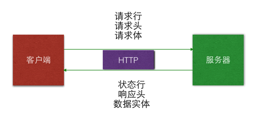

# URL

* `URL` 的全称是 `Uniform Resource Locator`（统一资源定位符）
* 通过 1 个 URL，能找到互联网上唯一的 1 个资源
* URL就是资源的地址、位置，互联网上的每个资源都有一个唯一的  `URL`

## URL 格式

* 基本格式：`协议头://主机地址/路径`
    * `协议头`：不同的协议，表示不同的资源查找及传输方式
    * `主机地址`：存放资源主机的 `IP` 地址（域名）
    * `路径`：资源在主机中的具体位置


# HTTP 协议

* `HTTP` 的全称是 `Hypertext Transfer Protocol`，超文本传输协议
* 规定客户端和服务器之间的数据传输格式
* 让客户端和服务器能有效地进行数据沟通
* `HTTP` 协议是网络编程使用最为广泛的协议


* 思考
    * 客户端该传什么格式的数据给服务器？服务器才能看懂
    * 服务器该返回什么格式的数据给客户端？客户端才能看懂

## HTTP协议特点

* 简单快速
    * 因为HTTP协议简单，所以 `HTTP` 服务器的程序规模小，通信速度快
* 灵活
    * HTTP **允许传输任意类型的数据**
* `HTTP 0.9` 和 `1.0` 使用非持续连接
    * 限制每次连接只处理一个请求，服务器对客户端的请求做出响应后，立刻断开连接，这种方式可以节省传输时间
* `HTTP 1.1` 使用持续连接
    * 不必为每个web对象创建一个新的连接，一个连接可以传送多个对象

## HTTP通信过程

### 请求

* `HTTP`协议规定：一个完整的`由客户端发给服务器`的 `HTTP 请求` 需要包含以下内容：
    * `请求行`：指定 `请求方法`、`请求资源路径` 以及 `HTTP协议版本`
```bash
# / 表示访问根目录
GET / HTTP/1.1
```
    * `请求头`：对客户端的环境描述、客户端请求的主机地址等信息
        * `请求头`中至少包含以下信息
```bash
# 客户端要访问的服务器主机地址
Host: m.baidu.com
```
        * `请求头`中还可以包含以下信息
```bash
# 客户端的类型，客户端的软件环境
User-Agent: iPhone AppleWebKit
# 客户端所能接收的数据类型
Accept: text/html, */*
# 客户端的语言环境
Accept-Language: zh-cn
# 客户端支持的数据压缩格式
Accept-Encoding: gzip
# 访问结束后，是否断开连接
Connection: Close
```
    * 请求体(可选)：客户端发给服务器的具体数据，例如要上传的文件数据

* 请求格式
    * 每一项请求信息末尾使用 `\r\n`
    * 最后一个请求项末尾使用 `\r\n\r\n` 表示请求结束

### 响应

* `HTTP`协议规定：一个完整的 `HTTP 响应`包含以下内容：
    * 状态行：包含了HTTP协议版本、状态码、状态英文名称
```bash
# 请求成功
HTTP/1.1 200 OK
# 内容无变化
HTTP/1.1 304 Not Modified
```
    * 响应头：包含了对服务器的描述、对返回数据的描述
```bash
# 服务器的类型
Server: Apache/2.4.10 (Unix) PHP/5.5.20
# 返回数据的类型
Content-Type: text/html
# 返回数据的长度
Content-Length: 660
# 响应时间
Date: Thu, 04 Jun 2015 19:31:50 GMT
# ETag(HASH值，用于检测本地资源和服务器资源是否一致)
ETag: "294-4e1862f57e7c0"
```
    * 实体内容：服务器返回给客户端的具体二进制数据


