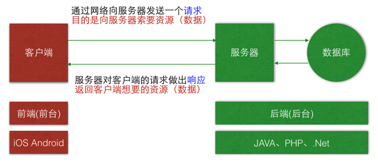

# 为什么要学习网络编程？

* 在`移动互联网时代`，移动应用的特征有：
    * 几乎所有应用都需要网络，比如QQ、微博、网易新闻、优酷、百度地图
    * 只有通过网络跟外界进行`数据交互`、`数据更新`，应用才能保持新鲜与活力
    * 如果没有了网络，也就缺少了数据变化，无论外观多么华丽，终将变成一潭死水

* 学习网络编程：
    * 可以掌握实时更新数据的手段
    * 是开发优秀应用的前提和基础

# 基本概念

* `客户端（Client）`：移动应用（iOS、android等应用）
* `服务器（Server）`：为客户端提供服务、提供数据、提供资源的机器
* `请求（Request）`：客户端向服务器索取数据的一种行为
* `响应（Response）`：服务器对客户端的请求做出的反应，一般指返回数据给客户端

> 作为移动开发工程师，主要的精力都是放在`前端`开发

## 服务器

按照软件开发阶段来分，服务器可以大致分为2种

* 远程服务器
    * 别名：外网服务器、正式服务器
    * 使用阶段：应用上线后使用的服务器
    * 使用人群：供全体用户使用
    * 速度：取决于服务器的性能、用户的网速

* 本地服务器
    * 别名：内网服务器、测试服务器
    * 使用阶段：应用处于开发、测试阶段使用的服务器
    * 使用人群：仅供公司内部的开发人员、测试人员使用
    * 速度：由于是局域网，所以速度飞快，有助于提高开发测试效率

### 本地服务器

* 在工作中，会有专门的后端人员开发服务器程序，不由得你选择
* 在学习阶段，选择什么本地服务器都可以，能用就行
* 在我们课程中，选择 `Apache` + `PHP` 服务器
